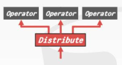

-
- 多索引扫描 Multi-Index Scan
	- 使用age字段的索引，把`age<30`的记录筛选出来；同时也使用dept字段的索引，把`dept='cs'`的人筛选出来。之后取他们的交集，再从交集中选取出`country='US'`的记录。
	- 取交集的过程可以通过#bitmap #哈希表 /#布隆过滤器 等实现。
	- 
	- 在[[Postgres]]中，称作#BitmapScan
- 索引扫描后的按页排序 Index Scan Page Sorting
	- 在使用#非聚簇索引 查找数据时，得到的结果集是乱序的，在接下来的二次回表中，就会造成多次的IO读取，效率不高。
	- DBMS首先找出它所需的tuples(#晚物化 )，再将它们按照PageId进行一次排序。这样可以减少一定的IO次数。
- 表达式求值 Expression Evaluation
	- SQL中的Where块以及join On 块，共同构成了表达式树 expression tree
	- 树中的节点有如下5类
		- 比较运算符(=,<,>,!=)
		- AND 和 OR
		- 数学运算符(+,-,*,/,%)
		- 常量Constant和变量Parameter
		- 对tuple属性的引用，也就是表中的某一字段
	- 解析这棵树通常而言是低效的做法。DBMS必须遍历树中的每一个节点，执行每一步操作。
	- 另一种做法是将这颗树(甚至将整个查询计划)编译成机器码，如JIT(#即时编译器 )一般，执行速度更快。
- 并行查询
	- 为什么需要并行查询？
		- 提高吞吐量(能够处理更多的用户请求)
		- 降低对用户的响应延迟
		- 提升系统的可用性
		- 降低总成本
		  collapsed:: true
			- 使劲压榨CPU的性能从而降低机器等硬件成本
	- 并行与分布式 Paraller VS. Distributed
	  collapsed:: true
		- 共同点
			- 需要使用到多份资源来实现
			- 使用者不关心实际的物理组织架构，就像是使用单机数据库(单线程单节点)一样使用它
		- 并行式数据库
			- 资源都集中在一台机器上
			- 资源之间的通信速度快
			- 通信过程十分简易、可靠
		- 分布式数据库
			- 资源之间可能间隔很远(在世界上的不同角落)
			- 资源之间的通信依托于较慢的网络
			- 通信过程中的耗时与问题无法被忽略(即使概率小，一定会发生)
	- 并行处理模型 Process Models
	  collapsed:: true
		- DBMS的**process model**描述的是多个用户的查询请求是如何并发执行的
		- **worker**是DBMS中用来执行任务task的组件
			- 比如，一份查询计划可以被分为多个task，交由多个worker去执行
		- process model有三大方向
		- 每个worker一个进程 Porcess per DBMS Worker
		  logseq.order-list-type:: number
		  collapsed:: true
			- 整体流程
				- Client优先请求Dispatcher,Dispatcher再分配一个Woker给Client
				- Client与Woker建立链接，Woker开始处理工作，然后返回结果。
			- 每一个Worker都是OS级别的进程
				- 依赖于操作系统的调度
				- 可以使用共享内存的方式共享数据
				- 单进程的崩溃不会导致整个系统宕机
			- 如果并发的量太大，那么操作系统上会有很多的进程，每个进程都会占用一定的计算机资源，**调度开销**也会随之增大。
			- 
		- 进程池 Process Pool
		  logseq.order-list-type:: number
		  collapsed:: true
			- 每个 Worker 可以使用 Worker Pool 中任意空闲的进程
				- 依旧依赖于操作系统的调度和共享内存
				- 对CUP的缓存(L1,L2)不是很友好
			- 
		- 每个worker一个线程 Thread per DBMS Worker
		  logseq.order-list-type:: number
			- 每个worker对应一个线程
				- DBMS管理着这些线程的调度
				- 可以不需要dispatcher线程
				- 一个线程的崩溃可能导致整个系统的崩溃
			- 
			- 使用多线程架构的优点
				- 更少的上下文切换开销
				- 无需管理共享内存
					- 同一个进程的多个线程是天然地共享内存的（因为使用的是相同的页表）
			- 并不是每个SQL语句的执行都是并发的，而是说会**同时有多个线程并发地去执行多个SQL语句**
	- 并行执行 Execution Parallelism
		- 调度 Schedule
			- 对于每一次的查询计划，由DBMS决定何时、何地、用何种方法执行(where,when and how)
			  collapsed:: true
				- 此次查询计划被分成了多少个tasks？
				- 需要投入多少的CPU资源？
				- task应该在哪个CPU上执行？
				- task何时停止或是输出结果？
			- DBMS永远知道的比OS多
		- Inter-Query 查询之间的并发处理
			- 通过允许同时执行多个查询来提高整体性能
			- 如果所有的查询都是read-only的，那就不容易产生并发导致的数据竞争，线程间的同步操作不多
			- 果并发的查询都在更新数据库，那么这就是另一大问题，涉及到#事务 ，#并发控制
			- 实现方式1：水平切分 Intra-Operator Horizontal
				- 将要处理的数据切分成片段fragment,每一个片段给一个worker,且每个worker做的工作是一样的。
				- DBMS还要在执行计划中插入exchange算子，用于做数据的聚集(Gather)、分发(Distribute)、再平衡(Repartition) 等。
				  collapsed:: true
					- 聚集 
					- 分发 
					- 再平衡 
				- 以filter算子为例，DBMS用exchange算子把查询计划切分成了三个fragment，exchange算子负责去并发地调用这三个部分的`next`方法,然后将这些worker返回的数据聚集之后，返回给上层算子。
				- 
				-
			- 实现方式2：垂直切分 Inter-Operator Vertical
				- 把执行计划树中的每个算子丢给一个相应的worker去执行，它们之间是并发执行的，同时算子之间也有数据的传递，这和现代处理器中的流水线很像。
				- 
				-
			- 实现方式3：Bushy Parallelism
				- 既做到将算子切开并发执行，也做到算子和算子之间并发执行，并且依然需要exchange算子
				- 
			-
		- Intra-Query 查询内部的并发处理
			- 通过并行执行算子，来提高单个查询的性能
			- 设计思想类似于#生产者-消费者 模型
			- 每个算子都有其对应的并发版本
				- 方便在并发和非并发的场景下切换
				- 以grace hash join举例
					- 每个woker处理一对哈希桶的join，最后再把各自的处理结果聚集起来
					- 
	-
	-
-