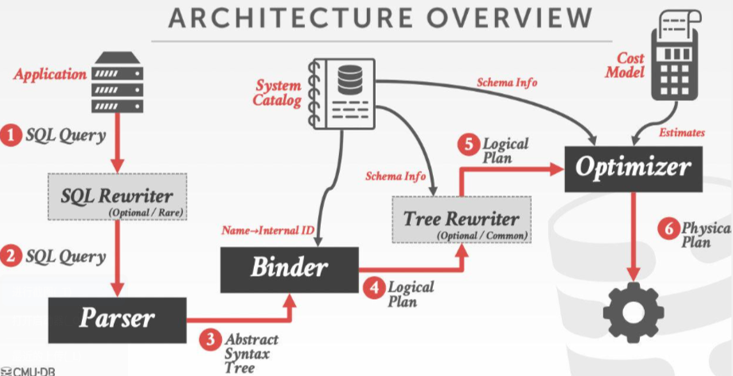
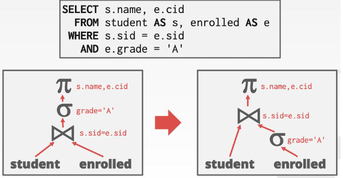
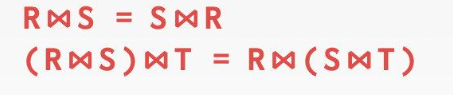
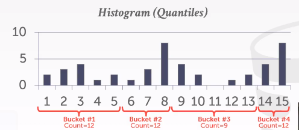

- SQL语句是声明式的，只说了它要什么样的答案，而没有说为了获得答案需要经历怎样的过程。
- SQL请求的执行流程
  collapsed:: true
	- 
	- 1 and 2 用户的业务会发出SQL查询语句，少部分DBMS会有SQL Rewriter这个组件，对字符串形式的SQL语句进行文本上的预处理
	- 2 to 4 Parser会把SQL语句变成抽象语法树，抽象语法树当中会涉及到库/表/列的名称，这些名称要和数据库系统元数据里面的库/表/列/索引的ID对应上，因此会有Binder（即连接器）把SQL抽象语法树中用户写的表名/列名/索引名转化成数据库内部使用的ID
	- 5 经Binder处理过之后的抽象语法树会被送入Tree Rewriter，这个组件大多数DBMS都有，它会输出一个标准的执行计划，这个过程中也会查一些系统的元数据，Tree Rewriter输出的原始的逻辑计划是优化器进行优化的源头
		- 比如说SQL语句里有一堆join操作，一开始的抽象语法树中的join的排布可能是乱的，Tree Rewriter会把所有的join排列成左深树，这个步骤也叫正则化
	- 6 基于规则的优化器（RBO， rule based optimizer）会查询一些系统的元数据来做优化，基于代价的优化器（CBO， cost based optimizer）不仅会查询元数据，还会查询相关的代价模型，根据代价模型去做优化，最后优化器会生成物理计划，被实际使用
- 逻辑执行计划 VS. 物理执行计划 Logical Plans VS. Physical Plans
	- 逻辑计划是**关系代数**级别的，物理计划包括了各个算子的**具体执行方式**(比如说join算子是用nested-loop join还是merge/hash join来完成)
	- 逻辑表达式和物理算子未必是1对1的（比如我使用了sort merge join ，就可以取消 order by 表达式了)
- 查询优化属于NP-Hard问题（NP是非多项式的意思），甚至都不一定能得出最优解，是DBMS最难的部分。目前最新的研究中甚至引入了机器学习来辅助查询优化，但这样的人工智能模型有些时候是不可解释的，是一个黑盒
- 通过DBMS的优化器自动地去对SQL语句进行查询优化，有如下两种方式，两种策略都会被用于查询优化。
- Heuristics / Rules 启发式/基于规则
  collapsed:: true
	- 通过一些规则/变换的手段(等价的关系代数表达式)，优化掉用户的查询语句里面低效的部分
	- 需要查询相关的元数据（catalog，比如说需要知道有没有给某个attribute构建索引），不需要检查数据本身（比如说获取数据的统计信息）
	- 关系代数表达式的等价 Relation Algebra Equivalences
		- 如果两个关系代数表达式所输出的结果集是一样的，那么它们等价
		- 即使没有cost 模型，DBMS也可以找到更好的逻辑执行计划，这一过程称作 查询重写(query rewriting)
		- 谓词下推
		  collapsed:: true
			- 
		- 对选择的操作(Selections)的优化 值传导
		  collapsed:: true
			- 
		- 对Join操作的优化 交换律和结合律
		  collapsed:: true
			- 
		- 对投影操作(Projections)的优化 下推
		  collapsed:: true
			- 1 在执行过程中优先执行投影算子，把无关的属性删掉，让tuple和中间结果更小
			- 2 只关注当前需要用的自动，等到最后投影时再回表查询然后输出。
				- 假如投影之前要进行join，那么在join的时候只考虑join key，最后要输出的时候回表现查其他的attribute
			- 列存储的数据库永远都是最后进行对tuple的物化
- Cost-based Search 基于代价
	- 通过构建一些代价模型，来计算查询如果按照某个计划去做的话相应的代价是多少
	- 通过比较多个计划的代价，从中选出代价最小的计划去执行
		- 为了计算出代价，往往需要知道数据库所存储的数据的一些统计信息（比如说数据的规模）
	- 代价评估 Cost Estimation
		- 一次查询耗时最长的过程在哪里？
		  collapsed:: true
			- CPU: 几乎可以忽略不计
			- Disk: 取决于读取数据块的数量 普通数据库瓶颈
			- Memory: 取决于所用内存的大小  内存型数据库瓶颈
			- Network: 取决于通信的次数 分布式数据库瓶颈
		- 我们需要读取/写入多少的数据量?
		- 要得到上述的精确答案，需要耗费昂贵的计算成本去获得它，因此DBMS需要额外的数据来驱动代价评估模型运作。
		- DBMS通常会存储一些有关于表、字段和索引的统计信息。不同的系统维护它们的时刻不同。
			- PG/SQLite: Analyze
			- Oracle/MySQL: Analyze Table
			- SQL Server: Update Statistics
			- DB2: Runstats
		- 对统计数据的估计
			- 定义N_r: 表R中的数据条数 `count(1)`
			- 定义V(A,R): 表R中，字段A的去重数量 `count(distinct A)`
			- 假设1,数据均匀分布
			- 假设2,谓词相互独立
			- 假设3,必定存在原则
				- join key时，inner table中存在的key必定存在于outer table中
			- select操作
			  collapsed:: true
				- P : 谓词语句。如 `age = 2 ; name like 'A%'`
				- select cardinality $$SC=N_R / V(A,R)$$
				- Equality谓词 $$sel(A=常量) = SC(P) / N_R$$
				- Range谓词 $$sel(A >=a) = (A_max -a) / (A_max - A_min)$$
				- Negation谓词 $$sel(not \space P) = 1 - sel(P)$$
				- Conjunction谓词 `AND` $$sel(P1 \wedge P2) = sel(P1) * sel(P2)$$
				- Disjunction谓词 `OR` $$sel(P1 \vee  P2) = sel(P1) + sel(P2) - sel(P1\wedge P2) = sel(P1) + sel(P2) - sel(P1) * sel(P2)$$
			- 估计不准的原因 以及解决方案
			  collapsed:: true
				- 谓词并不相互独立
					- 例如，手机供应商`小米`与手机品牌`红米`之间就具有关联关系。假设表中，手机供应商有10条，手机品牌有100条。查询此SQL时，估计cost `1/10 * 1/100 = 0.0001`,而实际上，cost `1/100 = 0.001`
					- 显示告知DBSM, 属性a和属性b之间存在关联关系
				- 数据并不均匀分布
					- 使用Range Bucket分桶统计，目标是使每个bucket中的数据量尽可能的一致，因此bucket 1 与 bucket 2 的范围大小并不是固定的。
					- 
		- Sample Table 样本估计法
			- 从目标表中，按照某种采样方法进行数据的采集，这些数据组成Sample Table
			- 查询到来时，先看它命中Sample 的条数占比，如 1/3 从而估计原表占比 1/3
-