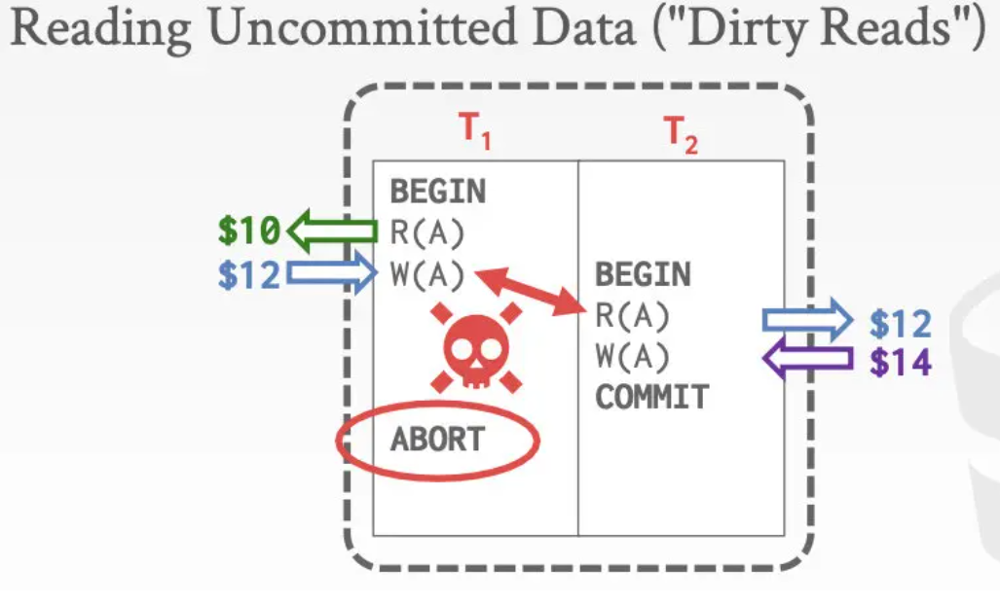

- DBMS由多个组件构成，如下图只是举例，并不完全。而其中的 并发控制[Concurrency Control] 和 数据恢复[Recovery] 是横跨多个层级的。
	- 
	- 并发控制的目的是 避免数据竞争的发生
	- 数据恢复的目的是 在实现持久化时一直保持正确的数据库状态
- #事务  Transaction
	- 是一系列操作的集合；是DBMS执行的最基本单位(原子性)。
- 事务问题的简化模型
	- 数据库：一组固定不变的、无重复项的数据表的集合
	- 事务：一系列的读和写操作
		- 新事务的开启使用`Begin`关键字
		- 事务的提交或放弃使用 `Commit` 或 `Abort` 关键字
- 衡量一种事务实现方式是否正确的标准是 ACID
	- ((66666b64-cf63-40d9-a060-dfc5ad62cb9f))
		- 事务内的所有操作，要么都发生、要么都没发生
	- ((66666f1b-a26a-4442-8e5c-bc0ff6572cd7))
		- 事务开始时，DB是状态a；事务结束时，DB还是状态a.DB中的不变量(与本次事务无关的相关数据)不会发生变化。
		- 对操作者来说，看起来是正确的
	- ((666670e1-5b37-4b0e-ab02-d54368275978))
		- 正在执行的事务a和b，他们是互不影响的。
	- ((666679d5-2ca1-4803-98f6-cfc19b02f501))
		- 一旦事务提交，它的改动被持久化。
-
- 原子性 Atomicity
  id:: 66666b64-cf63-40d9-a060-dfc5ad62cb9f
  collapsed:: true
	- 执行一个事务只会迎来两种结局：要么完成全部的内部操作然后commit；要么中途被abort，进行回滚；
	- 实现事务的原子性，有两种手段
		- 日志 Logging
			- 事务在执行的过程中，每执行一步都要记录一下“如果要回滚这一步该怎么办”.
			- 这种日志也被称为"undo log"-回滚日志，内存和磁盘中都会有它的备份.
		- 脏页备份 Shadow Paging
			- 事务想修改哪些文件页，DBMS就给这些页做备份，事务操作这些备份，如果事务成功提交，那就拿备份替换下原有的页，否则就删除备份，实现回滚
- 一致性 Consistency
  id:: 66666f1b-a26a-4442-8e5c-bc0ff6572cd7
  collapsed:: true
	- 数据库中的所反映出的外部世界应该是**逻辑上**正确的，而且我们对数据库所执行的查询的结果也是逻辑上能讲的通的
	- 一致性分为如下两个方面
		- 数据一致性
			- 后面发生的事务要能看到在它之前发生的事务导致的结果
		- 业务一致性
			- 如果数据库在事务开始之前是一致的，那么在事务结束的时候也应该是一致的
- 隔离性 Isolation
  id:: 666670e1-5b37-4b0e-ab02-d54368275978
  collapsed:: true
	- 用户在执行事务时，好像数据库没有其他的用户在使用
	- 为了实现事务的隔离性，就需要数据库的**并发控制机制**去决定事务之间的交错的执行是**以怎样的一个顺序/时间表来进行**，不可以随意地交错执行。
	- ((66667183-db02-41b9-8ad7-712bc22d447f))
	- 实现并发控制有两大流派：
		- 悲观协议：不要让问题发生，在问题出现之前就让线程停住
		- 乐观协议：我们假设并发的冲突是少数的，只在问题出现之后再去回滚
- 持久性 Durability
  id:: 666679d5-2ca1-4803-98f6-cfc19b02f501
  collapsed:: true
	- 事务提交的所有更改必须被写入存储介质持久化，并且不能有更新只进行一半的情况，也不能有事务失败之后更新被残留的情况
	- 使用前面提到的logging或shadow paging手段实现这一点
- 如何判断一系列读写是否会导致数据不一致 -- 理论情况，实现会采用不同方式
  id:: 66667183-db02-41b9-8ad7-712bc22d447f
	- 定义
		- **执行调度** Schedule
			- 一系列操作的执行顺序被称为数据库系统的
		- **等价调度**
			- 两个输出结果相同的执行调度被称为是
		- **串行调度**
			- 按顺序来执行一个个事务，不进行事务操作的交错执行的执行调度是
		- **可串行化调度**（Serializable Schedule）
			- 如果一个执行调度能够和串行执行等价，那么它就拥有正确的一致性，它也被称作
	- 证明两个执行调度是等价的 -- 冲突操作("conflicting" operations)
		- 两个操作来自不同的事务
		- 都在操作同一个数据 且 至少其中一个事务是写操作
		- 有如下三种冲突
			- R-W冲突
			  collapsed:: true
				- 冲突发生时，破坏了隔离性，这一现象/问题又被称为 不可重复读
				- 
			- W-R冲突
			  collapsed:: true
				- 一个事务里面更新了某个值之后，但还没有提交，有其他的事务基于这个值去做了其他操作。这一现象/问题又被称为 脏读
				- 
			- W-W冲突
			  collapsed:: true
				- 两个事务都对相同的对象进行写操作，这一现象/问题又被称为 覆盖写
				- 
		- 关注冲突操作的意义在于：两个事务中冲突的操作不能在时间序列上交换位置，否则会改变执行调度的结果
	- 基于冲突的可串行判断 Conflict Serializability
		- 定义
			- **冲突等效**
				- 如果两个执行调度包含了相同事务的相同操作，并且有相同的冲突
			- **冲突可串行化**(conflict serializable)的**可串行化调度**
			  id:: 66667615-6a45-4a8d-af11-3e216fd97f89
				- 如果某个执行调度S和某个真正串行的执行调度冲突等效
		- 证明某个调度是 冲突可串行化
			- 交换算法
				- 如果一个调度S经过**交换**位于不同事务里，时间上连续，并且两者之间不构成前面说的那三种冲突的**操作**在时间序列上**的位置后**可以**转换为串行的调度**，那么它就是冲突可串行化的。
				- 对于仅包含两个事务的执行调度是很有效的，但对于多个事务，并不合适。
			- 图算法
			  collapsed:: true
				- 每个事务$$T_i$$ 视为一个节点
				- 定义 $$T_i$$ 到 $$T_j$$ 的一条有向边
					- $$T_i$$的操作$$O_i $$与 $$T_j$$的操作$$O_j $$发生冲突 且 $$O_i $$在时间上优先于 $$O_j$$
				- 如果图中出现了环，那么对应的调度就不是可串行化的
				- 但是有一些特例，会导致算法的误判为不可串行化
				- 
	- 基于观察的可串行性 View Serializability
		- 通过观察来确定某个执行调度是可串行还是不可串行，目前还没有DBMS能实现它
-