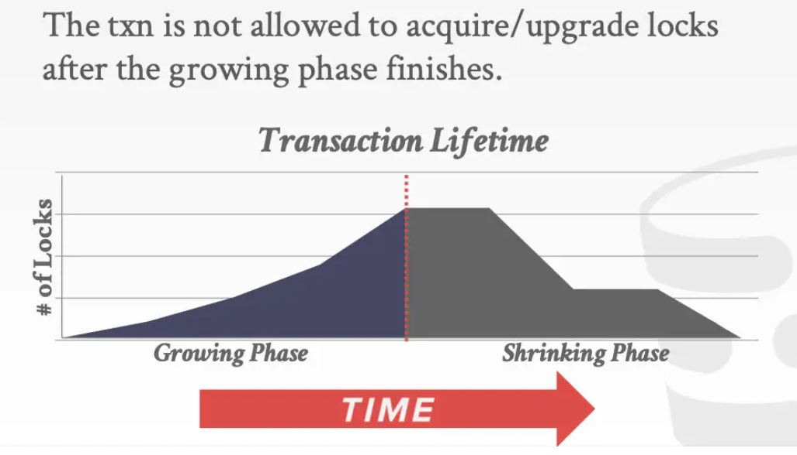
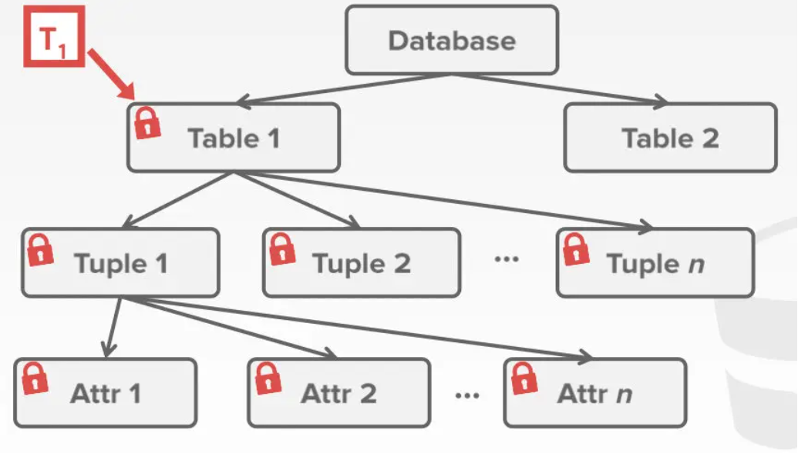
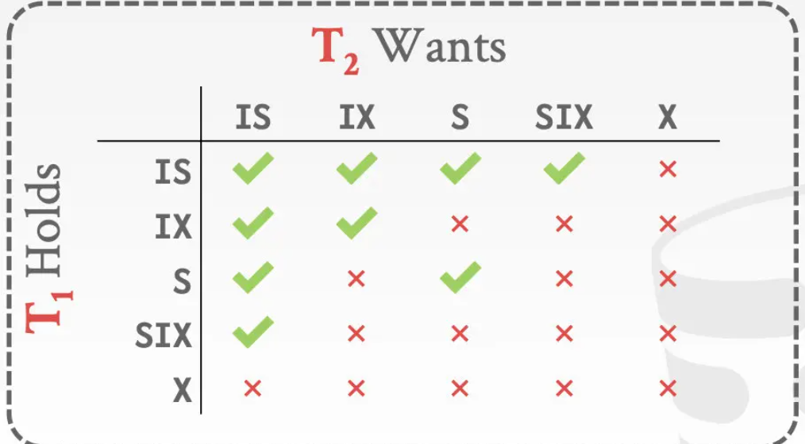
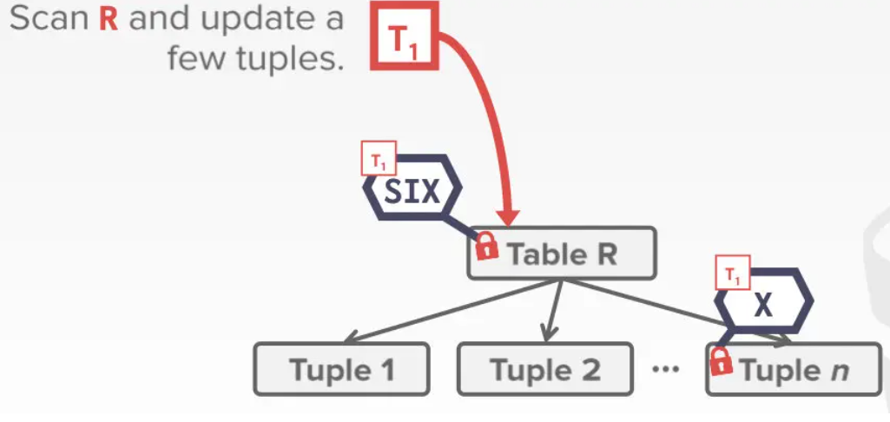
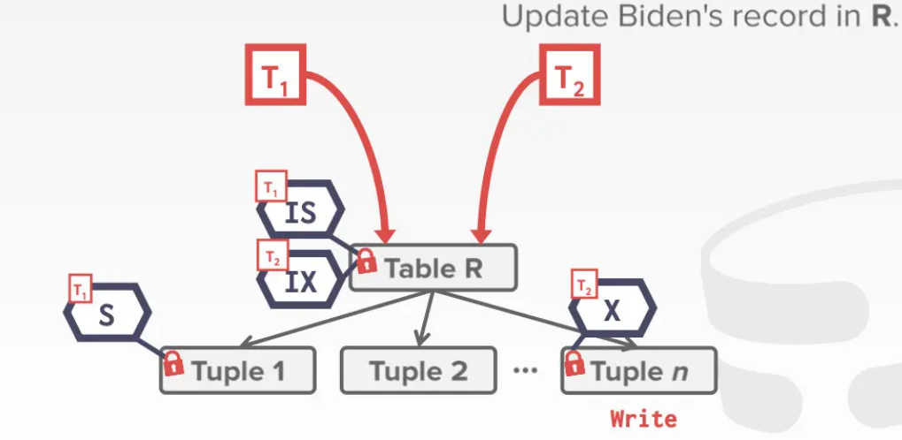
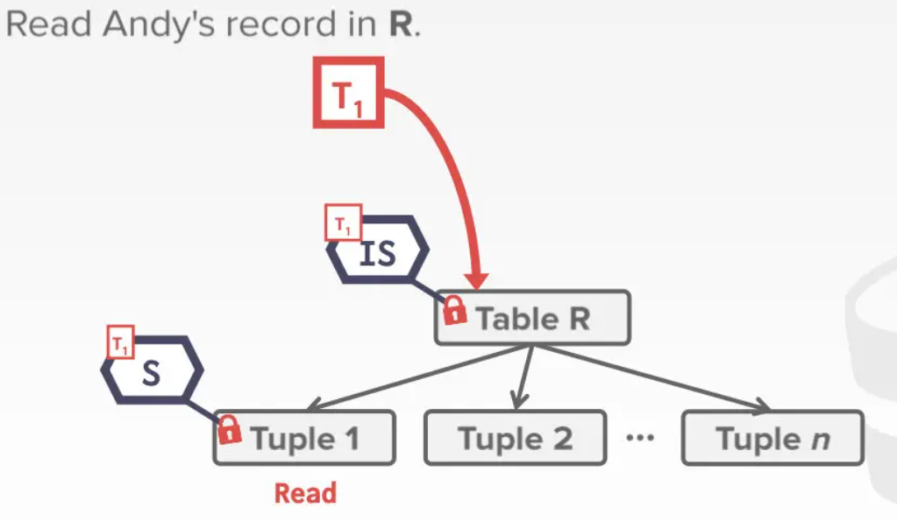
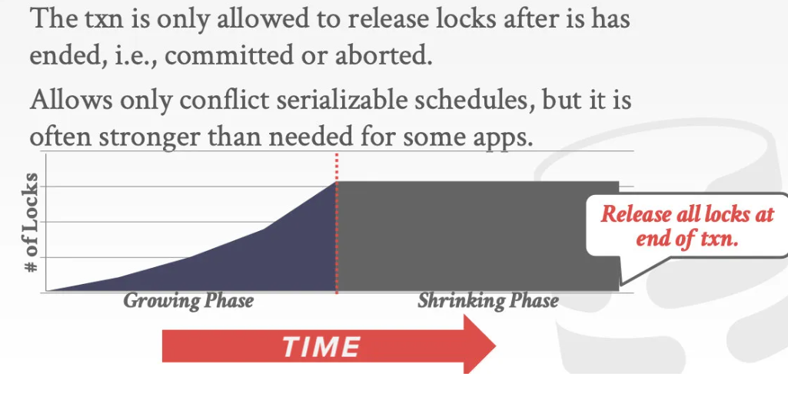

- 上一节中所介绍的判断执行调度是否满足冲突可串行化的方法需要等到执行调度里所包括的多个事务都**执行完之后**才能判断出这个执行调度是否可串行化。但等到执行调度所包括的事务全都执行完并提交了之后，它们就都已经完成了对DBMS的更新，如果这个执行调度是不可串行化的，那么DBMS的一致性就会被破坏，因此这种检测可串行化的方式是**无济于事**的。
- 相应的解决方法是我们用锁来保护数据库中的被共享的对象，从而避免数据竞争。
- Lock
	- Lock保护的不是具体的数据结构，而是数据库的抽象的内容，比如说向锁管理器申请的可以是对数据库的表的某一行的锁，这个锁会保护涉及这一行的所有的索引里面关于这一行的部分。
	- 先获取Lock，在对这个逻辑对象内部的数据结构实际进行操作时再获取Latch。
- 两种Lock
	- S-Lock: 共享锁，读锁
	- X-Lock: 排他锁，写锁
- 在带有Lock的情况下，事务执行的过程
	- 事务获取锁(更新锁)
	- 锁管理器授权或阻塞事务
	- 事务释放锁
	- 锁管理器更新内部的lock-table
		- lock-table负责记录哪些事务持有锁，哪些事务仍在等待
- 普通的加锁，并不能保证本次调度的执行结果正确，需要一些额外的规则限制
- 二阶段锁 Two-Phase Locking
  id:: 6666a683-b051-4d25-a4f6-9e91200fafb4
	- 二阶段锁是一个并发控制协议，它规定了一个事务在运行的过程中如何跟其他事务之间协调锁，从而实现可串行化。
	- 使用两阶段锁不需要提前知道完整的执行调度，它会在调度进行的过程中避免不可串行化的情况发生.
	- 两个阶段
		- 阶段1：Growing
			- 事务只能不断地请求获得锁，不能释放锁
		- 阶段2：Shrinking
			- 事务只能释放锁，不能再获取新的锁
		- {:height 241, :width 304}
	- 在使用了二阶段锁协议后，相应的执行调度对应的依赖图（Dependency Graph）一定没有环，二阶段锁可以严格地保证冲突可串行化
	- 但会出现 ((6666a76e-9c0e-45cf-962c-33b69d8934cf)) 的问题，解决方式是使用 ((6666a83a-aace-4db8-a531-c55396dad6e6))
	- 会导致 ((6666a8f6-9b85-44e3-84a6-5a0a4f4acf36)),解决方式是 进行 ((6666a99c-d11c-4ba4-bf97-a8d4b682ebe7))  或 ((6666a9b2-20d7-48e2-ae04-68a184444034))
- 锁粒度 Hierarchical Locking
	- 如果一个事务想修改很多很多个tuple，那么它就要不停地获取/释放tuple的锁，这会带来很大的开销，导致性能变差.
	- DBMS可以根据实际情况对锁的粒度进行调整,从而减少事务需要获取的锁的数量.
		- {:height 127, :width 202}
	- 如果想获取table的锁，需要检查它的全部tuple的锁的情况,如果检查到了最后一个tuple才发现有tuple被其他事务锁住，这便十分低效.
	- ((6666abad-8b2f-4360-8bfd-1d59a597b489))的出现，可以解决这一问题
-
- 意向锁 Intention Locks
  id:: 6666abad-8b2f-4360-8bfd-1d59a597b489
	- 通过对table这种更高层级的对象加一些**标记**来表明它是否含有被锁住的tuple，有了这样的意向标记s（它并没有真的锁住table），想获取table的锁的事务就不必逐个检查这个table里的tuple
	- 三种意向锁
		- 意向共享锁 IS
			- table含有的tuple中有被上共享锁的
		- 意向排他锁 IX
			- table含有的tuple中有被上排他锁的
		- 表共享锁+意向排他锁 SIX
			- table含有的tuple中有被上排他锁的，并且整个table也被上了共享锁
	- 锁获取协议
		- 要想获取当前节点的共享锁S 或是 意向共享锁IS，需要最低持有其父节点的IS锁。
		- 要想获取当前节点的排他锁X、IX 或 SIX ,需要最低持有期父节点的IX锁。
		- {:height 129, :width 246}
	- 加锁场景举例
		- SIX `Scan R and update a few tuples`
		  collapsed:: true
			- {:height 124, :width 251}
		- IX `update Biden's record in R`
		  collapsed:: true
			- {:height 152, :width 228}
		- IS `Read Andy's record in R`
		  collapsed:: true
			- {:height 157, :width 244}
		-
- 级联回滚 Cascading Aborts
  id:: 6666a76e-9c0e-45cf-962c-33b69d8934cf
	- T1修改表A之后释放了A的锁，T2在T1的修改基础之上进行了修改。但T1最终需要Abort 回滚，那么T2就必须跟着T1一起回滚。
- 严格二阶段锁协议 Strong Strict 2PL
  id:: 6666a83a-aace-4db8-a531-c55396dad6e6
	- 事务所修改的数据在事务结束之前，其他事务都不能读写。它只比串行执行好那么一点点。
	- {:height 174, :width 295}
- 死锁 deadlock
  id:: 6666a8f6-9b85-44e3-84a6-5a0a4f4acf36
	- 两个事务之间互相持有并等待对方的资源释放。
- 死锁检测 Deadlock Detection
  id:: 6666a99c-d11c-4ba4-bf97-a8d4b682ebe7
	- DBMS内部会维护一个锁等待图（waits-for graph），图中每个节点对应一个事务，每条有向边对应一个锁的等待关系。
	- DBMS会周期性地检查这个图，看看图里有没有成环，如果有的话就会想办法把环给解开。
	- 如果DBMS检测到锁等待图里出现了环，那就会选择一个事务牺牲，让它回滚，这样环就会解开，死锁被拆除（这和哲学家吃饭问题很像）。
	- 被牺牲的事务要么重启、要么中止
		- 如果中止，用户的业务代码会收到SQL执行失败的错误提升，并返还给前端，如“充值失败，庆稍后再试”
		- 重试，是因为SQL是由定时任务发起的，如果abort了用户可能不知道，就需要DBMS去重启事务。
	- 死锁的检测频率、被牺牲事务的选择方式 都需要去权衡trad-off
	- 被牺牲的事务回滚到何种程度，也有两个方案
		- 完全回滚，到它开始执行时的状态，就好像它没发生过
		- 最小化地去回滚，去判断到底是哪几个SQL语句造成的死锁，回滚到这些语句还没开始执行的状态即可，没必要完全回滚，并且与此同时让其他事务继续执行。
- 死锁预防 Deadlock Prevention
  id:: 6666a9b2-20d7-48e2-ae04-68a184444034
	- 根据时间戳给各个事务优先级，规定越先开始的事务它的优先级越高。eg:先执行的事务T1 > 后执行的事务T2
	- Wait-Die
		- T1想获取T2的锁时，等待T2主动释放锁
		- T2想获取T1的锁时，T2直接abort回滚
	- Wound-wait
		- T1想获取T2的锁时，T2直接abort回滚
		- T2想获取T1的锁时，等待T1主动释放锁
	- 两个方案本质上是不让事务之间互相等待。
	- 因为预防死锁被abort了的事务重新开始执行时，它的**时间戳（即优先级）不会发生变化**，不然就有可能一直因为优先级太低被abort，造成饥饿
-