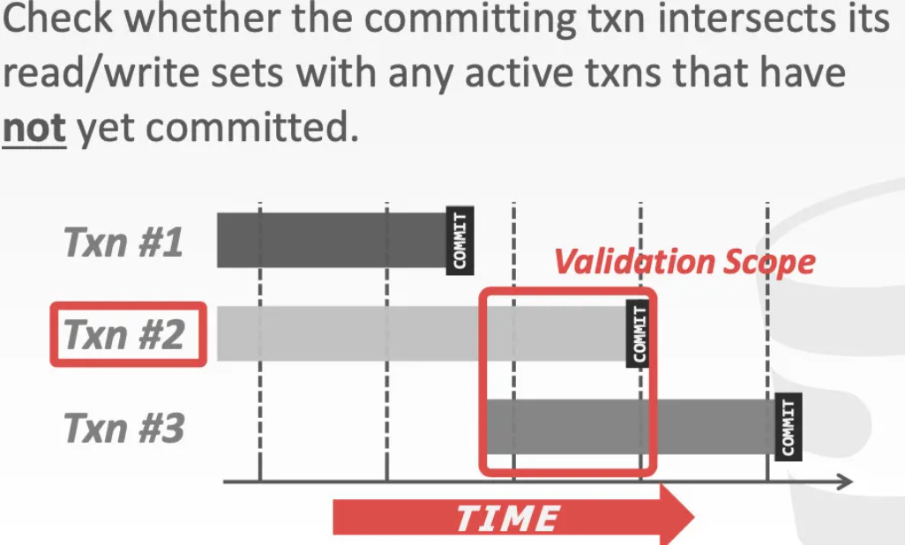

- 是一种乐观的并发控制方式。它的基本原理是，给每个事务一个时间戳，根据事务的时间戳来决定它们的顺序以及出现冲突操作时该如何处理。
- 如果事务Ti的时间戳在Tj之前，那么DBMS要保证这两个事务都被提交之后的效果相当于Ti先执行，Ti执行完了之后Tj再执行
- 时间戳分配 Timestamp Allocation
	- 对于每一个事务Ti，都会被分配到一个全系统唯一的并且是单调递增的时间戳。
	- 具体的实现策略有三种
		- 系统时钟
			- 缺点：需要每隔一段时间进行校准，站在本地机器的角度来看，会出现“突然被调慢了一分钟”的情况，导致时间戳顺序发生混乱
		- 逻辑计数器
		- 两者的混合(#雪花算法 ) 多用于分布式系统
- 基础时间戳排序协议 Basic Timestamp Ordering(T/O) Protocol
	- 事务在读写时不加锁
	- 对每个对象X(每一条数据记录)，都额外附带两个时间戳，由上次成功的读/写操作更新
		- W-TS(x) 在ts时刻写入x
		- R-TS(x) 在ts时刻读取x
	- 每次读写前，都要检查这两个时间戳：比较当前事务的时间戳和将要进行读写的对象的时间戳，要求是“不能操作未来的数据”。 ((666d7bb8-b76b-4a7c-a64a-57cdd9e59e27)) ((666d7d4c-a5f7-44cb-be4e-708f0ff5ed04))
	- 如果不考虑 ((666d7dd3-13b1-4d1c-baf0-1a6fdc0fe9c8))带来的优化，基础T/O协议会产生 ((66667615-6a45-4a8d-af11-3e216fd97f89))
		- 优点是不可能构成死锁，因为没有事务会进行等待
		- 缺点是 执行时间较长的事务(上白条SQL语句的批量操作)可能会“饥饿”；数据的copy会带来不小的开销
			- 长事务的饥饿：长事务执行了一段时间之后，想要访问的数据都是被比它更“年轻”的事物修改过的，那它只能abort，重启之后又迎来同样的结局
	- 基础T/O协议的执行调度是不可恢复的 ((666d7efa-2e63-4b9b-8538-5ca317562a80))
		- 很有可能一个长事务执行半天然后abort了,短事务都commit很多了
	- ------
	- 读流程 Reads
	  id:: 666d7bb8-b76b-4a7c-a64a-57cdd9e59e27
		- 如果 `TS(Ti)<W-TS(X)`, 这就属于“操作来着未来的数据”了，当前事务Ti abort，之后系统再给这个事务一个新的时间戳，并重启事务。
		- 否则，就是合法的。
			- Ti可以读取对象x
			- 更新`R-TS(X) = max(R-TS(X),TS(Ti))`
			- copy对象x到事务本地，确保之后读取的x都是这份副本
				- 对象x可能接下来会被其他事务修改
	- 写流程 Writes
	  id:: 666d7d4c-a5f7-44cb-be4e-708f0ff5ed04
		- 如果 `TS(Ti) < R-TS(X)` or `TS(Ti)<W-TS(X)`, abort然后重启Ti
		- 否则
			- 对X进行写操作，并更新W-TS(X)
			- 也将其copy一份到事务本地
	- 托马斯写规则 Thomas Write Rule
	  id:: 666d7dd3-13b1-4d1c-baf0-1a6fdc0fe9c8
	  collapsed:: true
		- 如果`TS(Ti) < R-TS(X)`,abort然后重启Ti
			- 说明比Ti更靠后的事务读取了该对象的值，不能让Ti进行写操作
		- 如果`TS(Ti)<W-TS(X)`
			- 比Ti更靠后的事务已经修改了该对象的值，如果不提交Ti修改记录也没事。等效于 Ti完成了写操作但被Tj的写操作覆盖了
		- 否则
			- 对X进行写操作，并更新W-TS(X)
- 乐观并发控制 OOC Optimistci Concurrency Control
  collapsed:: true
	- DBMS为每个事务创建一个独有的workspace
		- 任何需要读取的数据都copy一份到该空间
		- 修改操作也只作用于该空间
	- 当事务Commit时，DBMS会将要提交的数据更新和其他事务要提交的更新进行比较
		- 如果没有冲突，一次性地把事务所做的所有更新都提交
		- 如果发现冲突，事务会abort
	- OOC的三个阶段
		- 1-读取
			- 执行SQL语句中的读和写入，将结果保存在workspace里
			- DBMS为确保数据的可重复读，会将事务需要访问的所有数据从db中复制到workspace
		- 2-校验
			- 事务执行完了准备提交时，把它完成的数据更新和其他事务相比较。如果校验通过，那么就转至下一个阶段，否则abort并重启事务
			- 数据库中的对象只有写时间戳，**先进入校验阶段**的事务会先拿到较早的时间戳，在进入校验阶段之前事务都没有自己的时间戳
			- ((666d8624-20ea-4d7f-814c-0a6b89650623))
			- 两种具体的实现方式
				- ((666d87a3-1ff1-425f-9006-970d345e6ebe))
				- ((666d87c6-50ce-4e68-972b-7c509c2ace87))
		- 3-写入
			- DBMS执行事务Ti的所有写入集合，写入db并确保对其他事务都可见
			- 同一时刻，只能用一个事务进入写入阶段。
				- 使用写锁 Write Latch
				- 虽然这牺牲了并发性，但由于前面已经准备好了要写的数据，所以写操作的时间并不长，因此开销可以接受
	- 优点
		- OOC适用于事务之间冲突不多的场景
		- 如果数据库很大，事务里的查询是非倾斜的（也就是说没有特别热点的数据），出现事务间冲突的概率就比较小，可以考虑OCC，否则就会出现频繁的事务回滚，性能下降。
	- 缺点
		- 也会copy数据到本地
		- 校验和写入阶段是性能瓶颈
			- 校验阶段的逻辑复杂
			- 写入阶段是串行化的
		- 不同于 ((6666a683-b051-4d25-a4f6-9e91200fafb4)),OOC如果中途校验失败，只能完全回滚。而2PL支持最小化的回滚
	- ---
	- 校验流程
	  id:: 666d8624-20ea-4d7f-814c-0a6b89650623
		- DBMS需保证遵守 ((666672ae-8e30-4ad8-bce1-204cd6572189))原则
		- 会检查RW与WW冲突，判断依赖图是否成环
	- 向后校验 Backward Validation
	  id:: 666d87a3-1ff1-425f-9006-970d345e6ebe
		- 对于事务T2来说，需要向已经Commit过的事务校验。判断事务T1和事务T2之间的冲突操作是否成环；如果成环，当前事务T2 abort
		- {:height 173, :width 254}
	- 向前校验 Forawrd Validation
	  id:: 666d87c6-50ce-4e68-972b-7c509c2ace87
		- 事务T2提交的时候，事务T3还没有执行完，因此只会校验事务T2和事务T3有重叠的部分
		- {:height 160, :width 255}
		- 如果校验的那一部分中出现了成环的冲突操作,可根据情况选择其中的一个abort
		- 假设`TS(Ti)<TS(Tj)`,具备下列三种情况之一才能校验通过
			- 执行调度本身就是串行的
			- Ti在Tj进入写阶段之前完成，并且Ti要修改的那些对象没有被Tj读过
				- 这是不满足条件的
				- {:height 175, :width 308}
			- Ti先于Tj完成读阶段 且 Ti修改的对象Tj既没有读过也没有修改
	-
- 幻读问题
	- 二阶段锁和OCC这些都预防不了幻读，都是只考虑已经存在的对象
	- 三种解决方案
		- Re-Execute Scans 二次扫描
			- 记录下来事务所有可能出现幻读的地方(涉及到范围扫描的操作)
			- 在事务提交之前会再执行一遍前面所记录的所有扫描
		- Predicate Locking 谓词锁
			- 给select语句中的where子句加共享锁Share lock
			- 给update/insert/delete语句中的wherer子句加独占锁Exclusive lock
		- Index Locking 索引锁
			- 如果谓词里的attr具有索引，可以给相关的**索引页**上锁
			- 如果没有相关索引，就使用**表锁**这种宽范围的锁
		- MySQL中的间隙锁：在进行范围扫描的时候会**同时锁数据和间隙**，这样的话间隙里就不能插入数据。这和索引锁类似。
- 2PL 和 T/O这些，都是为了实现串行化这样一个最高的事务隔离级别。实际的业务场景里有些业务可以忍受非串行化的执行调度。
-
- ------
- 可恢复的执行调度 Recoverable Schedules
  id:: 666d7efa-2e63-4b9b-8538-5ca317562a80
	- 如果 事务在修改共享对象时，都是在其他事务已提交对共享对象的更新的基础上去修改，那么，这份调度就是可恢复的
	- 否则，DBMS很难保证在崩溃后恢复时数据的一致性
	- {:height 217, :width 356}
-
-