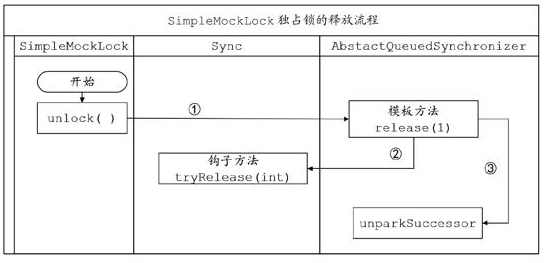

- 是[[Java CLH锁]]的一个变种
- AQS中的核心变量
	- 状态标志位 state
	  id:: 63a3d2e8-2cb5-4e3c-9089-94547ab24970
		- `private volatile int state;` 使用volatile保证可见性
		- 使用CAS操作修改其值，保证 原子性
		- 0-未锁定 1-锁定 >1 - 重入锁定
	- 队列节点 Node
		- 节点状态值 waitStatus
		  id:: 63a90e4f-5fc9-484a-8419-d4becbeb3522
			- 0 初始状态
			- 1 Cancelled 取消状态
				- 抢锁请求被取消
			- -1 Singal 后继线程处于等待状态
			- -2 Condition 当前线程正在进行条件等待
			- -3 Propagate 共享锁操作需要无条件传播
	- 持有head和tail，构成FIFO的双向队列
- AQS与JUC之间的关系
	- 
- 如何自定义一把锁
	- `public class SimpleMockLock implements Lock` 实现Lock接口
		- `lock()`与`unlock`方法则委托给`sync`对应的方法
	- `private static class Sync extends AbstractQueuedSynchronizer` 继承QAS的内部类Sync
		- 并实现 `tryAcquire()` 和`tryRelease()`方法
- AQS抢锁流程
	- 
	- 钩子实现：tryAcquire(arg)
	  id:: 63a909a2-d497-4118-8d71-7dc9450db6fa
	  collapsed:: true
		- `compareAndSetState(0, 1)` CAS更新 ((63a3d2e8-2cb5-4e3c-9089-94547ab24970)) 为1
			- 更新成功，表示成功占用，返回true
			- 失败，则进入 ((63a90dce-30f0-47bd-bd5b-245672491108))  方法
	- 直接入队：addWaiter
	  id:: 63a90dce-30f0-47bd-bd5b-245672491108
	  collapsed:: true
		- 创建新节点 `Node node = new Node(Thread.currentThread(), mode);`
		- 尝试通过CAS操作修改队尾 `compareAndSetTail(pred, node)`
		- 修改成功，则返回
		- 修改失败，则进入 ((63a90f60-d9ef-4cbf-8659-f39ab07b59b1))
	- **自旋入队：enq**
	  id:: 63a90f60-d9ef-4cbf-8659-f39ab07b59b1
		- 这是一个无条件的for循环
		- if 队列为空，初始化尾节点和头节点（CAS操作）
		- else 队列不为空，将新节点插入队列尾部(CAS操作)
	- **自旋抢占：acquireQueued()**
		- 这是一个无条件的for循环,操作的是自己的**prev节点**
		- if 自己的prev 是head && 当前线程 ((63a909a2-d497-4118-8d71-7dc9450db6fa)) 抢锁成功
			- 将当前节点设置为头节点，移除旧的头节点
			- 退出循环
		- if ((63a91217-5443-4b1d-bb42-fab408fa3269)) && ((63a91222-b070-45c0-9a6d-11424e16975a))
		- finally (timeout\被中断了) 将当前节点从队列中移除
	- 挂起预判：shouldParkAfterFailedAcquire()
	  id:: 63a91217-5443-4b1d-bb42-fab408fa3269
	  collapsed:: true
		- 将当前节点的有效prev节点找到，并设置prev. ((63a90e4f-5fc9-484a-8419-d4becbeb3522)) = -1 具体可分为三种情况
			- prev的状态已经为-1，直接返回true
			- prev的状态为1(Cancelled )，循环向前找到一个有效节点，调整它的next指针指向自己
			- prev的状态为其它情况，则通过CAS操作设置状态为-1
				- 状态=-3的情况。 在使用共享锁的时候出现，并且只可能设置在head上
				- 状态=0的情况。
					- 节点刚成为新队尾，但还没有将旧队尾的状态设置为SIGNAL
					- 节点的前驱节点为head
	- 线程挂起：parkAndCheckInterrupt()
	  id:: 63a91222-b070-45c0-9a6d-11424e16975a
	  collapsed:: true
		- `LockSupport.park(this);` 挂起自己，进入 waiting状态
		- `return Thread.interrupted();` 被唤醒后，检查自己是否被中断
		- 何时唤醒？头节点释放锁，`LockSupport.unpark(postThread)` 唤醒后继节点
- AQS释放锁流程
	- 
	-