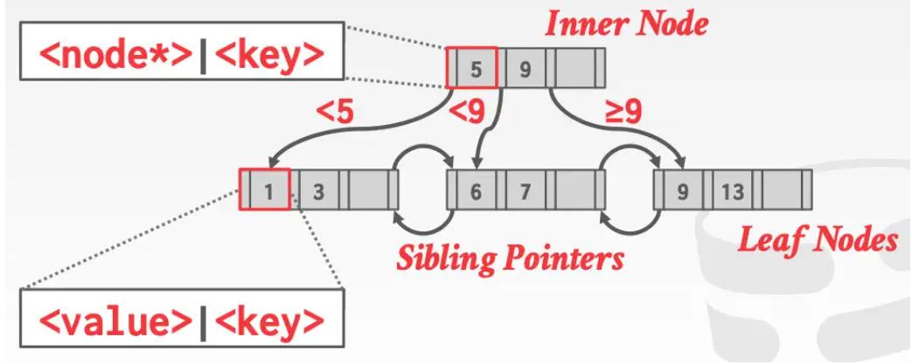

- B+树是一个自平衡的树型数据结构。它在排序、搜索、区间访问、插入和删除时，都是O(logN)。
	- {:height 115, :width 285}
	- 有M个子节点，每个子节点都有差不多的深度；
	- 包含[M/2 -1,M-1]个KV， `M/2 -1 <= keys.size() <= M-1`
	- 每个非叶子节点有k个key，k+1个非空指针指向child
- B+树如果设计得合理，可以使得
- Leaf Node 的结构
	- Level-- 处在树中的层级
	- Slots -- 空闲槽的数量
	- Prev、Next 指针
	- Sorted keys [ ]
	- Values[] 既可以存 Record ID 也可以存整个Tuple数据
- B+树的插入 --页分裂
	- 找到正确的Leaf Node
	- 将数据翻入Leaf Node 并符合排序
		- if LeadNode有空间 return
		- else 将LeafNode中的keys拆分到 LeafNode 和 LeafNode2
			- 从中间的key平分，middle key被分到 LeafNode2
			- 插入新生成的指向LeafNode2的指针到父节点和middle key
- B+树的删除 -- 页合并
	- 从root节点开始，找到包含entry的LeafNode
	- 移除entry
		- if LeafNode.size() > M/2 -1 return
		- else: 合并周边节点
			- 试着向兄弟节点“借”entry
			- 如果不行，合并LeafNode和兄弟节点
			- 如果合并发生，必须删除父节点中，与合并有关(LeafNode or 兄弟节点 )的keys
- B+树的具体实现策略
	- Node Size -- 一个节点的leaf node 的数据大小正好就是一页
	- Merge Threshold -- 节点合并的阈值
	- Variable-Length Keys -- 可变长度的Key
		- 如果拿字符串当作索引的Key，那么很有可能它是变长的
		- 存储Key的指针
		  logseq.order-list-type:: number
		- Node节点页可变长度
		  logseq.order-list-type:: number
		- 前导0填充
		  logseq.order-list-type:: number
		- Key Map 中间槽
		  logseq.order-list-type:: number
			- 点里面有数组形式排布的slot，slot中存储指向对应KV的指针
			  logseq.order-list-type:: number
- B+树的存储优化方案
	- 前缀压缩
	- 去重
	- 按批插入
-