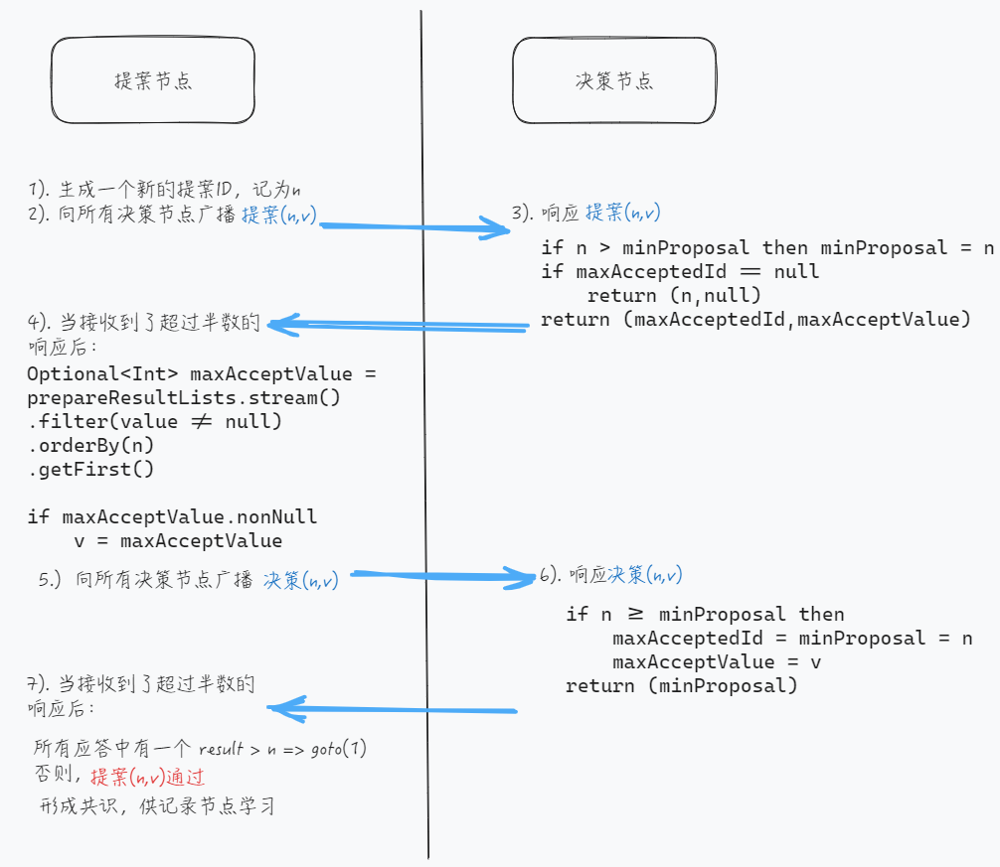

- 前置条件
	- 只作用与**单个值**
	- 信息在集群中的传播可能发生**丢失和延迟**，但不考虑篡改
- 主要角色
	- 提案节点 Proposer
		- 负责**提出对某个值进行设置操作**，设置值这个行为被称为提案。请注意，这里的“设置值”不要类比成程序中变量赋值操作，应该类比成日志记录操作。
	- 决策节点 Acceptor
		- 决定收到的提案是否可被接受。提案一旦得到过半数决策节点的接受，即称该提案被**批准**。提案被批准即意味着该值不能再被更改，也不会丢失，且最终所有节点都会接受该它。
		- 决策节点至少会保存三个值
			- 最新合法提案ID minProposalID
			- 最近批准的合法提案数据 (maxAcceptedID,maxAcceptValue)
	- 记录节点 Learner
		- 不参与提案，也不参与决策，只是单纯地从提案、决策节点中学习已经达成共识的提案。通常是上线后的节点进行数据同步。
- 执行过程
	- 
	- 一个提案数据包含两个字段**(n,v)**,其中n为全局唯一序列号且会单调递增，v为提案值。
	- 准备阶段 Prepare
		- 一个提案节点 向 所有决策节点 广播自己的提案。每一个决策节点在收到提案后，会给予提案节点承诺与应答，并更新 最新合法提案ID
			- 承诺不再接受**提案ID <= n **的 准备请求(Prepare)和 接收请求(Accept)
			- 应答则可以分为三种情况：违反承诺不予应答、提案首次设值 返回(n,null)、提案非首次设值 返回(maxAcceptedID,maxAcceptValue)。
			- if n > minProposalID then minProposalID = n
	- 批准阶段 Accept
		- 提案节点**收到了超过半数决策节点的应答**后,会发生两种情况
			- **所有**响应的决策节点此前都没有批准过该值，构造 (n,v) 再次广播给全部决策节点
			- **至少一个节点**的应答中包含有值，从应答列表中选出**提案ID最大的那个的值**，构成(n,maxAcceptValue)再次广播给全部的决策节点。
		- 决策节点在收到Accept提案包后，也会发生两种情况
			- n >= minProposalID ,表明此时没有比n新的提案参与竞争，此accept可以被接受。将更新(maxAcceptedID,maxAcceptValue) 以及 minProposalID。然后返回 n。
			- 反之，n < minProposalID，表明此时有更新的提案参与竞争。决策节点将不会接受此次提案。然后返回 minProposalID。
		- 提案节点**收到了超过半数决策节点的应答**，判断接受情况
			- **所有**返回值result <=n, 提案通过。形成决议，共记录节点学习
			- **至少一个**节点返回的result > n, 需要重新生成提案ID(将会比minProposalID 大)，再次执行此过程。
-