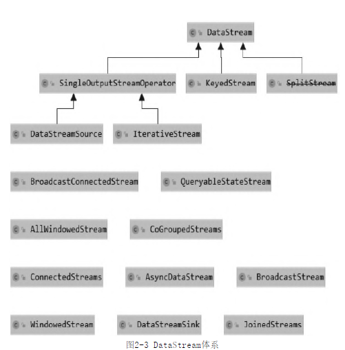
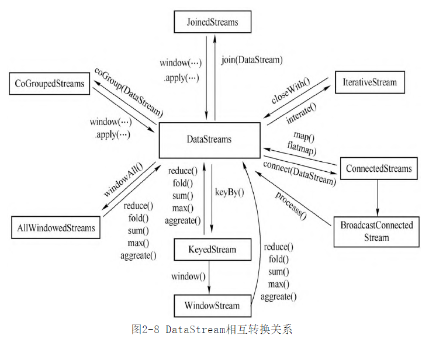
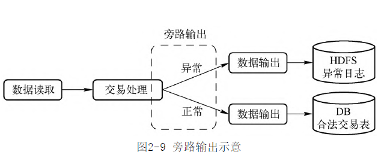

- 类关系图
	- 
	- 
-
- 数据读取
	- 从内测读取数据
	- 从文件读取数据
	- Socket接入数据
	- 自定义连接器
- 数据处理
	- https://nightlies.apache.org/flink/flink-docs-master/docs/dev/datastream/operators/overview/
	- 基本算子
	- 聚合算子
	- window算子 [[Flink Windows]]
- 数据写出
	- 写到Console
	- 写到Socket
	- 自定义Sink
- 旁路输出 SideOutput
	- 将一个DataStream按条件切分为多个子数据流,分别交给下游处理
	- 
	- 条件=OutputTag
	- 只有在特定操作时,才能使用旁路输出
- [[Flink Transformation]]