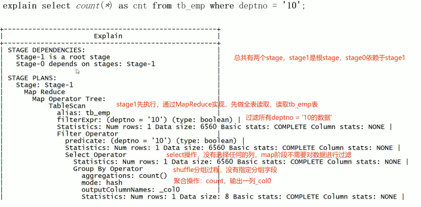

- 语法
	- 
		- formated 返回JSON格式的执行计划
		- extended 提供一些额外的新，如文件的路径信息
		- dependency 返回JSON格式的查询所依赖的表和分区
		- authorization 列出需要被授权的条目，包括输入\输出
- 构成
	- [[抽象语法树 AST]]
	- Stage 的依赖关系
	- Stage 的内容
	- {:height 356, :width 705}
	- Fetch Operation 抓取操作，并没有开启 [[MapReduce]]
-
	-