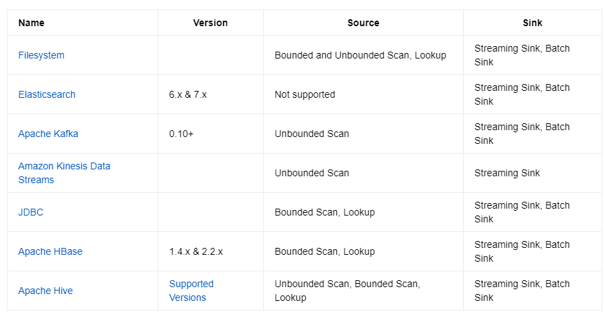

- 预定义的Source和Sink
	- 基于文件的
	- 基于Socket
	- 基于Collections\\Iterators \\Print
- [Bundled Connectors](https://nightlies.apache.org/flink/flink-docs-release-1.14/docs/connectors/datastream/overview/) (Flink项目的一部分,但是独立发包)
	- Apache [[Kafka]] (source/sink)
	- Apache Cassandra (sink)
	- Amazon Kinesis Streams (source/sink)
	- [[Elasticsearch ]] (sink)
	- [[Hadoop]] FileSystem (sink)
	- RabbitMQ (source/sink)
	- Apache NiFi (source/sink)
	- Twitter Streaming API (source)
- [Apache Bahir](https://bahir.apache.org/) 中的连接器(Bahir 扩展了Flink的Connector 和 Spark的DStream)
	- ActiveMQ
	- Akka
	- Flume
	- Redis
	- Netty
- Async I\O
	- 异步IO,通过数据连接,向数据库交换数据
- [Table & SQL 级别支持的Connecto](https://nightlies.apache.org/flink/flink-docs-release-1.14/docs/connectors/table/overview/)
	- 
	- |*Name*|*Version*|*Source*|*Sink*|
	  |Filesystem||1|台|
	  |Elasticsearch|6.x & 7.x|3|台|
	  |Apache Kafka|0.10+|2|台|
	  |JDBC||
	  |Apache HBase|	1.4.x & 2.2.x|
	  |Apache Hive||
	-
	-