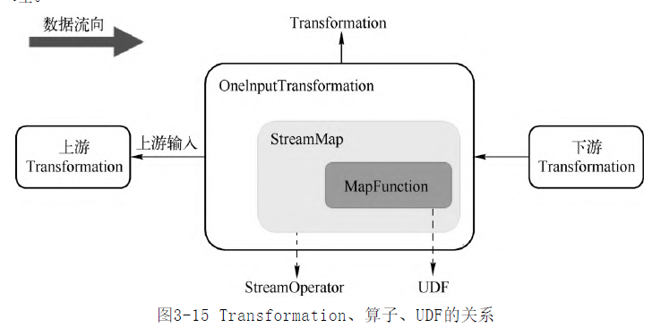
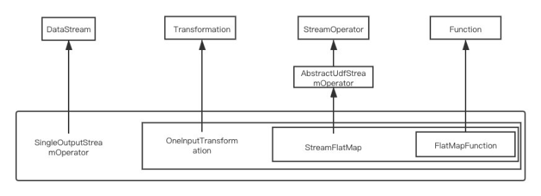
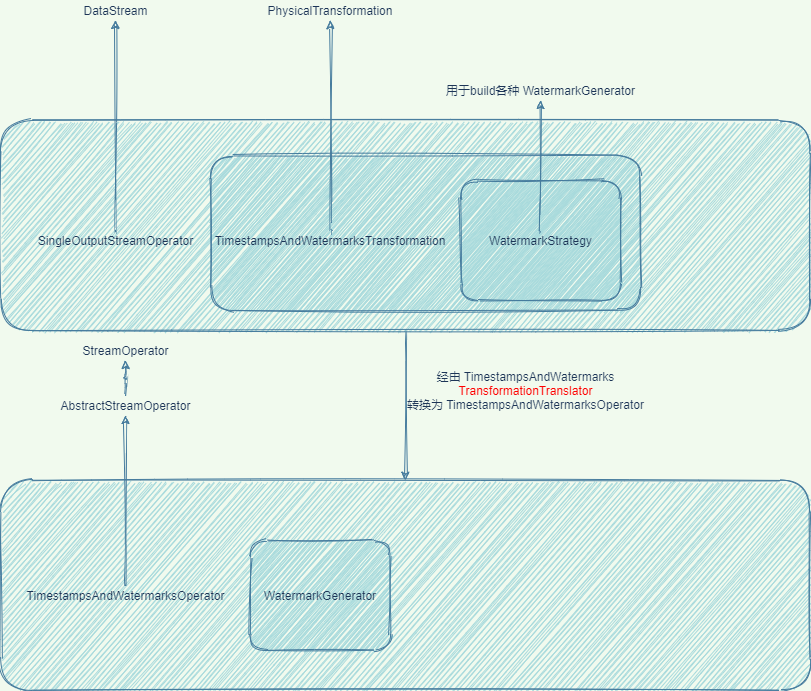

- transformation是处理行为的抽象,包含了数据的读取\计算\写出. 在job执行之前,[[DataStream API]] 组成的pipeline 将会转换为 transformation pipeline
- Transformation 有两大类 继承了PhysicalTransformation的称为**物理TS**,其他称为**虚拟TS**
- Transformation 与 [[Flink StreamOperator]] [[Flink UDF]] 的关系
	- 
- 如何通过阅读[[DataStream API]]源码,找到并画出这个图? 以`dataStream.flatMap()`为例
  id:: 62ab28d3-639a-4f38-a7da-8d0c0688a24f
	- 方法一
		- 通过代码,跟进flatMap方法,主要看return对象是如何构造出来的
		- 直到 `doTransform` 方法,可以看到对应的Transfromation是 `OneInputTransformation`
		- 然后关注 [[Flink StreamOperator]] 是如何构造出来的,需要向外回溯,可以看到对应 `StreamFlatMap` 方法
		- 最后关注 [[Flink UDF]] 找到了`FlatMapFunction`
		- 
	- 方法二
		- 通过代码跟进,可以找到`DataStream `和 `Transformation`
		- 然后通过 `TransformationTranslator `找到 `StreamOperator `和 `Function`
		- 
		  id:: 62b171e7-cc34-45b9-9fdd-4340c6281eaf
- 物理Transformation一共有如下4种
	- SourceTransformation
	- SinkTransformation
	- OneInputTransformation 单流输入
	- TwoInputTransformation 双流输入
- 虚拟Transformation
	- SideOutputTransformation 旁路输出
	- SplitTransformation 条件切分
	- SelectTransformation 选择过滤
	- PartitionTransformation 分区/Shuffle
		- 不包含StreamOperator 而是包含 [[Flink Partitioner]]
	- UnionTransformation 多个TS 合并
	- FeedbackTransformation&CoFeedbackTransformation 反馈
		- 把符合条件的数据重新发回上游Transformation处理
-