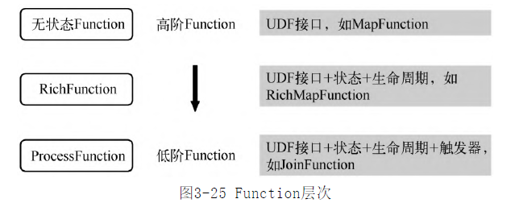

- User Defined Function 开发者编写的函数,广义理解也包括已经定义好的内置函数,分为3类
	- SourceFunction
	- SinkFunction
	- 普通Function
- UDF提供了3阶Function ,从高到低分别是
	- 
	- 无状态Function: 供开发者使用,无须关心定时器之类的底层概
	  念，只需要关注业务逻辑即可
	- RichFunction: 可以管理Function的生命周期;能够获取到执行时作业级别的参数信
	  息;有了状态的访问能力
		- 基本类型函数,如 RichMapFunction
		- 广播函数
		- 异步函数
		- 数据源函数
		- 输出函数
		- 检查点函数
	- ProcessFunction: 可以访问流应用程序所有（非循
	  环）基本构建块
		- [[Flink 数据流元素]]
		- 状态 state [[Flink State 状态]]
		- 时间 time [[Flink Time 时间]]
-