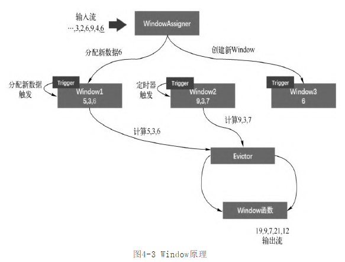
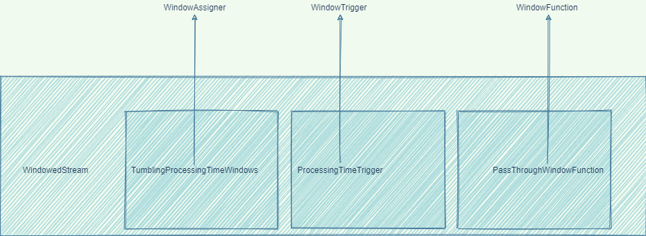
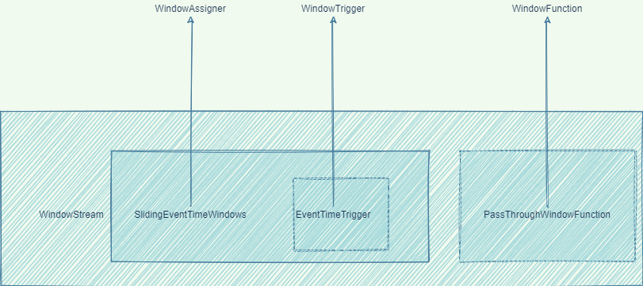

- 依据 [[Flink Time 时间]] 对流数据进行切分,称为窗口.
- 按切分规则的不同分为了3类窗口
	- {:height 639, :width 650}
	- Count Window 计数窗口
	- Time Window 时间窗口
	- Session Window 会话窗口
- 窗口构成
	- 
	- WindowAssigner 决定某个元素被分配到哪个/哪些窗口中去
	- WindowTrigger 决定了一个窗口何时能够被计算或清除
		- Trigger的触发结果分为4类
		  collapsed:: true
			- Continue
			- Fire
			- Purge
			- Fire + Purge
	- WindowEvictor 在Window Function执行前或后，从Window中过滤元素 **非必须项**.
		- CountEvictor: 计数过滤器 .保留指定数量的元素,从并从窗口头部开始丢弃其余元素 (FIFO)
		- DeltaEvictor:阈值过滤器. 计算窗口中每个数据记录，然后与一个事先定义好的阈值做比较，丢弃超过阈值的数据记录
		- TimeEvictor: 时间过滤器。保留Window中最近一段时间内的元素，并丢弃其余元素
			- [[Flink Time 时间]]
	- WindowFunction 计算函数
		- ReduceFunction `reduce()`
		- AggregateFunction 不同于`reduce()`的地方在于,增加了中间类型`ACC`
			- 例如求平均值时,acc保存了总和及个数.因为平均值无法累加在相除.
		- ProcessWindowFunction 是Window的最底层UDF,能够访问一些更加底层的数据 , [[Flink UDF]]
- 分析WorldCount demo中的`window()`操作
	- {{embed ((62aaf121-6b99-4b1e-a659-7852a75bc772))}}
	- 
	  id:: 62abf89c-d6c8-4278-8445-76fa64af63ae
	- 固定时间窗口,到期或填满元素会生成一个新窗口,因此没有WindowEvictor 操作
- 滚动窗口
	- `TumblingEventTimeWindows`和`TumblingProcessingTimeWindows`创建的滚动时间窗口分别对应 `Event Time`和`Processing Time`
	- ((62abf89c-d6c8-4278-8445-76fa64af63ae))
- 滑动窗口
	- `SlidingEventTimeWindows`和`SlidingProcessingTimeWindows`创建的滚动时间窗口分别对应 `Event Time`和`Processing Time`
	- 
- 会话窗口
	- `EventTimeSessionWindows`和`ProcessingTimeSessionWindows`创建的滚动时间窗口分别对应 `Event Time`和`Processing Time`
- WindowTrigger  和 WindowEvictor 的关系
	- ```java
	          TriggerResult triggerResult = triggerContext.onEventTime(timer.getTimestamp());
	  
	          if (triggerResult.isFire()) {
	              Iterable<StreamRecord<IN>> contents = evictingWindowState.get();
	              if (contents != null) {
	                // 这里调用了 evictBefore();userFunction.process()和 evictAfter();
	                // 如果没有配置Evictor 则直接调用userFunction.process()
	                  emitWindowContents(triggerContext.window, contents, evictingWindowState);
	              }
	          }
	  
	          if (triggerResult.isPurge()) {
	              evictingWindowState.clear();
	          }
	  ```
- 聚合优化
	-