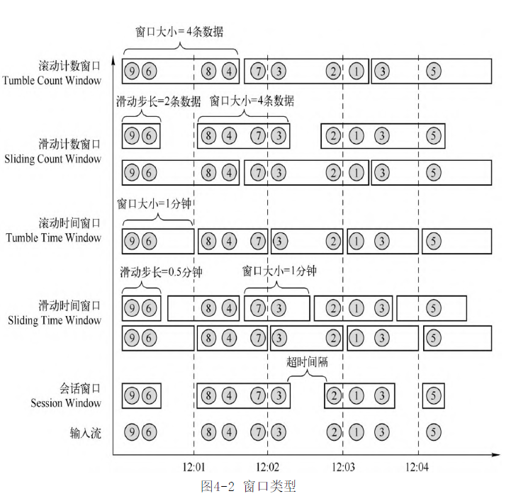

- 依据 [[Flink Time 时间]] 对流数据进行切分,称为窗口.
- 按切分规则的不同分为了3类窗口
	- {:height 639, :width 650}
	- Count Window 计数窗口
	- Time Window 时间窗口
	- Session Window 会话窗口
- 窗口原理
	- WindowAssigner
		- 决定某个元素被分配到哪个/哪些窗口中去
-