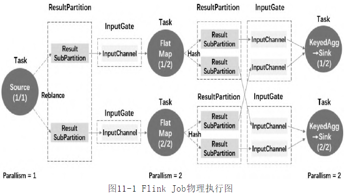

- 经Flink多层Graph转换后,作业进入调度阶段,最终生成物理执行图 ExecutionGrap
- ExecutionGrap 物理执行图
  id:: 62ebadaa-bc5f-4544-9b0e-e42f0977a8da
	- 
	- 该图并非Flink的数据结构.而是根据物理上各个Task关系生成的拓扑图.
- 核心对象
	- StreamInputProcessor 输入处理器
		-