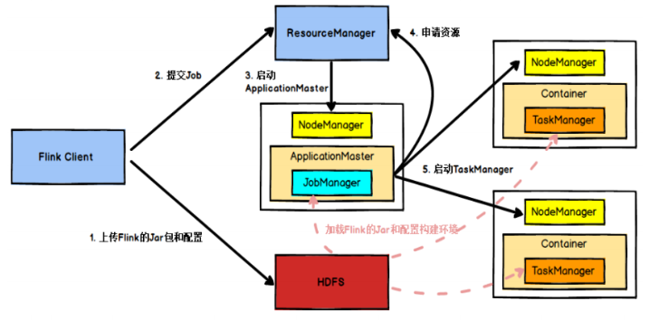
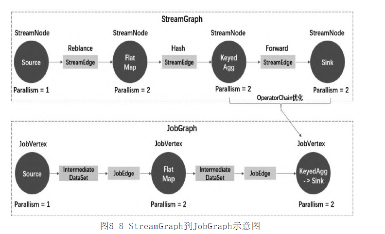

- 
	- 1. Client 向HDFS上传 Jar包和配置
	- 2. 之后Client向Yarn ResourceManager 提交任务; ResourceManager 分配Container, 并选举出Master节点 ApplicationMaster
	- 3. ApplicationMaster拉取Jar包和配置,启动自身的JobManager,JobManager向Yarn 申请 TaskManger资源.
	- 4. 资源分配完成后,由ApplicationMaster 通知启动 TaskManager
	- 5. TaskManager拉取Jar包和配置,启动. 之后向JobManager发送心跳包,等待分配任务.
- 代码执行过程
	- DataStream API -> Transform -> ((62eb6b03-24ff-48f7-80fb-10f23e1060d0))-> ((62eb6d5c-1c3d-40e9-b4b9-e7ad1e4dfd11))-> ExecutionGraph -> TaskGraph
- StreamGraph 流图
  id:: 62eb6b03-24ff-48f7-80fb-10f23e1060d0
	- Flink Client 触发 用户代码的main方法,用户编写的业务逻辑组装成 Transformation, 最后会触发 构建 StreamGraph
	- StreamNode 节点
		- 一个StreamNode从一个Transformation转换而来.
		- 也存在实体和虚拟之分.实体会变成物理算子,虚拟会附着在StreamEdge上
	- StreamEdge 边
		- 连接两个StreamNode.一个Node可以有多个出\入边.
		- 包含旁路数仓\分区器\字段筛选输出(select *)等信息
- JobGraph 作业图
  id:: 62eb6d5c-1c3d-40e9-b4b9-e7ad1e4dfd11
	- 在StreamGraph的基础上进行一些优化,如 通过OperatorChain机制将算子合并; 尽量调度在同一个Task线程上,避免跨线程跨网络传输.
	- 
	- JobVertex 顶点
		- 一个JobVertex包含一个或多个算子, 它的输入是JobEdge,输出是IntermediateDataSet
	- JobEdge 边
		- 连接IntermediateDataSet  和 JobVertex 的边,表示一个数据流转通道.
		- 它的数据分发模式会直接影响执行时Task直接的数据连接关系
	- IntermediateDataSet 中间数据集
		- 是一种逻辑结构,用来表示JobVertex的输出.
		- 决定了在执行时 数据交换的模式 (见10.3 )
	-