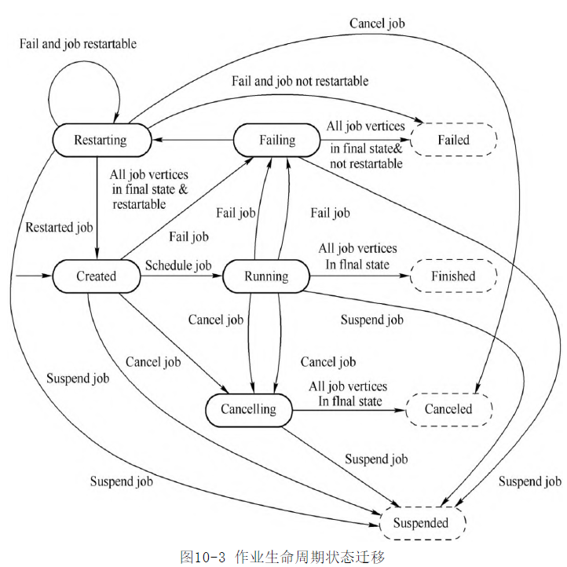
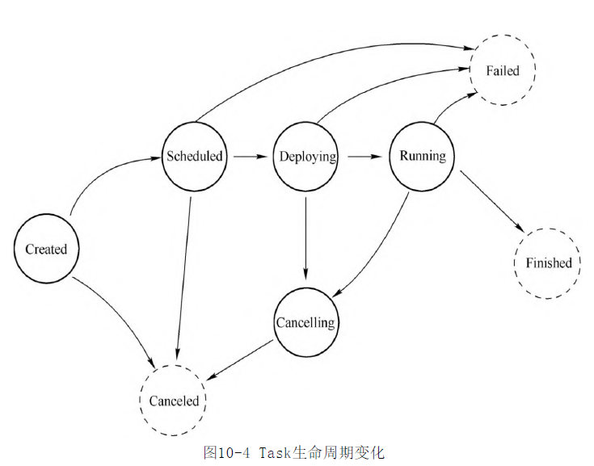

- 作业提交给JobManager生成ExecutionGraph之后，进入作业调度执行的阶段
- 调度器根据调度模式选择对应的调度策略，申请所需要的资源，将作业发布到TaskManager上，启动作业执行
	- 调度模式
	- 执行模式
	- 数据交换模式
	  id:: 62eb7b86-ded1-4eb9-8637-415924d11a0f
- 生命周期维护
	- 作业生命周期
	  collapsed:: true
		- 
		-
	- 任务生命周期
	  collapsed:: true
		- 
		-
- 关键组件
	- JobManager (新版本叫JobMaster)
	  id:: 62eb89a8-e7e1-4045-8f1e-efc523db2f96
		- 调度执行和管理
			- 接收JobGraph,转换为ExecutionGraph.
			- 调度Task的执行.并处理Task的异常
		- 作业Slot资源管理
			- Slot的申请\持有\释放 实际上是通过SlotPool管理
		- 检查点与保存点
		- 监控\运维指标
		- 心跳管理
	- TaskManager 
	  id:: 62eb8ac2-c51e-4a0e-ba0e-fe262530923b
		-