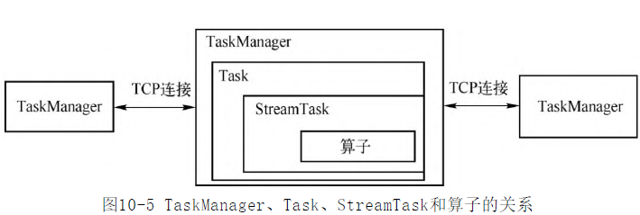

- 作业提交给JobManager生成ExecutionGraph之后，进入作业调度执行的阶段
- 调度器根据调度模式选择对应的调度策略，申请所需要的资源，将作业发布到TaskManager上，启动作业执行
	- 调度模式
	- 执行模式
	- 数据交换模式
	  id:: 62eb7b86-ded1-4eb9-8637-415924d11a0f
- 生命周期维护
	- 作业生命周期
	  collapsed:: true
		- 
		-
	- 任务生命周期
	  collapsed:: true
		- 
		-
- 关键组件
	- JobManager (新版本叫JobMaster)
	  id:: 62eb89a8-e7e1-4045-8f1e-efc523db2f96
	  collapsed:: true
		- 调度执行和管理
			- 接收JobGraph,转换为ExecutionGraph.
			- 调度Task的执行.并处理Task的异常
		- 作业Slot资源管理
			- Slot的申请\持有\释放 实际上是通过SlotPool管理
		- 检查点与保存点
		- 监控\运维指标
		- 心跳管理
	- 
	- TaskManager 
	  id:: 62eb8ac2-c51e-4a0e-ba0e-fe262530923b
	  collapsed:: true
		- 是计算资源的基本单位,管理 Slot
		- 是检查点的执行者
		- 与JobManager直接维持心跳,汇报任务执行情况
		- 与ResoureceManager维持心跳,汇报资源使用情况
		- 提供数据交换的基本框架(跨网络和内部)
	- Task
	  collapsed:: true
		- 为StreamTask执行业务逻辑的时候,提供基础服务.如 内存管理\IO管理\文件缓存等
		- 在流计算中使用的是StreamTask ,而在批处理时执行的是BatchTask. 通过抽象Task层,对TaskManager解耦.
		-
	- StreamTask
	  collapsed:: true
		- 是所有流计算作业子任务的执行逻辑的抽象基类，是算子的执行容器。
		- 其子类类型与算子的类型一一对应
	-
- 作业启动
	- JobManager启动作业
		- 
	-
- 组件容错
-