- Flink是什么
	- Apache Flink 是一个**框架**和**分布式**处理引擎,用于对 **无界和有界的数据流**进行**状态**计算
- Flink的特点
	- 流批一体
	- 可靠的容错能力
	- 高吞吐低延迟
	- 大规模复杂计算
	- 多平台部署
- Flink架构
	- [[Flink Connector]] Flink连接器
	- 应用层, 如 [[Flink CEP]] [[Blink Table&SQL]]
	- API层,如 [[DataStream API]] [[DataSet API]]
	- 运行时层 [[Flink运行时的角色]]
	- 部署层, 本地单机模式 和 集群模式
- Flink Job Demo
	- 基本代码构成
	  collapsed:: false
		- 从配置文件或命令行中获取参数(可选)
		- 初始化Stream 执行环境
		- 配置参数
		- 读取外部数据
		- 处理数据
		- 将结果写入外部
		- 触发执行
	- API
	  collapsed:: false
	  id:: 6257d95b-f739-43aa-b382-42535459e2eb
		- 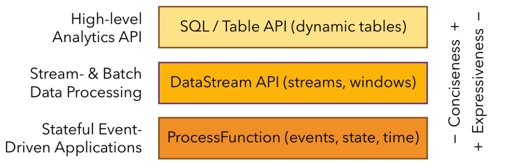
		- 越接近SQL 层，表达能力会逐步减弱，抽象能力会增强,
		- [[Blink Table&SQL]] (dynamic tables)
		- [[DataStream API]] (streams,windows)
		- ProcessFunction (events,state,time)
		- ProcessFunction 层API 的表达能力非常强，可以进行多种灵活方便的操作，但抽象能力也相对越小。
	-
- 数据处理的发展和演变
  collapsed:: true
	- 事务处理 OLTP
		- 操作->xx系统->关系型数据库->响应
	- 分析处理 OLAP
		- xx系统->ETL-> DW->统计查询
	- 有状态的流处理 一代
		- 操作->xx应用->本地状态(内存)->响应
		- 本地状态(内存) -> 定期持久化到远程存储
	- lambda架构 二代
		- 数据流->批处理器->批处理表
		- 数据流->流处理器->流处理表
		- 两表合并->应用展示
	- akka架构 三代
		-
- Flink 基本概念
  collapsed:: false
	- Streams 流
	  collapsed:: true
		- 流是一个带有方向性的数据集,数据作为流的一部分自然而然的被创建.但是在数据分析时,必须使用{{embed ((6256985b-def1-4f4a-a62e-19c509c79bbf))}} 和{{embed ((6256987c-62b3-4c8d-944c-2dc1e0d8dcda))}}
		- 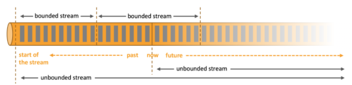
		- 有界流 bounded stream
		  id:: 6256985b-def1-4f4a-a62e-19c509c79bbf
			- 具有明确的开始和结束节点
			- 数据会随时间的推演而持续增加,计算持续进行且不存在结束的状态
		- 无界流 unbounded stream
		  id:: 6256987c-62b3-4c8d-944c-2dc1e0d8dcda
			- 只有开始节点,没有结束节点
			- 数据大小固定，计算最终会完成并处于结束的状态。
	- State 状态
	  collapsed:: true
		- State是Flink中的顶级概念.计算过程中的数据具有state
			- eg. 需要keep之前的数据,算最近一个小时内的总PV,这些数据就是stateful(有状态的),它所对应的计算就是有状态计算
		- 流计算在本质上是Incremental Processing，因此需要不断查询保持状态
		- 持久化存储带状态的数据,能够保证在整个分布式系统运行失败或者挂掉的情况下做到Exactly- once
	- Time 时间
	  collapsed:: true
		- 时间是在流计算中度量业务计算是否滞后，数据处理是否及时的重要依据。
		- 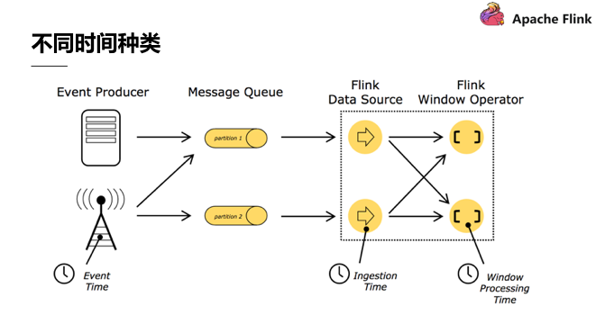
		- Event time 数据产生的时间
		- Ingestion time 数据进入Flink的时间
		- Processing time 数据被Flink处理的时间
- 使用场景
  collapsed:: true
	- Data Pipeline 数据搬运\同步
	  collapsed:: true
		- 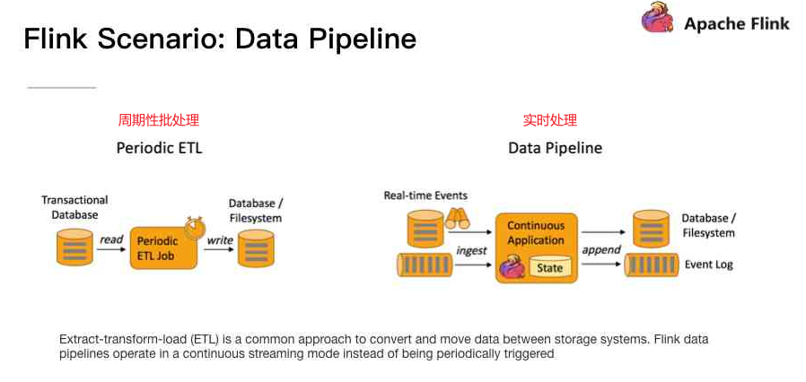{:height 348, :width 716}
		- 实时数仓
		  collapsed:: true
			- 进行实时清洗或扩展数据，清洗完成后写入到下游的实时数仓的整个链路中，可保证数据查询的时效性，形成实时数据采集、实时数据处理以及下游的实时Query。
		- 实时搜索引擎的index的build
		  collapsed:: true
			- 以淘宝为例，当卖家上线新商品时，后台会实时产生消息流，该消息流经过Flink 系统时会进行数据的处理、扩展。然后将处理及扩展后的数据生成实时索引，写入到搜索引擎中。这样当淘宝卖家上线新商品时，能在秒级或者分钟级实现搜索引擎的搜索。
	- Data Analytics 数据分析
	  collapsed:: true
		- 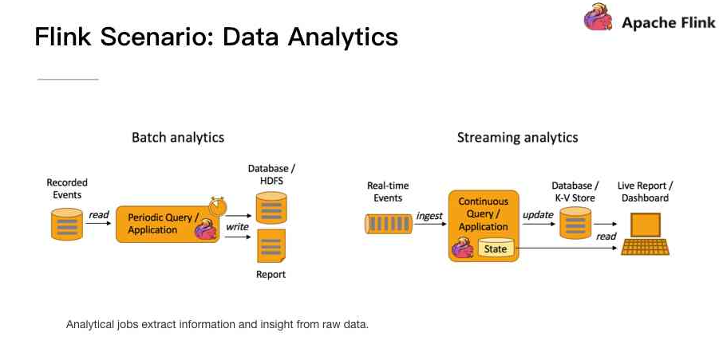
		- 实时大屏
		- 实时报表
	- Data Driven 数据驱动\事件处理
	  collapsed:: true
		- 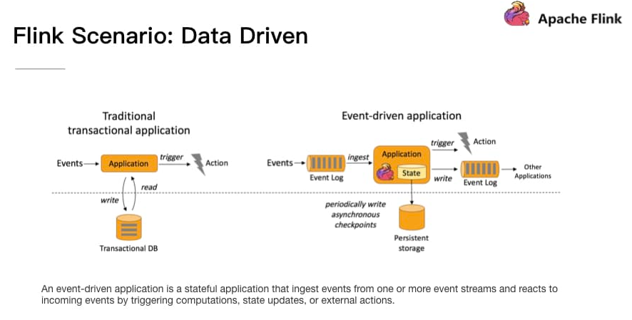
		- 实时风控
			- 装载规则到Flink -> 数据处理->触发规则告警->通知下游程序
- 有状态流式处理
  collapsed:: true
	- 传统的批处理方式
		- 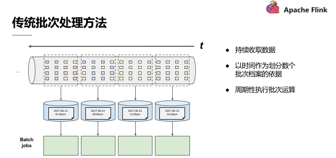
		- 现在有需求,计算事件A->B的转换次数,已小时为单位
		- 如果事件A发生在3:55 而事件B发生在4:01
			- 会将 中介运算结果(intermediate result)带到下一个批次运算
				- 其实就是 `看到了事件A`这一状态
		- 如果先收到了B,后收到了A呢?
	- 理想的处理方式
		- 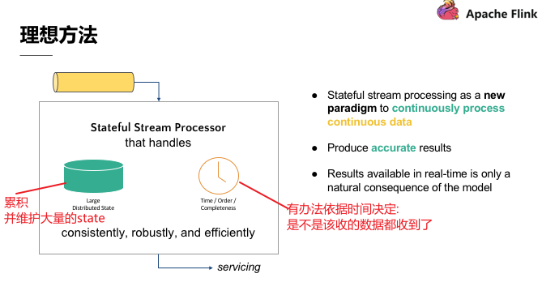
	- 分散式流试处理
		- 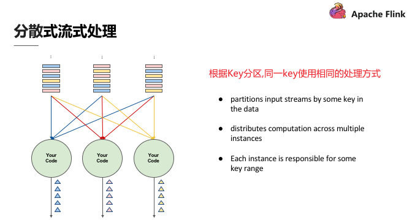
	- 有状态分散式流式处理
		- 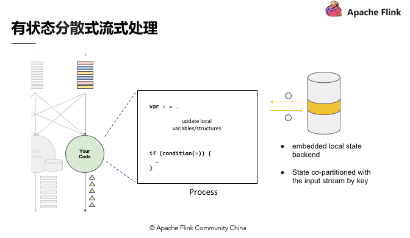
		- 引入变量X 符合变量x的数据称为具有状态X.在最后输出结果时，可以依据变数X 决定输出的内容
		- 状态会跟Key一同参与partition,同一key的不同状态一定会累积到一个处理程序中
		- 本地状态过多,需要有一个专门的服务去维护它
	-
		-
- Flink的优势
	- 精确一次(Exactly-once)的容错保证
	  collapsed:: true
		- 在不中断程序的情况下,产生全域一致的快照(Global consistent snapshot)
		- 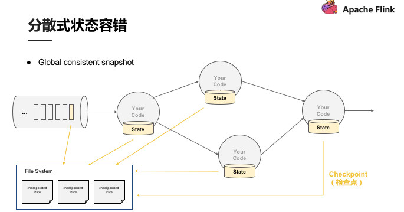
		- 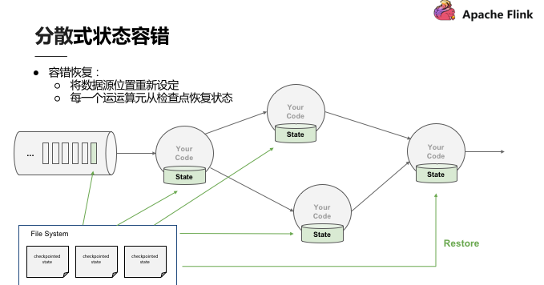
		- 实现原理 checkpoint barrier #flink特殊事件
			- 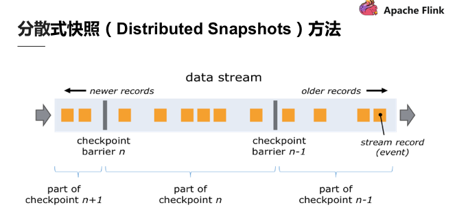
			- 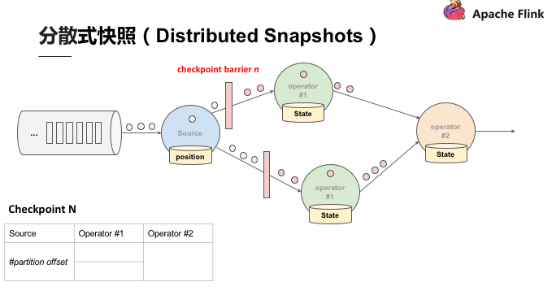{:height 371, :width 679}
			- 完整填完的Checkpoint N表格,才能用来恢复
		-
	- 状态维护
	  collapsed:: true
		- 状态维护即用一段代码在本地维护状态值，当状态值非常大时需要本地的状态后端来支持.它分为两种
			- 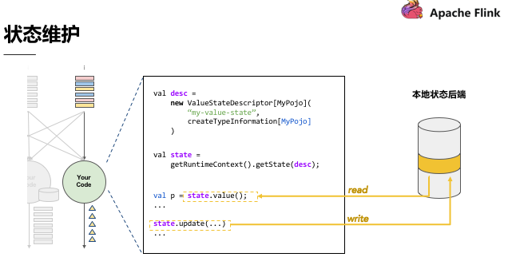
		- JVM Heap状态后端 -- 仅在内存中的
			- 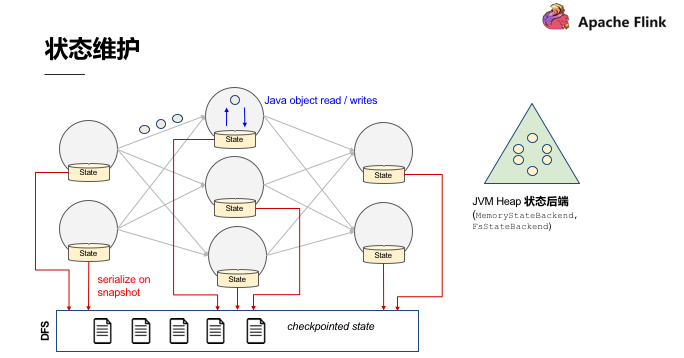
		- RocksDB状态后端 -- 可序列化保存在磁盘的
			- 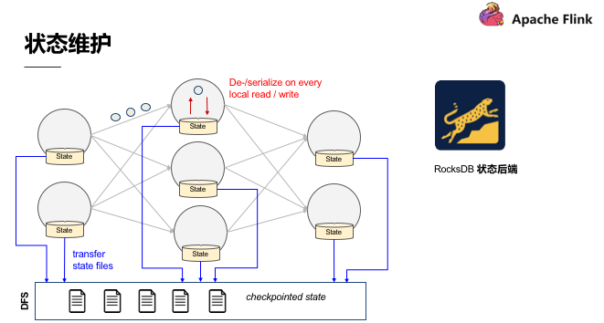
		-
	- Event Time处理
	  collapsed:: true
		- 利用时间来识别-该收的数据都已经收到了
		- 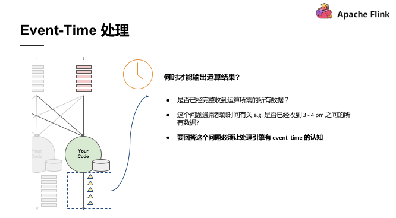
		- Watermarks #flink特殊事件
			- 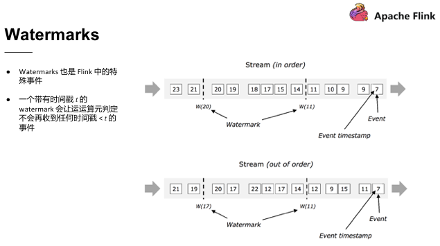
	- 状态保存与迁移
	  collapsed:: true
		- 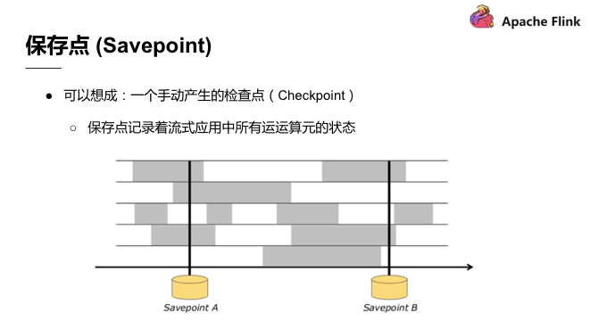
		- Savepoint产生的原理是在Checkpoint barrier 流动到所有的Pipeline 中手动插入从而产生分布式快照，这些分布式快照点即Savepoint
		- 主要用于 变更底层代码逻辑、修bug 或是升级Flink 版本，重新定义应用、计算的平行化程度等