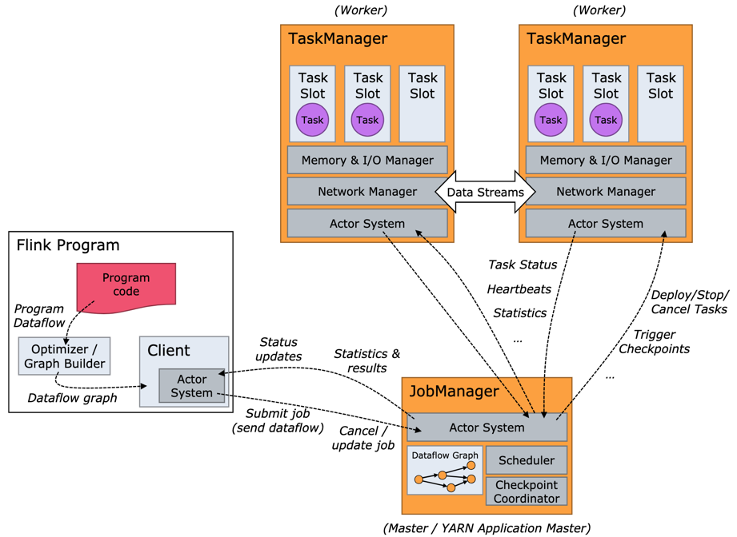

- 
- Operator 操作 算子
	- [[DataStream API]] 所定义的对数据的操作
	- 多个Operator可能被一起执行,运行在同一个Task中. 如果不能一起执行,则会分到不同的Task中
- Task
	- 是 Flink中资源调度的最小单位
	- 用户用 [[DataStream API]] 编写程序并提交后,多个不能被连一起执行(Chain )的 操作(Operator )会被分隔到不同的 Task 中
- JobManager（又称为 JobMaster）
	- 调 Task 的分布式执行，包括调度 Task、协调创 Checkpoint 以及当 Job failover 时协调各个 Task 从 Checkpoint 恢复等。
- TaskManager（又称为 Worker）
	- 执行 Dataflow 中的 Tasks，包括内存 Buffer 的分配、Data Stream 的传递等。
- Task Slot
	- 是一个 TaskManager 中的最小资源分配单位,有多少个 Task Slot 就意味着能支持多少并发的 Task 处理
-