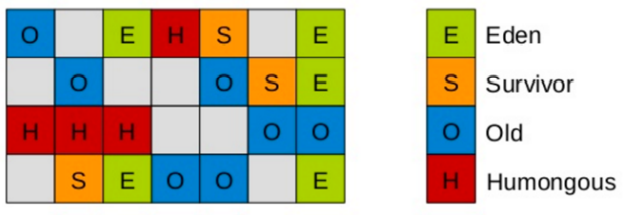
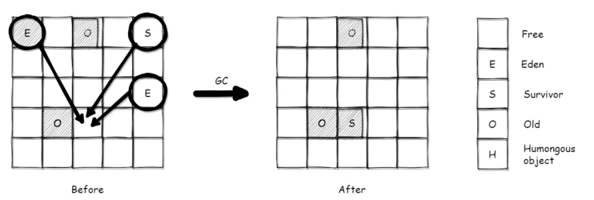
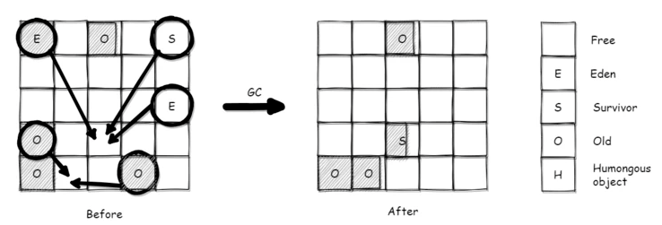
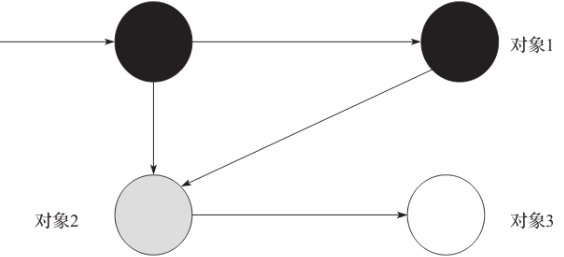
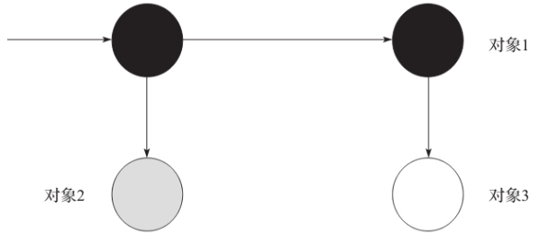

- 基于标记算法
- 新生代  和 老年代(jdk 10+) 都是并行收集
- 
- 将堆内存划分为大小固定的几个独立区域，可自由命名。
	- Eden区&Survivor区
		- 仍会 stop the world ，将存活对象copy到Old或Survivor空间
	- Old区
		- 从一个区域复制到另一个区域
	- Humongous区
		- 一个对象占用的空间超过分区容量50%以上，且生命周期短的对象
		- 如果一个H区装不下，那么会寻找连续空间
- 三种回收模式 Young GC & Mix GC & Full GC
  collapsed:: true
	- G1 Young GC 年轻代回收
		- 
		- 在*年轻代分配内存空间不足时*触发
		- 只选择年轻代区域（Eden/Survivor）进入回收集合
			- 基于标记-复制算法，并行收集
			- 基于停顿预测模型
				- 根据设置的停顿时间，推算本次要回收多少区域。
		- 回收过程
		  collapsed:: true
			- STW
			- 将需要回收的分区放入CSet
			- 并行执行
				- 根扫描
				- 处理RSet
				- 对象拷贝
			- 引用处理
			- 重建RSet
			- 释放对象
			-
	- G1 Mix GC 混合回收
		- 
		- *并发标记结束&&本次Young GC 结束后*，判断**下次GC**是否启用Mix GC
			- 并发标记结束，会更新`CSet Chooser`--下次GC的目标区域，也就是可回收空间
				- CSet可以包含老年代，但YounGC结束后，只包含新生代
			- 可回收空间/堆的总空间 > 设定参数`G1HeapWastePercent` 默认 5% 时，开启Mix GC
		- 会选择所有年轻代区域（Eden/Survivor）和部分老年代区域
			- 减少老年代的内存压力，从而避免Full GC
			- 根据*预测的停顿时间*决定一次回收老生代分区的数目
		- 回收过程
			- 初始标记
			  collapsed:: true
				- 借用了上一次Young GC的结果，进一步识别老年代中的活跃对象
			- 根区域扫描
			- 并发标记
				- 标记线程和工作线程可以同时运行
				- ((66ac7638-b39f-4c81-8dc4-3e5136f30ffd))
			- 最终标记-STW
			- 清除垃圾-STW
			- 拷贝存活对象
	- Full GC 完全回收
		- *新对象分配空间失败&&进行了YoungGC再次失败*后，触发Full GC
		- FullGC
			- JDK 10之前是串行,10引入了并行版本
			- 采用标记清除法
			- 回收过程
				- 标记活跃对象
				- 计算新对象的地址
				- 更新引用对象的地址
					- 把活跃对象和活跃对象中的引用更新到新位置
				- 移动对象完成压缩
				- 后处理
	- 三色标记法
	  id:: 66ac7638-b39f-4c81-8dc4-3e5136f30ffd
		- 黑白灰三色
			- 白色：未标记
			- 灰色：自身已标记但字段未完全标记
			- 黑色：自身及其所有字段都已标记
		- 由于标记线程和工作线程同时在运行。工作线程可能会修改对象的引用，而这些改动没有被GC即时捕捉到，就可能导致漏标。
		- 漏标的充分必要条件(同时满足)
			- 一个黑色对象 新增了一个 指向白色对象的引用
			- 一个灰色对象 删除了一个 执行白色对象的所有引用
			- 
			- 标记线程出让CPU，工作线程执行，改变了对象之间的引用关系
				- `obj2.next = null; obj1.next=obj3`
			- 
		- 解决方案
			- 增量更新-黑色对象重新标记为灰色
			- STAB算法-在发生`obj2.next` 更改之前，就把obj2.next 指向的*对象*放入STAB的队列中，相当于把obj3标记为灰色
		- 使用**写屏障**来监控对象引用的修改 `obj2.next = null`
			- 这里的写屏障不是*并发编程*中的写屏障，更像是一个代理，在赋值之前把旧的引用的对象加入STAB队列。
- G1的缺点
	- 停顿时间在100毫秒级
	- 支持的内存空间有限 100G以下
	-