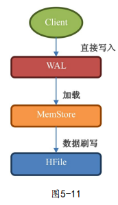
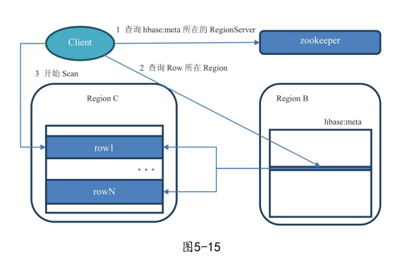

- [[HBase面试题]]
- 数据模型
	- 
	- 
	-
- 架构模型
	- 
	- HMaster
		- 负责分配Region到具体的RegionServer,执行各种管理操作(如 小文件合并、大文件拆分，table的创建、修改)
	-
- 增删改查的真面目
	- 新增-新增一条数据
	- 修改-新增一条数据，版本号比之前大
	- 删除-新增一条数据，value是空，类型为DELETE 墓碑标记
		- 真正的删除发生在对HFile的合并操作中
- 写入操作
	- 
	- 数据会在第一时间写入 WAL 日志，防止丢失。
	- MemStore会按照 [[LSM树]] 结构来存放和整理数据。
	- 当MemStore的大小达到一定阈值，或者到了刷写的时间间隔，存储的内容就被刷到磁盘的HFile上。
- 读取操作
	- Region定位
		- 
		- Client询问ZK，hbase:meta表在哪台机器上。hbase:meta表存储了所有Region的rowkey信息
		- 查询rowkey属于哪个region
		- 直联regionServer,获取row data
		- Client缓存本次meta信息，下次操作就不用再加载meta了
	- 数据扫描
		- BlockCache -> MemStore -> HFile
		- 扫描一个rowkey时(多条不同版本的记录)，由于不知道是否被删除，会直到被扫描数据**大于给定限定条件**终止
- 优化策略
	- RegionServe
		- 调大RegionServer的内存-> 增大MemStore内存->写数据不容易阻塞
		- 选取合适的GC策略 -> Parallel + CMS 组合 or G1
		- MemStore内存管理：MemStore 分配缓冲(类似于JVM中的线程分配缓冲)
	- Region拆分
		- 自动拆分
			- 按固定大小
			- 文件大小不断增长，直到到达max
			- 相同rowkey前缀 按长度匹配
			- 相同rowkey前缀 按分隔符分割
			- 热点Region
			- 永不自动拆分
		- 预拆分
		-
	- Region合并
	- WAL
	- BlockCache
	- MemStore
	-