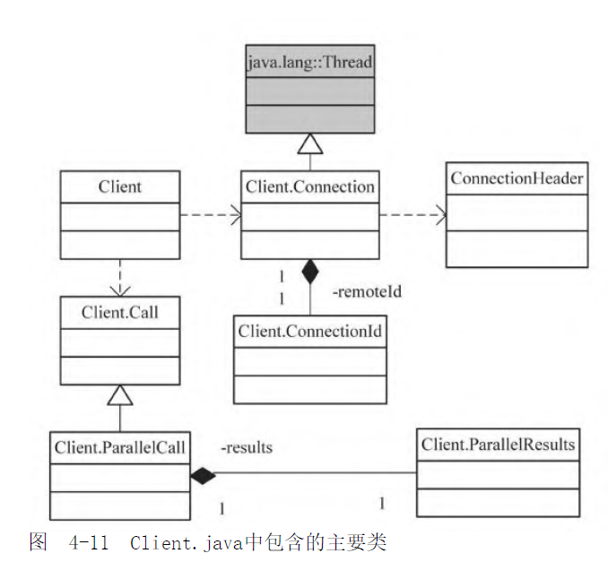
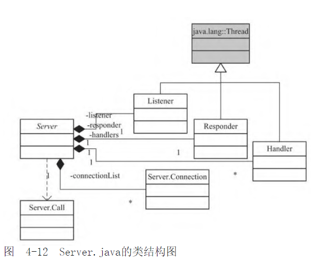
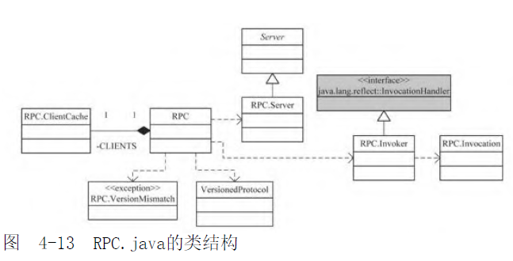

- Hadoop RPC的实现中,使用了 [[Java 动态代理]] 和 [[Java NIO]]
- 为什么要有自己的RPC?
- 都用在了什么地方?
- 主要角色和架构是什么样的?
	- Client
		- 包含的主要类
		  collapsed:: true
			- 
		- Client.Connection
			- 表示客户端向服务器建立的一条连接
			- 关键成员变量如下
				- ```java
				  private InetSocketAddress server; // 要连接的服务器的 ip:port
				  private final ConnectionId remoteId;//连接标识
				  private Socket socket = null; // 建立连接后的Socket
				  private Hashtable<Integer, Call> calls = new Hashtable<Integer, Call>() // 当前正在处理的远程调用
				  private AtomicLong lastActivity = new AtomicLong(); // 最后一次通信时间
				  private AtomicBoolean shouldCloseConnection = new AtomicBoolean();  //连接关闭标记
				  private IOException closeException; // 导致连接关闭的异常
				  private IpcStreams ipcStreams; // DataInputStream 和 DataOutputStream
				  ```
				-
		- Client.Connection.ConnectionId
			- 目的是为了复用客户端的连接
			- 当服务器地址(address) 用户信息(ticket) 和 协议类型(protocol) 三者一致时,表示可以复用这条连接.
			- 否则,新建Connection 和 ConnectionId
		- Client.Call
			- 客户端调用服务器方法时的代码抽象,具体的创建流程如下
				- 所有的RPC方法都被`java.lang.reflect.InvocationHandler` 捕获,并调用具体的`Invoker` 的`invoke()`方法,有两类
					- org.apache.hadoop.ipc.WritableRpcEngine.Invoker
					- org.apache.hadoop.ipc.ProtobufRpcEngine.Invoker
				- invoke方法中会调用 Client.call(),主要做了如下事情
					- Client.createCall() 创建了一个Call对象
					- Client.getConnection() 获取到一个Connection
					- ` connection.sendRpcRequest(call)` 发送报文
					- 异步等待结果返回
			-
	- Server
		- 包含的主要类
		  collapsed:: true
			- 
			-
		- Server.Connection 和 Server.ConnectionManager
			- Manager负责管理和建立Connection[register()] ,由Server.Listener.doAccept()唤起
			- Connection 是客户端向服务器建立的一条连接
			- 关键成员变量如下
				- ```java
				  private boolean connectionHeaderRead = false; // 是否已经读入了ConnectionHeader 读的是版本号
				  private boolean connectionContextRead = false; 
				  private SocketChannel channel;
				  private ByteBuffer data;
				  private final ByteBuffer dataLengthBuffer;
				  private LinkedList<RpcCall> responseQueue;
				  private AtomicInteger rpcCount = new AtomicInteger(); // 当前正在处理的RPC请求
				  private long lastContact;
				  private int dataLength;
				  private Socket socket;
				  // 客户端的 ip+ port 保存它的目的是为了留下痕迹,方便查询
				  private String hostAddress; 
				  private int remotePort; 
				  
				  ```
		- Server.Call
		- Server.Listener
			- 监听客户端发来的连接请求 和 连接建立后的数据请求
			- 调用服务端的相关方法,将放入一个阻塞队列中,由Handler处理
			-
		- Server.Handler
			- 根据Call中的数据,调用对应的接口实现类,完成服务器端的过程调用
			- 将调用结果序列化,再连接的应答队列为空时,返回给客户端
			- 当应答队列不为空时(客户端较忙),会把结果放入响应队列,并由Responder处理
		- Server.Responder
			-
	- RPC
		- 包含的主要类
		  collapsed:: true
			- 
			-
- ICP连接的建立过程
	- Client创建Connection `org.apache.hadoop.ipc.Client#getConnection`
		- 该代码是一段while循环,退出条件是 `connection.addCall(call)` 成功后
			- addCall 方法,是将一个Call加入到connection中.如果该Connection要被关闭了,则暂不加入,返回false
			- 之后,清理掉要关闭的connection
			- 循环回到开头,将会新建一个connection
		- 拿到了一个可用的connection,开始调用`org.apache.hadoop.ipc.Client.Connection#setupIOstreams` 方法
			- 首先,使用Java的Socket与服务端建立连接
			- 接着,调用`writeConnectionHeader()`与服务端进行握手,发送的报文如下
				- 魔术 "hrpc" 4字节
				- 客户端版本号 1字节
				- service class 1字节 ??
				- 鉴权手段 1字节
			- 第三步,调用`writeConnectionContext()` 发送真正的请求
			- 第4步,调用`touch()` 记录返最后一次I\O发生时间
			- 最后,调用`Thread.start()`启动connection线程,接收返回结果
	- 在Server端,主要负责连接的是 `Server.Listener` 和 `Server.Connection `
		-
		-
- RPC流程是什么样的?
-
- 相关类定位
	- org.apache.hadoop.ipc.Client
	- org.apache.hadoop.ipc.Server
	- org.apache.hadoop.ipc.RPC