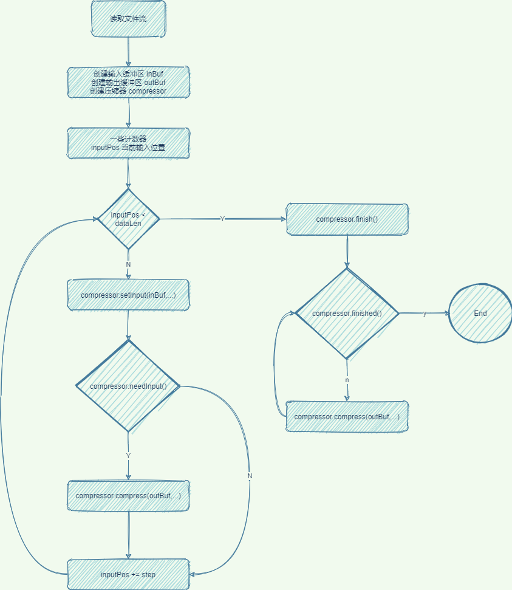

- 在使用[[压缩]]方面,Hadoop主要考虑的是压缩速度和压缩文件的可分割性.
- Hadoop支持的压缩格式
	- DEFLATE
	- gzip
	- bzip
	- Snappy
- 编码\解码器
	- `CompressionCodec`接口
		- 使用 [[抽象工厂]] 模式,用于创建一系列相关或相互依赖的对象.
		- `createOutputStream()` 创建对应压缩算法的**压缩流**
		- `createCompressor()` 创建对应的**压缩器**
		- `createDecompressor()` 创建对应的解压缩器
		- `createInputStream()` 创建对应的解压缩流
		- `getDefaultExtension()` 获取文件的扩展名
	- `CompressionCodecFactory`
		- 通过文件路扩展获取相应的处理类
		  collapsed:: true
		  id:: 62397ffd-1251-43f5-946f-cc3240c20b51
			- 使用一个有序Map保存处理类 codecs
				- key是后缀的翻转,value是处理它的类
				- ```
				  {
				      2zb. : org.apache.hadoop.io.compress.BZip2Codec,
				      etalfed. : org.apache.hadoop.io.compress.DeflateCodec,
				      yppans. : org.apache.hadoop.io.compres.SnappyCodec,
				      yzg. : my.self.Codec,
				      zg. : org.apache.hadoop.io.compress.GzipCodec
				  }
				  ```
			- ` getCodec(Path file)`方法,获取具体的处理类
				- 翻转fileName
				- 使用 headMap() 获取到离后缀最接近的map集合
				  collapsed:: true
					- 假如翻转后的文件名是`2zb.txt.EMDAER` 则返回结果是
					  collapsed:: true
						- ```
						  {
						  	2zb. : org.apache.hadoop.io.compress.BZip2Codec
						  }
						  ```
					- 假如翻转后的文件名是 `zg.txt.EMDAER` 则返回的结果是
					  collapsed:: true
						- ```
						  {
						      2zb. : org.apache.hadoop.io.compress.BZip2Codec,
						      etalfed. : org.apache.hadoop.io.compress.DeflateCodec,
						      yppans. : org.apache.hadoop.io.compres.SnappyCodec,
						      yzg. : my.self.Codec,
						      zg. : org.apache.hadoop.io.compress.GzipCodec
						  }
						  ```
				- 获取subMap最后一个元素,就得到了文件对应的编码\解码器
			- 问题1: 为什么要倒转文件名?
				- 快速获取文件后缀,相比于 find方法和正则方法来说,更高效
			- 问题2:为什么要用有序Map?
				- 防止自己扩展时,保证匹配到正确的编码\解码器
					- .gzy 和 .gz 
					  collapsed:: true
						- 如果输入的是.gz, 那么匹配出来的最后一个一定是zg.
						- 如果输入的是.gzy,那么匹配出来的最后一个一定是 yzg.
		- 通过[[java SPI]]机制加载自定义Codec 类
	- 压缩器 Compressor
	  collapsed:: false
	  id:: 62398b72-3697-4569-87a4-370443440650
		- `setInput(byte[] b, int off, int len)` 接收数据到内部缓冲区
		- `boolean needsInput()` 判断缓冲区是否已满
		- `int compress(byte[] b, int off, int len)` 获取压缩数据,释放缓冲区
		- `void finish()` 告诉压缩器,数据全部输入完毕
		- `boolean finished()` 判断压缩器中是否还有未读的压缩数据
	- 压缩流 CompressionOutputStream
		- `CompressionOutputStream` 实现了`OutputStream`的 `close()` 方法和 `flush()` 方法.
		- `CompressorStream` 则实现了余下的 `write()`方法 和 `finish()`方法
		-
	- 一个典型的调用流程
	  id:: 623a8c88-9463-4bfd-9c41-44882a680876
	  collapsed:: true
		- {:height 688, :width 590}
	- 类关系图
		- A
- 使用[[java 本地方法]]的压缩库来加速
	-
- 涉及到的类
	- org.apache.hadoop.io.compress.CompressionCodec
	- org.apache.hadoop.io.compress.CompressionCodecFactory
-