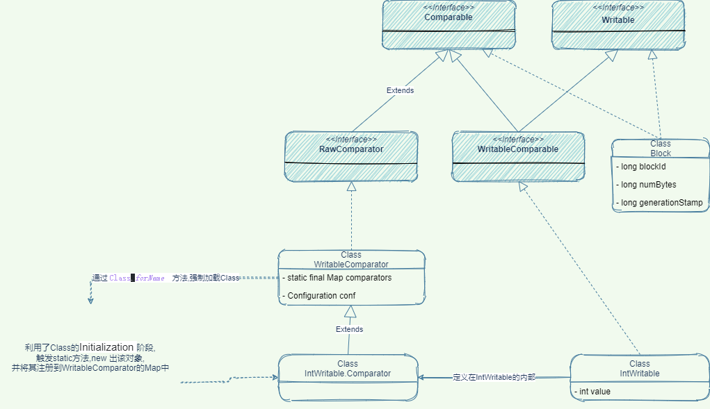

- Hadoop为了支持大规模,打数据量的分布式处理,其序列化需要有如下特点
	- 紧凑
		- 可以减少带宽
	- 快速
		- 在进程之间通信或MapReduce过程中会大量使用序列化机制,必须减少时间开销
	- 可扩展
		- 随着通信协议的升级而升级
	- 互操作
		- 支持不同开发语言之间的通信,如java和c++
- Writable 接口
	- 主要包含两个方法,进行数据的序列化\反序列化
		- ` void write(DataOutput out) `
		- ` void readFields(DataInput in)`
		- `DataOutupt `和 `DataInput `是`java.io`包中的类,在1.0版本就已经存在
	- 具体的一个实现,可以查看 `org.apache.hadoop.hdfs.protocol.Block` 类
- WritableComparable 接口
	- 该接口继承自 Writable  和 Comparable 两个接口,也就是说,给Writable 赋予可比较的功能
- RawComparator 接口
	- 继承自 `java.util.Comparator`接口,可以直接比较一行的数据(byte数组+位置信息)
	- 它有一个通用实现 `WritableComparator`,它有两个功能
		- 提供了raw compare的默认实现
		- 充当RawComparator实例的工厂方法
			- ```java
			  RawComparator<IntWriteable> comparator = WritableComparator.get(IntWriteable.class);
			  ```
- 三者之间的关系
	- 
- 为什么要自己实现比较的功能?
	- 为了减少创建对象所带来的开销
	- 如何减少创建对象?
		- 直接从byte数组中读取成基本类型,然后直接比较
- WritableUtils 实际读\写
	- 直接继承Writable接口的基本类型,class name都命名为了 VXxxWritable,如 `VIntWritable`
		- 这些类中,其write 和readFields方法,都使用的是WritableUtils提供的read\write方法
	- 值得注意的是writeVInt 直接调用了 writeVLong ,因此Int 可以被Long正确读取
	- 写入格式大都是 第一个byte存长度,之后的byte存储实际数据
		- 如果存放的int值 > -112 && < 127 则不存长度位,直接存放数据
		- string类型会先进行utf-8编码
- ObjectWritable
	- 提供了对如下 7类型的序列化\反序列化 的封装
		- 空值
		- 数组
		- 字符串
		- 基本类型
		- 枚举
		- Writable及其子类
		- Message及其子类
	- 主要用于2个地方
		- Hadoop的RPC中
		- 序列化不同类型的对象到某一字段中 (泛型)
	- 序列化成3部分
		- 对象类名 `instance.getClass().getName()` 获取到的
		- 对象实际类名 `instance`字段
		- 对象值的序列化结果
- 支持的其它序列化框架
	- 通过 `org.apache.hadoop.io.serializer.Serializer` 接口进行Hook
	- Hadoop [[Avro]]
	- Apache [[Thrift]]
	- Google [[Protocol Buffer]]
- 附录 提及的类和方法
	- org.apache.hadoop.io.Writable
	- org.apache.hadoop.io.WritableComparable
	- org.apache.hadoop.io.IntWritable
	- org.apache.hadoop.io.RawComparator
	- org.apache.hadoop.io.WritableComparator
	- org.apache.hadoop.io.WritableUtils#writeVInt
	- org.apache.hadoop.io.ObjectWritable
	-