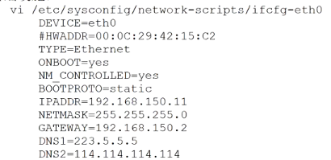
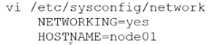
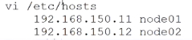
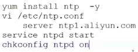
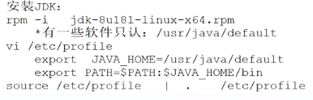
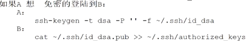

- [Hadoop官网](https://hadoop.apache.org/)
- 通常意义上的Hadoop，包含如下4个组件
	- Common包，组件的公共部分
	- [[HDFS ]] 分布式文件存储系统
	- [[YARN]] 分布式调度系统
	- [[MapReduce]] 分布式任务调度框架
- 在Apache 基金会中，可以与Hadoop联动的项目
	- [[HBase]] 大表存储数据
	- [[Hive]] 数仓+SQL查询
	- [[Spark]] 批处理执行引擎+SQL查询+流式实时处理+机器学习
		- 相似的还有 [[Flink]]
	- [[Tez]] 批处理执行引擎
	- [[Zookeeper]] 分布式协调服务
- 部署
	- 需要的硬件
		- GNU/Linux [[Linux]] 机器
	- 需要的软件
		- [[Java]] 8+
		- 运行Hadoop的机器中需要有 [[ssh]]
			- 远程免密登陆
			- 远程执行脚本\命令
	- 基础配置
collapsed:: true
		- 设置IP `vi /etc/sysconfig/netwwork-scripts/ifcfg-eth0`及 主机名 `vi /etc/sysconfig/network`
			- 
			- 
			- 关闭防火墙 `service iptables stop` `chkconfig iptables off`& selinux `vi /etc/selinux/config`
				- 
				-
			- 设置hosts映射
				- 
			- 时间同步 -- 使用ntp服务
				- 
				-
			- 安装 [[jdk]]
				- `rpm -i jdk-8ul81-linux-x64.rpm`
				- 
				-
			- 设置 [[ssh]] 免密登录
				- `ssh localhost` 自己登录自己 试试是否需要密码
					- 被动生成了`/root/.ssh`目录
				- 
				-
	- 伪分布式模式
		- 
		-
	- HA（High Available） 完全分布式模式 #高可用
-