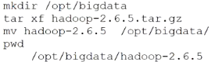
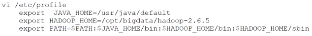
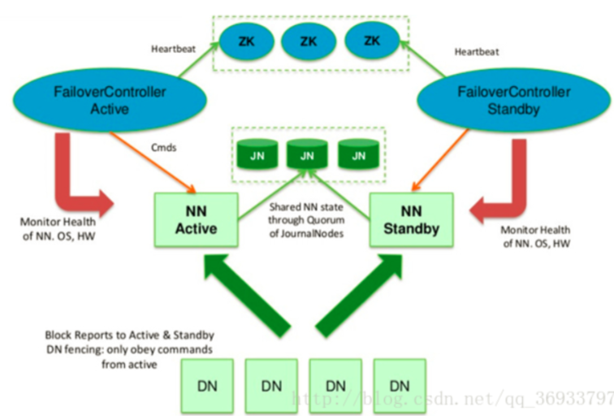
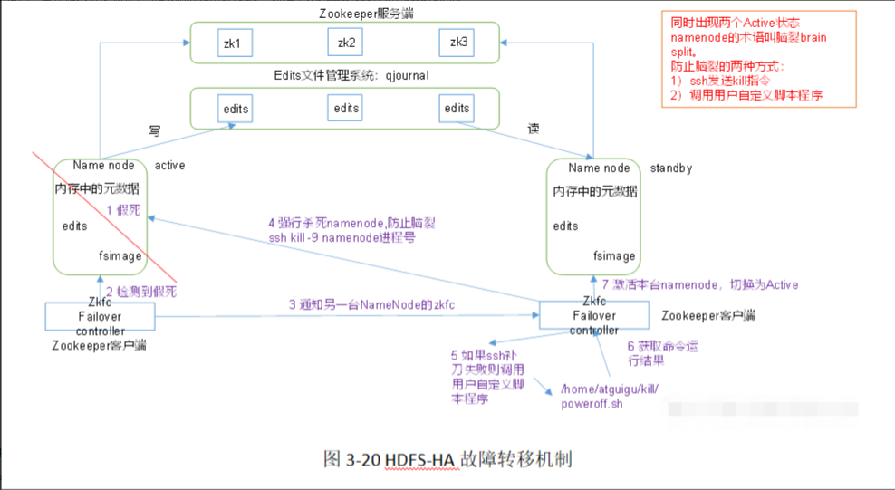
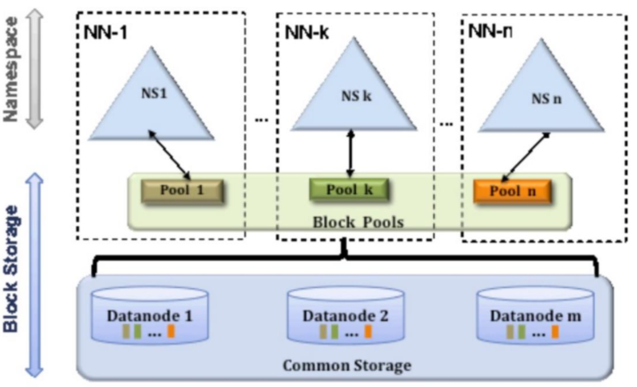

- [Hadoop官网](https://hadoop.apache.org/)
- 通常意义上的Hadoop，包含如下4个组件
	- Common包，组件的公共部分
		- [[Hadoop Configuration]] Hadoop的配置实现
		- [[Hadoop IO]] Hadoop的序列化与压缩 RPC通信
	- [[HDFS ]] 分布式文件存储系统
	- [[YARN]] 分布式调度系统
	- [[MapReduce]] 分布式任务调度框架
- 在Apache 基金会中，可以与Hadoop联动的项目
	- [[HBase]] 大表存储数据
	- [[Hive]] 数仓+SQL查询
	- [[Spark]] 批处理执行引擎+SQL查询+流式实时处理+机器学习
		- 相似的还有 [[Flink]]
	- [[Tez]] 批处理执行引擎
	- [[Zookeeper]] 分布式协调服务
- 部署
  collapsed:: false
	- 需要的硬件
		- GNU/Linux [[Linux]] 机器
	- 需要的软件
		- [[Java]] 8+
		- 运行Hadoop的机器中需要有 [[ssh]]
			- 远程免密登陆
			- 远程执行脚本\命令
	- 基础配置
	  collapsed:: true
		- 设置IP `vi /etc/sysconfig/netwwork-scripts/ifcfg-eth0`及 主机名 `vi /etc/sysconfig/network`
			- 
			- 
			- 关闭防火墙 `service iptables stop` `chkconfig iptables off`& selinux `vi /etc/selinux/config`
				- 
				-
			- 设置hosts映射
				- 
			- 时间同步 -- 使用ntp服务
				- 
				-
			- 安装 [[jdk]]
				- `rpm -i jdk-8ul81-linux-x64.rpm`
				- 
				-
			- 设置 [[ssh]] 免密登录
				- `ssh localhost` 自己登录自己 试试是否需要密码
					- 被动生成了`/root/.ssh`目录
				- 
				-
	- 伪分布式模式
	  collapsed:: false
		-
		-
		- 
		- 规划安装路径
			- 
		- 设置环境变量
			- 
		- 配置Hadoop的角色
			- 修改hadoop-env.sh的JAVA_HOME为绝对路径
				- 
			- 修改 `etc/hadoop/core-site.xml` -- [[NameNode]] 角色在那里启动
				- ```xml
				  <configuration>
				      <property>
				          <name>fs.defaultFS</name>
				          <value>hdfs://node01:9000</value>
				      </property>
				  </configuration>
				  ```
			- 修改`etc/hadoop/hdfs-site.xml` -- HDFS的副本数量
				- ```xml
				  <configuration>
				      <property>
				          <name>dfs.replication</name>
				          <value>1</value>
				      </property>
				    //NameNode元数据的保存目录
				    	<property>
				          <name>dfs.namenode.name.dir</name>
				          <value>/var/bigdata/hadoop/local/dfs/name</value>
				      </property>
				    //DataNode的数据块的保存目录
				      <property>
				          <name>dfs.datanode.data.dir</name>
				          <value>/var/bigdata/hadoop/local/dfs/data</value>
				      </property>
				    //SecondaryNameNode的启动地址
				       <property>
				          <name>dfs.namenode.secondary.http.address</name>
				          <value>node01:50090</value>
				      </property>
				    //SecondaryNameNode的数据目录
				         <property>
				          <name>dfs.namenode.checkopint.dir</name>
				          <value>/var/bigdata/hadoop/local/dfs/secondary</value>
				      </property>
				  </configuration>
				  ```
			- 修改 salves -- [[DataNode]] 角色在哪里启动
		- 初始化和启动
			- `start-dfs.sh` 启动所有角色
				- 第一次启动时,[[DataNode]]和 [[SecondaryNameNode]] 会创建数据目录
			- `hdfs dfs -mkdir -p /user/root` 创建存放数据的根目录
			-
	- 完全分布式模式
	- 两个互斥的解决方案
collapsed:: true
		- 单点故障
			- HA（High Available） #高可用
			- 多个NameNode,主备切换
			- **没有SNN角色**
			- 
				- 为什么NameNode需要向JN写数据?
					- NameNode的内存数据,如果挂掉了就丢失了.需要找个地方持久化
				- JN = [[Journal Node]] 适用于存数据
				- ZK = [[Zookeeper]] 适用于事件触发回调
				- ZKFC = Zoo Keeper FailoverController ,是运行于 NameNode所在主机的进程,主要做三件事情
					- 监测本机的NameNode的健康状态
					- ZK的会话管理
						- 在主NameNode的 zk中,维持一把znode锁,
						- 如果会话终止(NameNode挂掉了),锁节点会自动删除.
						- 进而,另其它的ZKFC会得到这个消息.它们开始抢锁,选除主NameNode
					- 故障转移
						- 将前一个主NameNode降级 \ 强行杀死该NameNode,防止假死
						- 将自己的NameNode升级
					- 宁可不可用，也不导致脑裂
				- NN Standby = NameNode从节点.
					- 滚动写FsImage,
					- NameNode本地还是会有EditLog
			- 故障转移机制 -- 自动切换
				- 
				-
		- 压力过大,内存受限
collapsed:: true
			- Federation 联邦机制 -- 元数据分片
			- 多个NameNode,管理不同的元数据
			- DataNode 用目录隔离,模拟不同NameNode存储
				- 访问不同的NN,可以存相同文件名的文件!
				- 更多的是公司层面做DataNode的资源统一,提高利用率
			- 
			-
	- HA模式
		- 
		- 配置
			- ```core-site.xml
			  <property>
			    <name>fs.defaultFs</name>
			    <value>hdfs://mycluster</value>
			  </property>
			  ```
			- ```hdfs-site..xml
			  <property>
			    <name>dfs.nameservices</name>
			    <value>mycluster</value>
			  </property>
			  // 集群包含的节点，类似于“桥接表”
			  <property>
			    <name>dfs.ha.namenodes.mycluster</name>
			    <value>node01,node02,node03</value>
			  </property>
			  //各集群的信息
			  <property>
			    <name>dfs.namenode.rpc-address.mycluster.nn1</name>
			    <value>node01:8020</value>
			  </property>
			  <property>
			    <name>dfs.namenode.rpc-address.mycluster.nn2</name>
			    <value>node02:8020</value>
			  </property>
			  <property>
			    <name>dfs.namenode.rpc-address.mycluster.nn3</name>
			    <value>node03:8020</value>
			  </property>
			  
			  <property>
			    <name>dfs.namenode.http-address.mycluster.nn1</name>
			    <value>node01:9870</value>
			  </property>
			  <property>
			    <name>dfs.namenode.http-address.mycluster.nn2</name>
			    <value>node02:9870</value>
			  </property>
			  <property>
			    <name>dfs.namenode.http-address.mycluster.nn3</name>
			    <value>node03:9870</value>
			  </property>
			  // journal node 在哪些机器
			  <property>
			    <name>dfs.namenode.shared.edits.dir</name>
			    <value>qjournal://node01:8485;node02:8485;node03:8485/myclster</value>
			  </property>
			  // journal node 保存数据的目录
			  <property>
			    <name>dfs.journalnode.edits.dir</name>
			    <value>/var/bigdata/hadoop/ha/dfs/jn</value>
			  </property>
			  // 配置免密登录
			    <property>
			        <name>dfs.ha.fencing.methods</name>
			        <value>sshfence</value>
			      </property>
			  
			      <property>
			        <name>dfs.ha.fencing.ssh.private-key-files</name>
			        <value>/home/exampleuser/.ssh/id_rsa</value>
			      </property>
			  ```
		- client如何找到NameNode集群中的Active那一台？
		-
	-
-