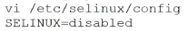
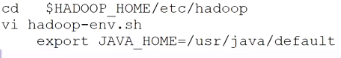

- [Hadoop官网](https://hadoop.apache.org/)
- 通常意义上的Hadoop，包含如下4个组件
	- Common包，组件的公共部分
		- [[Hadoop Configuration]] Hadoop的配置实现
		- [[Hadoop IO]] Hadoop的序列化与压缩
	- [[HDFS ]] 分布式文件存储系统
	- [[YARN]] 分布式调度系统
	- [[MapReduce]] 分布式任务调度框架
- 在Apache 基金会中，可以与Hadoop联动的项目
	- [[HBase]] 大表存储数据
	- [[Hive]] 数仓+SQL查询
	- [[Spark]] 批处理执行引擎+SQL查询+流式实时处理+机器学习
		- 相似的还有 [[Flink]]
	- [[Tez]] 批处理执行引擎
	- [[Zookeeper]] 分布式协调服务
- 部署
  collapsed:: false
	- 需要的硬件
		- GNU/Linux [[Linux]] 机器
	- 需要的软件
		- [[Java]] 8+
		- 运行Hadoop的机器中需要有 [[ssh]]
			- 远程免密登陆
			- 远程执行脚本\命令
	- 基础配置
	  collapsed:: true
		- 设置IP `vi /etc/sysconfig/netwwork-scripts/ifcfg-eth0`及 主机名 `vi /etc/sysconfig/network`
			- 
			- 
			- 关闭防火墙 `service iptables stop` `chkconfig iptables off`& selinux `vi /etc/selinux/config`
				- 
				-
			- 设置hosts映射
				- 
			- 时间同步 -- 使用ntp服务
				- 
				-
			- 安装 [[jdk]]
				- `rpm -i jdk-8ul81-linux-x64.rpm`
				- 
				-
			- 设置 [[ssh]] 免密登录
				- `ssh localhost` 自己登录自己 试试是否需要密码
					- 被动生成了`/root/.ssh`目录
				- 
				-
	- 伪分布式模式
	  collapsed:: false
		-
		-
		- 
		- 规划安装路径
			- 
		- 设置环境变量
			- 
		- 配置Hadoop的角色
			- 修改hadoop-env.sh的JAVA_HOME为绝对路径
				- 
			- 修改 `etc/hadoop/core-site.xml` -- [[NameNode]] 角色在那里启动
				- ```xml
				  <configuration>
				      <property>
				          <name>fs.defaultFS</name>
				          <value>hdfs://node01:9000</value>
				      </property>
				  </configuration>
				  ```
			- 修改`etc/hadoop/hdfs-site.xml` -- HDFS的副本数量
				- ```xml
				  <configuration>
				      <property>
				          <name>dfs.replication</name>
				          <value>1</value>
				      </property>
				    //NameNode元数据的保存目录
				    	<property>
				          <name>dfs.namenode.name.dir</name>
				          <value>/var/bigdata/hadoop/local/dfs/name</value>
				      </property>
				    //DataNode的数据块的保存目录
				      <property>
				          <name>dfs.datanode.data.dir</name>
				          <value>/var/bigdata/hadoop/local/dfs/data</value>
				      </property>
				    //SecondaryNameNode的启动地址
				       <property>
				          <name>dfs.namenode.secondary.http.address</name>
				          <value>node01:50090</value>
				      </property>
				    //SecondaryNameNode的数据目录
				         <property>
				          <name>dfs.namenode.checkopint.dir</name>
				          <value>/var/bigdata/hadoop/local/dfs/secondary</value>
				      </property>
				  </configuration>
				  ```
			- 修改 salves -- [[DataNode]] 角色在哪里启动
		- 初始化和启动
			- `start-dfs.sh` 启动所有角色
				- 第一次启动时,[[DataNode]]和 [[SecondaryNameNode]] 会创建数据目录
			- `hdfs dfs -mkdir -p /user/root` 创建存放数据的根目录
			-
	- 完全分布式模式
	- HA（High Available） #高可用
		- 多个[[NameNode]] 主备切换
		-
-