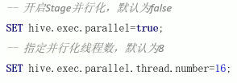
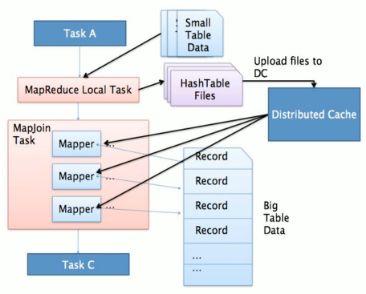
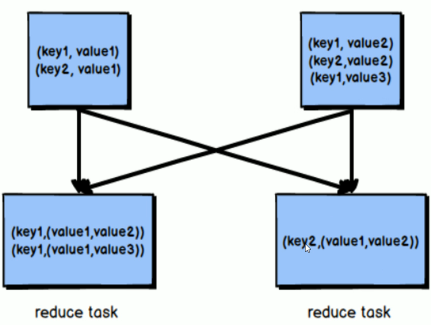

- [[Hive]] 自身不存储数据，而是采用HDFS。同理，自身也不对数据做运算，而是使用[[MapReduce]]框架或[[Spark]]框架。
- [[Hive查询]]
- 表结构优化 #查询优化
	- [[分区表]]
	- [[分桶表]]
- 表数据优化 #查询优化
	- [[Hive文件存储]]
	- [[Hive数据压缩]]
	- [[Hive存储优化]]
- [[Explain 查询计划]] 了解一条HQL在底层的实现过程
- [[MapReduce]] 的优化
	- 本地模式自动切换 `set hive.exec.mode.local.auto = true`
	- JVM重用
		- Hadoop默认为每个Task启动一个 [[JVM]] 来运行，而JVM启动时内存开销大
		- JVM重用指的就是一个JVM实例被多个Job重复使用
		- 但在3.0已经不再支持 `set mapreduce.job.jvm.numtasks=10`
	- 并行执行
		- 多个Stage之间无依赖关系的，可以并行执行
		- 
		-
- Join 优化 #查询优化
  id:: 621b3b25-831d-4e0d-b49c-19ab01044211
	- Map Join 适用于 小表 join 大表 或 小表 join 小表
collapsed:: true
		- 将小的那份完整的数据给每个MapTask的内存都放一份
		- 这样底层不需要经过shuffle,仅需占用存放小数据文件的内存空间
		- 
	- Reduce Join 适用于 大表 Join 大表
collapsed:: true
		- 利用Shuffle阶段的分组对数据按join字段进行合并。
		- 
	- 自动判断，满足Map Join则执行,不满足则Reduce Join
	- ((af068531-83f5-4711-9ab6-619396eda1c6))
- 关联优化 #查询优化
	- 当程序中的操作彼此间有关联性时，尽量的放在一个MapReduce中实现
	- eg: `select * from t_user group by id order by id desc`
	- 配置 `set hive.optimize.correlation=true`
- [[Hive 优化器]] #查询优化
- 谓词下推 PPD #查询优化
	- 将 where 中的表达式，尽可能的提前执行(下推到map端)。减少map到reduce的传输
	- 默认是开启的
	- 下推规则
		- 1. 对于a join b ,条件写在on后面，还是where后面，性能上没有区别。如果b表是副表，则它的分区条件一定要写在on后面
		  2. 对于 a left join b , b的条件写在 on 后面， a的条件写在 where后面
		  3. 对于 a right join b , a的条件写在on后面，b的条件写在where后面
- [[数据倾斜]] 优化 #查询优化
- 执行引擎-- [[Tez]]
- 执行引擎-- [[Spark]]
	-
-