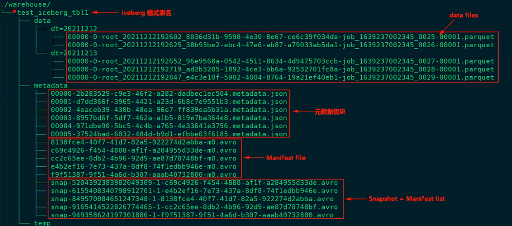

- 是一种用于大型数据分析场景的开放表格式(table format).使用类似于SQL表的高性能表格式,单表数据可存储PB级.
- 是一种数据湖解决方案.可配合 [[Spark]] [[Presto]] [[Flink]] 和 [[Hive]] 一同使用.
- 特点
	- 支持实时\批量 (Flink\Spark)数据的写入和读取
	- 支持事务ACID,支持增\删\改 操作
	- 不绑定任何存储格式,支持Parquet\ORC 等
	- 支持隐藏分区和分区变更,方便业务进行数据分区策略
		- 隐藏分区: 可以指定任意列,通过函数 进行分区
	- 支持快照数据重复查询,具备版本回滚功能. 可以查到历史数据
	- 超快速的记录扫描.通过表元数据对查询进行高效过滤
- 存储结构\表格式(Table Format)
	- 
	- 每进行一次提交,生成一个date file\  元数据信息\ Manifest file \Snapshot
	- 数据文件(Date files )
		- 真实存储数据的文件,存于`/tb_name/data/partition=xxx/` 目录下.
	- 表快照(Snapshot)
		- 表示某一时刻的状态.存储的是该时刻所有 清单文件(manifest files) 构成的一个 清单列表(manifest list),进而能找到所有的数据文件(date files)
	- 清单文件(manifest files)
		- 每一行描述了每个数据文件(date files)的详细信息,包括 文件状态\路径,分区信息,列级别的统计信息(每列的max_value min_value) ,文件的大小及数据行 等.
- 就地表演化  in-place table evolution
	- 指的是当你改变表结构或改变分区时,不会使用 新建表并重新写入数据这一方式.(不会挪动数据)
- 模式演化 Schema evolution
	- Add - 向表结构中增加列
	- Drop - 从表结构中移除列
	- Rename - 重命名表中的列
	- Update - 将复杂结构(Struct Map )中的级别类型扩展类型长度. 如 从tinyint 升级到 int
	- Recorder -