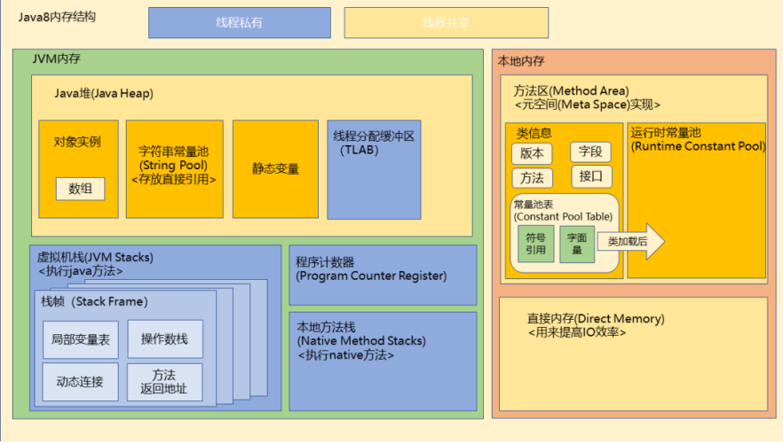

- 
- [[Java 虚拟机栈]]
- 本地方法栈
	- 执行的是native方法
	- 也可能抛出两种异常
- PC计数器
- [[Java 堆内存]]
- [[Java 方法区]] 1.8改为了 [[Java 元空间]]
- [[Java 直接内存]]
- 几种变量存放在哪里？
	- ```java
	  public class StaticObjTest {
	      static class Test{
	            // 静态变量&类变量
	            // 一个java.lang.Class类型的对象实例引用了此变量
	            static ObjectHolder staticObj = new ObjectHolder();
	            // 实例变量&成员变量
	            ObjectHolder instanceObj = new ObjectHolder();
	            void foo() {
	                // 局部变量
	                ObjectHolder localObj = new ObjectHolder()();
	                System.out.println("done");
	                }
	          }
	          private static class ObjectHolder{
	          }
	          public static void main(String[] args) {
	            Test test = new StaticObjTest.Test();
	            test.foo();
	      	}
	  }
	  
	  ```
	- 静态变量&类变量
		- `static`所修饰的，定义在方法外的变量
		- 1.8-随着Test类信息存放于 [[Java 方法区]] ，1.8+存放于[[Java 堆内存]]中
	- 实例变量&成员变量
		- 没有`static`修饰的，定义在类中
		- 在[[Java 类初始化过程]] 时，从 ((63bbf5ce-587f-4c0c-8d74-972bba355132)) 取出直接引用或值，随着Test对象实例存放于[[Java 堆内存]]中
	- 局部变量
		- 定义在类的方法中
		- 方法被调用时放入[[Java 虚拟机栈]]的栈帧中，方法结束后从栈中弹出
	- 变量的引用