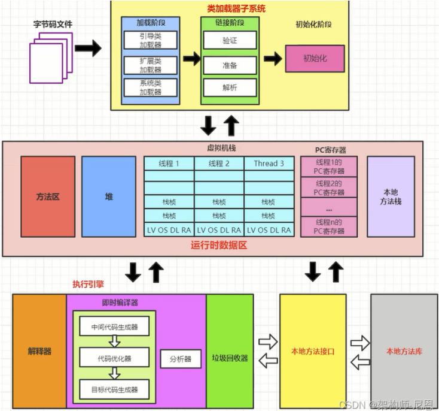

- 
- [[JVM 类装载器]]
- 运行时数据区 [[JVM 内存模型]]
- 执行引擎
	- 前端编译
		- 将 .java文件编译成.class文件
	- 解释执行
		- 每次执行方法调用时，JVM都会将字节码翻译成机器码，然后执行机器码，
	- 编译执行 [[JVM 即时编译器]]
		- 当代码段执行超过一定次数后(热点代码)，为了提升执行效率
		- 直接将字节码转换为机器码，缓存起来，在执行方法调用时直接执行机器码
- 本地库接口