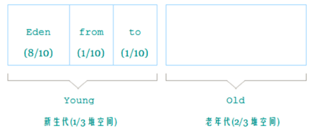
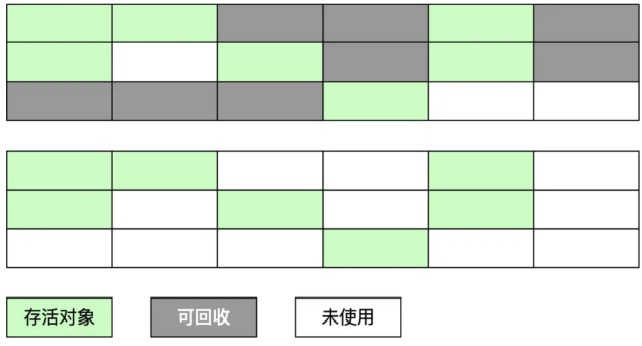
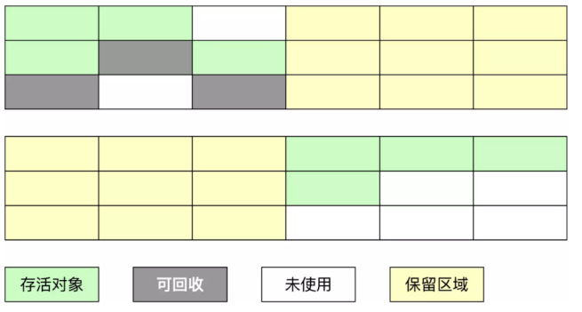
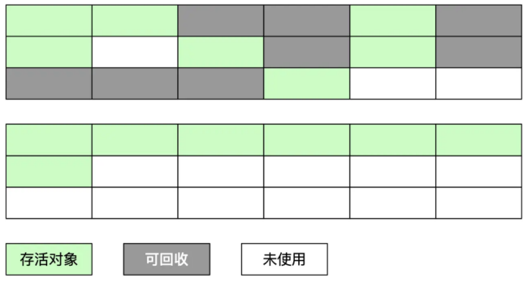
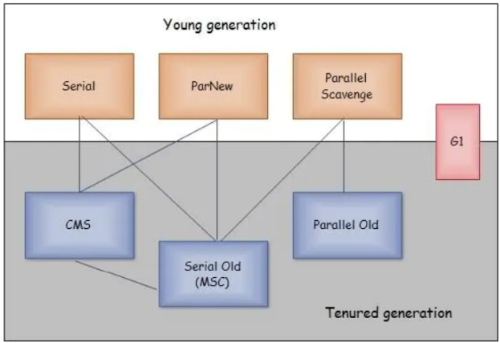
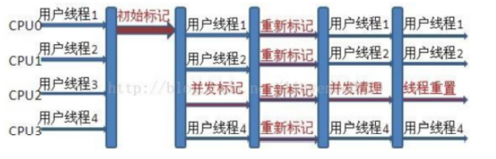

- GC Gabage Collection 是垃圾收集的意思。有了垃圾收集机制，使得程序员在编写代码时不再考虑内存管理的问题。有效的防止了内存泄漏。
- ## ((63be09ad-e4d7-4923-825b-d87a62faa166))
- {{embed ((63be6a8e-383b-47dd-9c41-2a50709409e1))}}
- ## 对象是否可被回收
	- 引用计数
		- 每个对象有一个引用计数属性，新增引用时+1，引用释放时-1.计数为0时可以回收。
		- 无法解决相互循环引用的问题
	- 可达性分析
		- 从GC Roots开始向下搜索，搜索的路径称为**引用链**。 当一个对象到GC Roots没有任何引用链路时，证明此对象不可达。
		- 至少会经过两次标记过程，才面临回收
- ## JVM内存分代
	- 
	- 分代的目的是为了 **提高对象内存分配和垃圾回收的效率**
	- 新生代 
	  id:: 63be78c1-12d7-4a42-a1fe-d3fd630c63bf
		- ((63be6a31-b5b0-4ffb-8c95-72fc10fc453a))
		- Eden区
			- 新对象的出生地。当Eden区内存不足时，会触发 ((63be6b6a-8bc6-477a-830f-13fcb1a8a633))
		- Servivor From 区
			- 上一次GC的幸存者，作为本次GC的被扫描者
		- Servivor To 区
			- 保留了一次 ((63be6b6a-8bc6-477a-830f-13fcb1a8a633)) 过程中的幸存者
	- 老年代
	  id:: 63be78c7-2334-4ee7-9399-7bc275ed6c9d
		- ((63be9cd8-0bf5-43f4-85b4-58fd0fbdeed2))
		- 存放生命周期较长的对象
		- 当新生代达到一定存活次数后，会被送来
		- 大对象直接分配到这里
		- 当空间不够时，触发 ((63bd458f-4ddf-4a39-ba1d-4b7d2b7baeae))
	- [[Java 永久代]] 不属于 [[Java 堆内存]]
- ## GC类型
	- Minor GC  
	  id:: 63be6b6a-8bc6-477a-830f-13fcb1a8a633
		- ((63be6a31-b5b0-4ffb-8c95-72fc10fc453a))
		- 复制
			- eden,Servivor From ,复制到 Servivor To .年龄+1
			- 如果有对象的年龄达到了放入老年代的标准，则复制到老年代区
		- 清空
			- 清空Eden,Servivor From 中的对象
		- 互换
			- Servivor To 和 Servivor From 互换。交互成为下一次GC的目标
	- Full GC/Major GC 
	  id:: 63bd458f-4ddf-4a39-ba1d-4b7d2b7baeae
		- ((63be9cd8-0bf5-43f4-85b4-58fd0fbdeed2))
		- 扫描一次所有老年代对象，标记出存活的。然后回收没有标记的对象。
		- 会产生内存碎片，会维护一张可用内存区的表。
	- GC触发时机
	- ### 为什么要设置两个Survivor区？
	  id:: 63be8025-29b0-460e-8867-4258e648347e
		- Survivor的存在意义，就是减少被送到老年代的对象，进而减少Full GC的发生。
		- 设置两个Survivor区最大的好处就是解决了碎片化。标记复制算法保证了存活对象占用连续的内存空间。
- ## 垃圾收集算法
	- 标记-清除算法
	  id:: 63be9cd0-ca1e-4a29-9cb8-bcf222c44fbf
		- 
		- 标记阶段：标记出可以回收的对象
		- 清除节点：回收被标记的对象所占空间
	- 复制算法
	  id:: 63be6a31-b5b0-4ffb-8c95-72fc10fc453a
		- 
		- 它把内存空间划为两个相等的区域，每次只使用其中一个区域。
		- 遍历当前使用的区域，把**存活对象复制**到另外一个区域中，最后将当前使用的区域的可回收的对象进行回收
	- 标记-整理算法
	  id:: 63be9cd8-0bf5-43f4-85b4-58fd0fbdeed2
		- 
		- 在标记可回收的对象后将所有存活的对象压缩到内存的一端，使他们紧凑的排列在一起
		- 然后对端边界以外的内存进行回收
	- 分代收集算法
		- 根据各年代特点分别采用最适当的 GC 算法
- ## 垃圾收集器
	- 
	- Serial 收集器
		- ((63be6a31-b5b0-4ffb-8c95-72fc10fc453a))
		- ((63be78c1-12d7-4a42-a1fe-d3fd630c63bf)) 单线程
	- ParNew 收集器
		- ((63be6a31-b5b0-4ffb-8c95-72fc10fc453a))
		- ((63be78c1-12d7-4a42-a1fe-d3fd630c63bf)) 并行收集
	- Serial Old 收集器
		- ((63be9cd8-0bf5-43f4-85b4-58fd0fbdeed2))
		- ((63be78c7-2334-4ee7-9399-7bc275ed6c9d)) 单线程
	- Parallel Old 收集器
		- ((63be9cd8-0bf5-43f4-85b4-58fd0fbdeed2))
		- ((63be78c7-2334-4ee7-9399-7bc275ed6c9d)) 并行收集
	- ### CMS Concurrent Mark Sweep 收集器
		- ((63be9cd0-ca1e-4a29-9cb8-bcf222c44fbf))
		- ((63be78c7-2334-4ee7-9399-7bc275ed6c9d)) 并行收集
		- 
		- 初始标记
			- 只标记GC Roots直接关联的对象，速度快，stop the world
		- 并发标记
			- GC Roots跟踪，和用户线程一起工作，不需要暂停
		- 重新标记
			- 修正产生变动的对象标记，stop the world
		- 并发清除
			- 清除不可达对象，和用户线程一起工作，不需要暂停
	- ### [[G1 Garbage First]]
		-
-