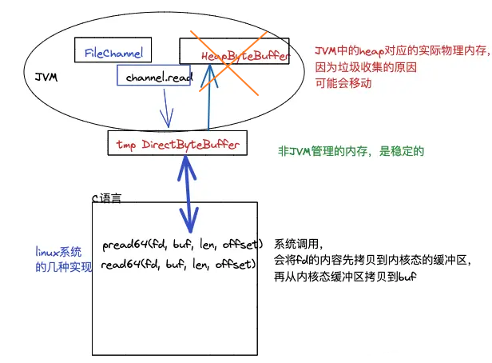
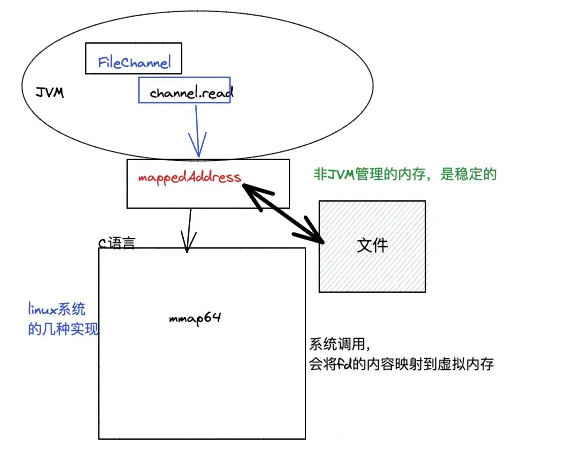
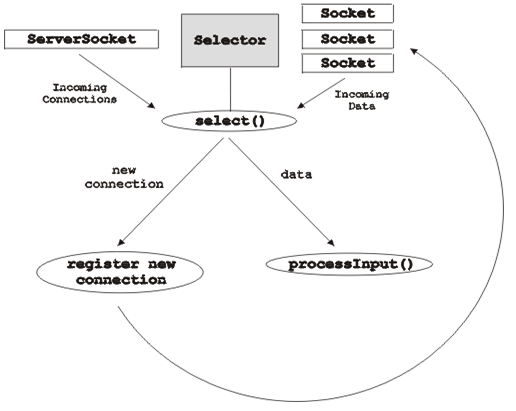
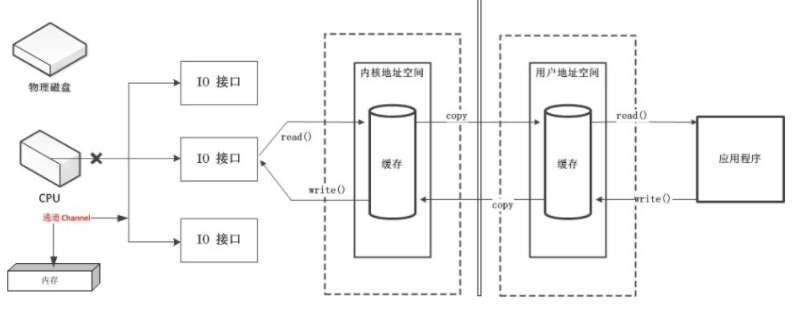

- 全称 `New Input/Output`
- `java.nio` 包下,包含如下关键类
  collapsed:: true
	- `Buffers` 缓冲区
	- `Channels` 通道
	- `Selectors` 选择器
	- `Multiplexed, non-blocking I/O` 多路复用的,非阻塞IO
- `Channels` 通道
  collapsed:: true
	- 通道是用于在实体(磁盘)和字节缓冲区(内存)之间有效传输数据的介质。它从一个实体读取数据，并将其放在缓冲区块中以供消费。反之也可以.
	- Channel有别于传统的流的地方在以下3点
		- 通道可以是双向的,但流是单项的
		- 通道可以异步读写
		- 通道不能直接访问数据,需要和Buffer进行交互
	- 常用的Channel实现
		- FileChannel : 用于读取、写入、映射和操作文件的通道
		- DatagramChannel : 通过 UDP 读写网络中的数据通道。
		- SocketChannel ： 通过 TCP 读写网络中的数据。
		- ServerSocketChannel ： 可以监听新进来的 TCP 连接，对每一个新来进来的连接都会创建一个 SocketChannel。
	- 使用示例
	  collapsed:: true
		- ```java
		  import java.io.FileInputStream;
		  import java.io.FileOutputStream;
		  import java.io.IOException;
		  import java.nio.ByteBuffer;
		  import java.nio.channels.ReadableByteChannel;
		  import java.nio.channels.WritableByteChannel;
		  
		  public class ChannelDemo {
		      public static void main(String args[]) throws IOException {
		          String relativelyPath = System.getProperty("user.dir");
		          FileInputStream input = new FileInputStream(relativelyPath + "/testin.txt");
		          ReadableByteChannel source = input.getChannel();
		          FileOutputStream output = new FileOutputStream(relativelyPath + "/testout.txt");
		          WritableByteChannel destination = output.getChannel();
		          copyData(source, destination);
		          source.close();
		          destination.close();
		          System.out.println("Copy Data finished.");
		      }
		  
		      private static void copyData(ReadableByteChannel src, WritableByteChannel dest) throws IOException {
		          ByteBuffer buffer = ByteBuffer.allocateDirect(20 * 1024);
		          while (src.read(buffer) != -1) {
		              // The buffer is used to drained
		              buffer.flip();
		              // keep sure that buffer was fully drained
		              while (buffer.hasRemaining()) {
		                  dest.write(buffer);
		              }
		              buffer.clear(); // Now the buffer is empty, ready for the filling
		          }
		      }
		  }//原文出自【易百教程】，商业转载请联系作者获得授权，非商业请保留原文链接：https://www.yiibai.com/java_nio/java-nio-channels.html
		  
		  ```
	- 通道之间的数据传输 `transferTo()` 和 `transferFrom()`
- `Buffers` 缓冲区
  collapsed:: true
	- 用于与NIO通道进行交互。这是写入数据的内存块，以便在稍后再次进行读取。 内存块用NIO缓冲对象包装，这样可以提供更简单的方法来处理内存块.
	- 常用的Buffer实现
		- 
	- 使用缓冲区
		- 分配缓冲区
		  collapsed:: true
			- ```java
			  //分配一个大小为28字节的缓冲区
			  ByteBuffer buf = ByteBuffer.allocate(28);
			  
			  ```
		- 从缓冲区中读取数据
		  collapsed:: true
			- `byte aByte = buf.get()`
		- 将数据写入缓冲区
		  collapsed:: true
			- ```java
			  FileChannel fcin = fin.getChannel(); 
			  ByteBuffer buffer = ByteBuffer.allocateDirect( 1024 );  
			  int r = fcin.read( buffer );  
			  ```
	- 直接缓冲区 `ByteBuffer.allocateDirect(1024 * 1024)`
		- 在JVM的内存之外,申请一块缓冲区,减少了一次用户态到用户态的数据拷贝过程
		- 
	- 内存映射IO `MappedByteBuffer `
		- 是一种读和写文件数据的方法,通过 将文件 实际读写的部分直接映射到内存中,并且直接操作位数据
		  collapsed:: true
			- 
			- ```java
			  public class Program {  
			      static private final int start = 0;<span style="font-family:FangSong_GB2312;font-size:13px;">  
			      static private final int size = 1024;  
			        
			      static public void main( String args[] ) throws Exception {  
			          RandomAccessFile raf = new RandomAccessFile( "c:\\test.txt", "rw" );  
			          FileChannel fc = raf.getChannel();  
			            
			          MappedByteBuffer mbb = fc.map( FileChannel.MapMode.READ_WRITE,  
			            start, size );  
			            
			          mbb.put( 0, (byte)97 );  
			          mbb.put( 1023, (byte)122 );  
			            
			          raf.close();  
			      }  
			  }
			  ```
- `Selectors` 选择器
  collapsed:: true
	- 用于使用单个线程处理多个通道.程之间的切换对于操作系统来说是昂贵的。 因此，使用它可以提高系统效率
	- 使用过程
		- ```java
		  // 创建选择器
		  Selector selector = Selector.open();
		  //绑定通道
		  ServerSocketChannel serverSocket = ServerSocketChannel.open();  
		  InetSocketAddress hostAddress = new InetSocketAddress("localhost", 8099);  
		  serverSocket.bind(hostAddress);
		  
		  // 遍历并处理所有通道
		  Set<SelectionKey> selectedKeys = selector.selectedKeys();  
		  Iterator<SelectionKey> keyIterator = selectedKeys.iterator();  
		  while(keyIterator.hasNext()) {    
		      SelectionKey key = keyIterator.next();  
		      if(key.isConnectable()) {  
		          // The connection was established with a remote server.  
		      } else if (key.isAcceptable()) {  
		          // The connection was accepted by a ServerSocketChannel.  
		      } else if (key.isWritable()) {  
		          //  The channel is ready for writing  
		      } else if (key.isReadable()) {  
		          // The channel is ready for reading  
		      }  
		      keyIterator.remove();  
		  }
		  ```
		- 
- IO的发展历程
  collapsed:: true
	- 第一阶段：由CPU直接处理和管理IO接口并进行数据传输
	- 第二阶段：引入寄存器[[DMA]]（流的概念引入），在需要使用IO操作的时候，由寄存器DMA向CPU申请，然后再由寄存器统一管理IO接口，实现数据传输。
	- 第三阶段：寄存器DMA换成通道Channel，通道独立开来不由CPU管，也不需要申请权限，只有由其对IO接口进行处理和管理，然后实现数据传输。
		- 
- 参考资料
	- [深入思考NIO](https://juejin.cn/post/7044920986445021198#heading-10)
	- [深入思考NIO_2](https://juejin.cn/post/7045672219866988551)
	- [java NIO教学](https://www.yiibai.com/java_nio/java-nio-buffers.html)
	- [Java NIO教学](https://edu.csdn.net/skill/java/java-ee223c3171384d6295cbf7d95e8dba61?category=475)
	-
-