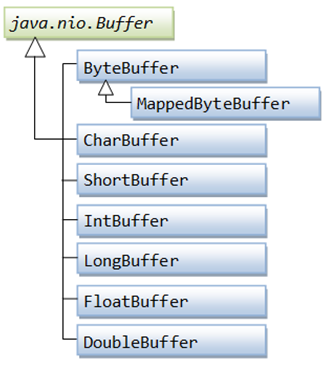

- 全称 `New Input/Output`
- `java.nio` 包下,包含如下关键类
	- `Buffers` 缓冲区
	- `Channels` 通道
	- `Selectors` 选择器
	- `Multiplexed, non-blocking I/O` 多路复用的,非阻塞IO
- `Channels` 通道
	- 通道是用于在实体(磁盘)和字节缓冲区(内存)之间有效传输数据的介质。它从一个实体读取数据，并将其放在缓冲区块中以供消费。反之也可以.
	- Channel有别于传统的流的地方在以下3点
		- 通道可以是双向的,但流是单项的
		- 通道可以异步读写
		- 通道不能直接访问数据,需要和Buffer进行交互
	- 常用的Channel实现
		- FileChannel : 用于读取、写入、映射和操作文件的通道
		- DatagramChannel : 通过 UDP 读写网络中的数据通道。
		- SocketChannel ： 通过 TCP 读写网络中的数据。
		- ServerSocketChannel ： 可以监听新进来的 TCP 连接，对每一个新来进来的连接都会创建一个 SocketChannel。
	- 使用示例
	  collapsed:: true
		- ```java
		  import java.io.FileInputStream;
		  import java.io.FileOutputStream;
		  import java.io.IOException;
		  import java.nio.ByteBuffer;
		  import java.nio.channels.ReadableByteChannel;
		  import java.nio.channels.WritableByteChannel;
		  
		  public class ChannelDemo {
		      public static void main(String args[]) throws IOException {
		          String relativelyPath = System.getProperty("user.dir");
		          FileInputStream input = new FileInputStream(relativelyPath + "/testin.txt");
		          ReadableByteChannel source = input.getChannel();
		          FileOutputStream output = new FileOutputStream(relativelyPath + "/testout.txt");
		          WritableByteChannel destination = output.getChannel();
		          copyData(source, destination);
		          source.close();
		          destination.close();
		          System.out.println("Copy Data finished.");
		      }
		  
		      private static void copyData(ReadableByteChannel src, WritableByteChannel dest) throws IOException {
		          ByteBuffer buffer = ByteBuffer.allocateDirect(20 * 1024);
		          while (src.read(buffer) != -1) {
		              // The buffer is used to drained
		              buffer.flip();
		              // keep sure that buffer was fully drained
		              while (buffer.hasRemaining()) {
		                  dest.write(buffer);
		              }
		              buffer.clear(); // Now the buffer is empty, ready for the filling
		          }
		      }
		  }//原文出自【易百教程】，商业转载请联系作者获得授权，非商业请保留原文链接：https://www.yiibai.com/java_nio/java-nio-channels.html
		  
		  ```
- `Buffers` 缓冲区
	- 用于与NIO通道进行交互。这是写入数据的内存块，以便在稍后再次进行读取。 内存块用NIO缓冲对象包装，这样可以提供更简单的方法来处理内存块.
	- 常用的Buffer实现
		- 
	- 使用缓冲区
		-