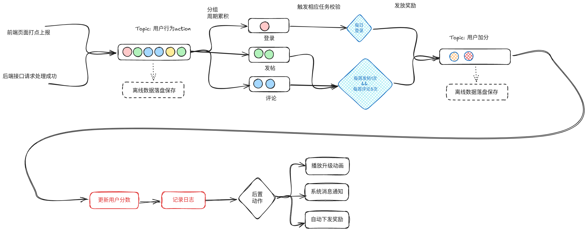

- {{cards [[Java项目介绍面试题]] }}
- 介绍一下项目的架构，请求如何进入我们项目的 #card
  card-last-interval:: 0
  card-repeats:: 11
  card-ease-factor:: 1.3
  card-next-schedule:: 2024-08-14T01:31:20.692Z
  card-last-reviewed:: 2024-08-14T01:31:20.692Z
  card-last-score:: 3
	- 接入层 {{cloze LVS Linux虚拟服务器}} + {{cloze Nginx}}
	- 服务层 {{cloze Spring 网关}} + {{cloze 本地缓存}} + {{cloze Redis集群}} + {{cloze 数据库 兜底}}
- 从高并发的角度介绍项目 10 #card
  card-last-interval:: 0.02
  card-repeats:: 4
  card-ease-factor:: 1.3
  card-next-schedule:: 2024-08-14T00:54:54.116Z
  card-last-reviewed:: 2024-08-14T00:54:54.116Z
  card-last-score:: 3
	- 拆分为微服务
		- {{cloze 方便重要业务的水平扩展，如基础模块，用户模块}}
	- 分库分表
		- {{cloze MySql单表数据不超过500W,性能最佳}}
	- 读写分离
		- {{cloze 数据库分主从，主库写，从库读}}
	- 链接池化
		- {{cloze 使用的都是框架，所有链接均放在链接池中}}
	- 缓存
		- {{cloze Redis二级缓存+本地三级缓存}}
	- 消息队列削峰
		- {{cloze CPA任务中使用了}}
	- 熔断降级
		- {{cloze 所有一级页面都有兜底数据}}
	- 限流
		- {{cloze Redis分布式限流}}
	- 水平扩容
		- {{cloze 服务自身加机器，依赖的中间件加机器}}
	- 海量数据处理
		- {{cloze ES + HBase}}
- 抽奖模块设计要略 #card
  id:: 63d86c04-4b9e-4b39-adb5-66cc686129ff
  card-last-interval:: 0
  card-repeats:: 11
  card-ease-factor:: 1.3
  card-next-schedule:: 2024-08-14T00:59:24.428Z
  card-last-reviewed:: 2024-08-14T00:59:24.429Z
  card-last-score:: 3
	- 步骤拆分
		- 抽奖准入->产生奖品->扣减库存 -> 记录日志
	- 用户的抽奖次数扣减，高并发下如何保证不超扣
		- 分布式锁，key=固定前缀+userId
		- CAS操作，最后扣减
		- 抽奖次数为0的用户缓存，这部分请求不打入数据库
	- 库存扣减，高并发下如何保证不超扣
		- 同一类型的奖品ID设置多个，尽可能的分散请求
		- for update 行锁 ，保证顺序执行
		- 库存为0的记录缓存，这部分请求不打入数据库
	- 保底机制
		- 过程中一旦发生异常，走保底奖品(虚拟、不限量)
		- 大盘监控，奖品库每15分钟播报一次
		- 每日对账
- 任务和积分模块设计要略 #card
  card-last-interval:: 4
  card-repeats:: 2
  card-ease-factor:: 2.22
  card-next-schedule:: 2024-08-16T07:59:33.436Z
  card-last-reviewed:: 2024-08-12T07:59:33.436Z
  card-last-score:: 3
	- 
	- 用户行为收集
		- 异步发送MQ，MQ消息落盘保存
	- 分行为周期累积
		- 按用户ID、行为类型、不同周期 进行累积
	- 触发任务进度判断
		- 根据一条或多条周期记录 & 周期内未发放奖励
	- 发放奖品
		- 异步发送MQ，MQ消息落盘
	- 写入用户积分日志 + 更新用户积分
- 线上系统异常的可能原因及其处理方案 #card
  card-last-interval:: 0.14
  card-repeats:: 1
  card-ease-factor:: 2.36
  card-next-schedule:: 2024-08-16T04:09:19.994Z
  card-last-reviewed:: 2024-08-16T01:09:19.994Z
  card-last-score:: 3
	- 新上线功能故障-- 回滚版本
	- 第三方服务故障-- 熔断降级
	- 接口突然变慢 -- 限流并做查询优化
	- 通用步骤
		- 保存故障现场、包括请求、日志、JVM相关的情况
		- 重现故障
		- 发现问题并解决
		- 测试
		- 上线
- 提升接口QPS的策略 #card
  id:: 66c2e98d-7825-4f7b-8e37-2ae2f7605cdc
	- 优化数据库，包括 优化索引 和 表结构
	- 使用缓存
	- 异步处理，使用线程池 和 消息队列
	- 线程池调优、JVM参数调优
	- 服务拆分、读写分离
	- 避免大事务
	- 快速重试