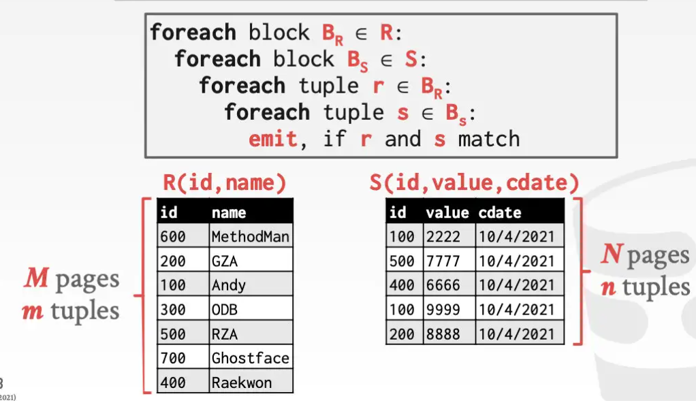
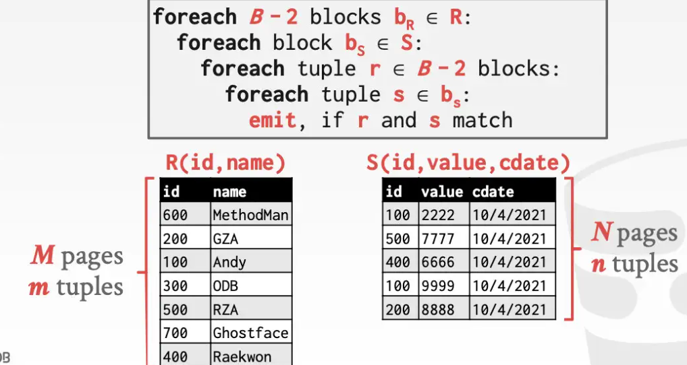
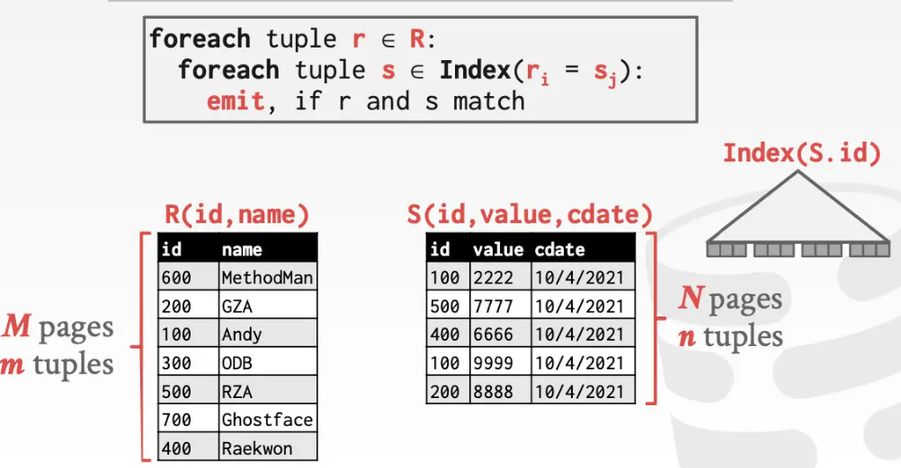

- 在查询计划中，通常把小表(所占页数较少的)放在左侧，称为*驱动表*。
- Join算子的输出
	- R表中的记录r与S表中的记录s，满足匹配条件，r&s组成一条新记录，返回给上级算子。
	- 影响输出的三个因素
		- SQL处理模型
		- 存储模型
		- 整个SQL所需的数据
	- 输出的内容
		- R和S的全tuple
		- R和S的记录id
- Join操作的开销计算
	- 主要是计算磁盘的IO开销。
	- 假设R表的大小为M页，m条数据; S表大小为N页，n条数据。
- Nested Loop Join 嵌套循环join
	- {:height 241, :width 326}
	- $$ cost =M+(m*N)$$
	- 优化一、基于页的嵌套循环join Block Nested Loop Join
		- 1个page放R表数据 B_r ,1个page放S表数据B_s
		- {:height 279, :width 449}
		- $$cost=M+(M*N)$$
		- 更进一步，如果缓存区很大，可以拿出B-2个page给outer table，1个page给inner table，1个page用于记录输出结果
		- 
		- $$cost=M+(\left \lceil M/(B-1) \right \rceil * N)$$
	- 嵌套循环join慢的原因：对于outer table中的每一行数据，都需要遍历inner table。可以使用inner table的index来加速寻找匹配项
		- index可以使用现成的索引
		- 也可以临时建立一个(Hash表,B+树)，临时用
	- 优化二：基于索引的嵌套循环join Index Nested Loop Join
		- 
		- $$cost=M+(m*C)$$ C为index上查找每个tuple的均值
- Sort Merge Join
	- 阶段一：Sort
		- 以join key为基准，对两张表数据进行排序，可以用外排。
	- 阶段二：Merge
		- 使用两个指针指向排序好的两张表，然后进行匹配。
		-
- Hash Join