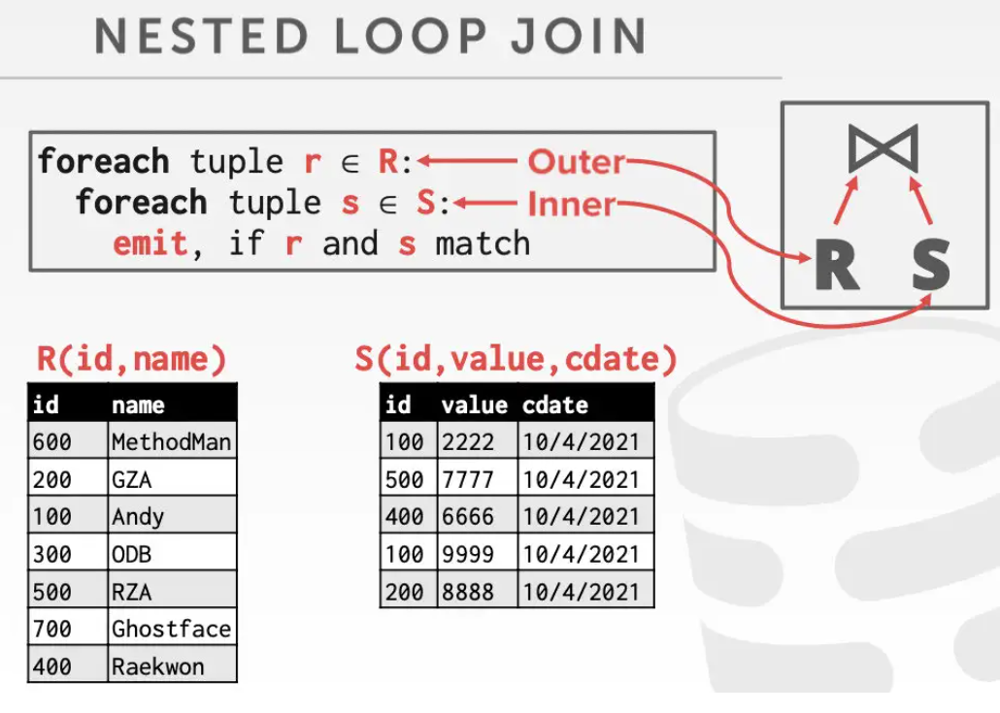

- 在查询计划中，通常把小表(所占页数较少的)放在左侧，称为*驱动表*。
- Join算子的输出
	- R表中的记录r与S表中的记录s，满足匹配条件，r&s组成一条新记录，返回给上级算子。
	- 影响输出的三个因素
		- SQL处理模型
		- 存储模型
		- 整个SQL所需的数据
	- 输出的内容
		- R和S的全tuple
		- R和S的记录id
- Join操作的开销计算
	- 主要是计算磁盘的IO开销。
	- 假设R表的大小为M页，m条数据; S表大小为N页，n条数据。
- Nested Loop Join 嵌套循环join
	- {:height 241, :width 326}
	- IO cost =  $$M+(m*N)$$
	- 优化一、基于页的嵌套循环join Block Nested Loop Join
		- 1个page放R表数据 B_r ,1个page放S
- Sort Merge Join
- Hash Join