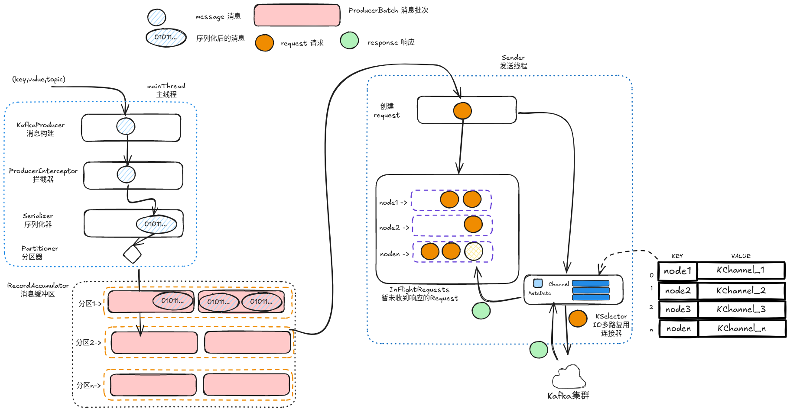
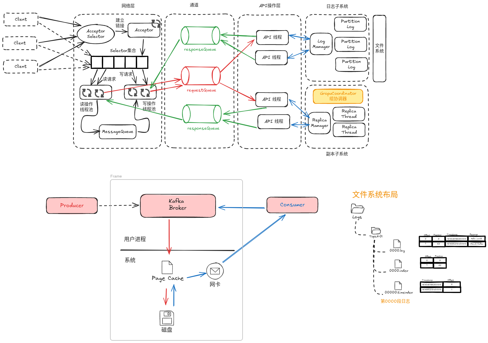
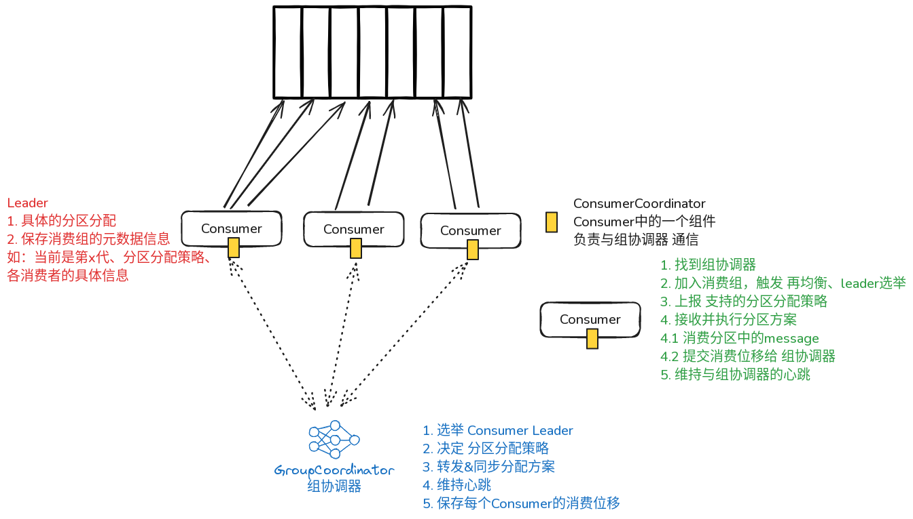
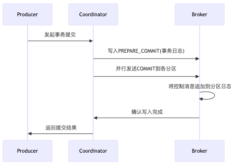

- [生产者 Producer](https://excalidraw.com/#json=qKm_c7SjBe1IUen_HxVsg,CMYjMm-Jb2hYFVe2xOTqsw)
	- {:height 399, :width 748}
	- 消息投送流程
		- 主线程
			- (key,value,topic) -> 消息构建message -> 拦截增强 -> 序列化 -> 分区
		- 消息缓冲区
			- 按照分区，将message聚合成producerBatch 消息批次
			- 每个Batch的内存将会被复用，**降低GC次数**
		- 发送线程
			- 从缓冲区取出一个批次 -> 构建Request -> selector投送的同时，放入InFlightRequests -> 分区转node -> http通信 -> 接收返回Response -> 匹配 Request 确保`exactly once`
- [Kafka服务](https://excalidraw.com/#json=W5R3qeFekvB5Tw7RQ-aVB,I4QOulGO04B11ngy9U3hTg)
	- 
	- 高性能
		- IO多路复用的 Reactor模型
			- 一个Acceptor线程，负责 链接的建立和维护
			- n个Processor线程，负责 读写数据
			- m个RequestHandler线程，负责 具体的业务逻辑
		- 磁盘顺序写入
		- 页缓存 Page Cache
			- 缓存的是最近会被使用的磁盘数据，作为消息队列，一是顺序写入，而是立马会被消费掉，非常契合。
			- 缓存中的页如果被修改，则变成脏页，由操作系统调度刷入磁盘
		- 零拷贝 mmap 和 sendfile
			-
	- 高可用
		- 日志文件目录 `../logs/topic-01/`
			- `{segmentNum}.log` 日志文件
				- offset-相对偏移量、position-物理地址、timestamp-时间戳、message-具体的消息内容
			- `{segmentNum}.index` 索引文件
				- offset、position
			- `{segmentNum}.timeIndex` 基于时间的索引文件
				- timestamp、offset
		- 日志压缩
			- 定期执行Log Compaction任务，合并相同key的消息，并保留最新的消息
			- 相关配置 `log.cleanup.policy=compact` `log.cleaner.enable=true`
		- 日志清理
			- 使用**清理检查点**文件（`cleaner-offset-checkpoint`）来记录每个分区的已清理偏移量
			- 触发方式
				- 基于文件保留时间 -- 删除超过时间的日志
				- 基于文件保留大小 -- 删除超过大小的旧记录
				- 基于日志起始偏移量 --日志分段的起始偏移量 <`logStartOffset` 则该日志分段可以被删除
			- 影响
				- 消息丢失：如果消费位移落后于HW，清理后消费者可能无法读取到已经被清理的消息。
				- 会占用一定的I/O资源
		- 副本同步机制
			- Leader负责顺序写入，Follower负责同步记录
			- 高水位指针HW
				- 表示消费者可以从中读取的最大消息偏移量。
				- 即使消息已经被写入到日志中，如果它在HW之后，消费者也是看不到的。
			- 低水位指针LW
				- 用于消费者或删除操作需要回溯消息时的最小偏移量
- [消费者 Consumer](https://excalidraw.com/#json=h952lkuaWLN1N52KyWbYW,0boEaiT_ziKYIkCLq3OCKA)
	- 
	- 分区分配策略 `partition.assignment.strategy`
	  collapsed:: true
		- RangeAssignor 范围分配
			- 首先对消费者进行字典序排序
			- 然后为每个消费者分配一个连续的分区范围
			- 分区范围 $$n = 分区数/消费者数 $$ $$m=分区数%消费者数$$，前m个分区 分得n+1个partition
			- 缺点：*当分区数和消费者数量不能整除时，可能导致分配不均匀*
		- RoundRobinAssignor 轮询分配
			- 将消费者**和**他们订阅的所有主题的分区按照字典序**排序**
			- 然后逐个将分区依次分配给每个消费者
			- 缺点：*如果消费者的订阅信息不同，可能会导致分配不均匀*
		- StickyAssignor 粘性分配
			- 分配尽可能的均匀
			- 再平衡时尽可能与上次结果保持一致
	- 消息消费流程
		- Consumer加入消费组
			- 寻找组协调器
			- 加入消费组、触发 再均衡 和 leader选举
			- 上报支持的分区方案
			- 接受并执行分区方案
			- 维持与组协调器的心跳
		- 消息消费
			- 从负责的分区中拉取消息
			- 消费处理
			- 手动/自动的提交消费位移 至 组协调器
	- 再均衡 Reblanace
	  id:: 67e0c8e2-9091-4f40-91e2-9d313e2d8d70
		- **再均衡时，会暂停有关Topic的消费，造成短暂的消息积压**，需要避免。
		- 触发时机
			- 消费者加入/离开消费组
			- 消费者的心跳链接断开
			- Topic的分区数发生变化
			- 消费者订阅的Topic发生变化
				- 如使用正则表达式订阅新增符合条件的主题时
			- 组协调器发生变更
		- 均衡过程
			- find_group --  消费者询问组协调器的位置
			- join_group -- 消费者加入组，并提供自己的订阅信息和分区分配策略
			- leader_decision -- 选出消费者Leader (按字典序的第一个)，投票统计分配方案，并选择一个大多数都接受的。计算出具体的分区方案。
			- sync_group -- 接收并下发  分区方案给所有消费者
			- heartbeat -- 维持与消费者的心跳链接
- [[Kafka面试题]]
- 幂等性
  id:: 67e666e3-8842-4534-b702-1ec4c80a4818
	- 唯一性标识
		- `PID` (Producer ID)：每个生产者唯一的身份标识
		- `Sequence Number`：每条消息的单调递增序列号
	- 生产者开启配置
		- ENABLE_IDEMPOTENCE_CONFIG = true
		- ACKS_CONFIG = all
	- Broker进行检查
		- 检查`(PID, Partition, Sequence)`组合,接受正常递增的消息,拒绝重复的序列号
	-
- 事务控制消息
  id:: 67e665d9-a1c0-47fe-9ed6-3126d0adecce
	- 控制消息类型
		- COMMIT -标记事务成功提交
		- ABORT - 标记事务终止
		- prepare_commit - 事务准备提交
	- 事务流程
		- 
	-