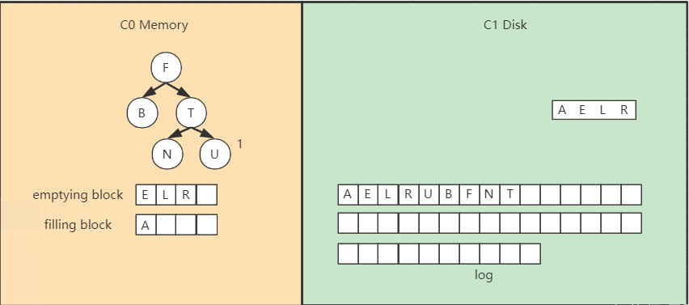
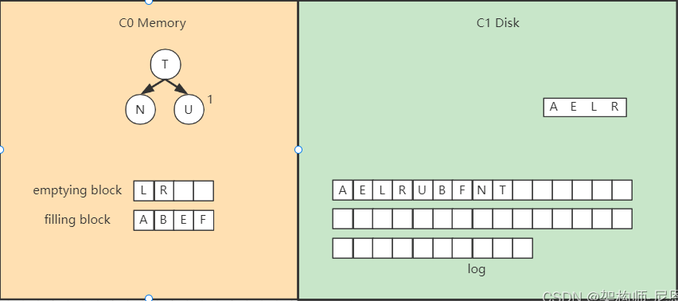
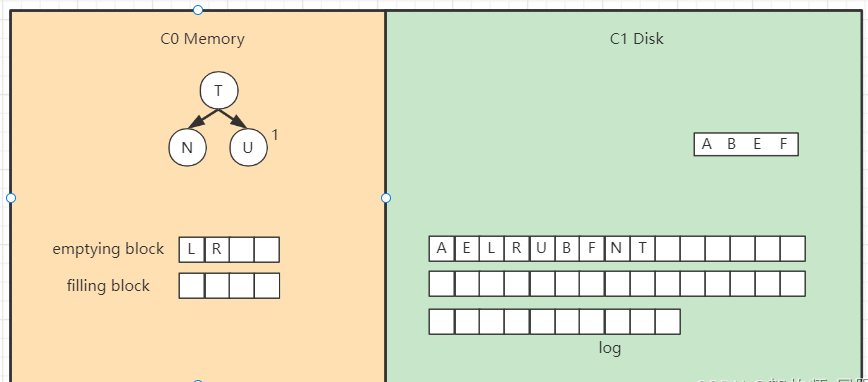
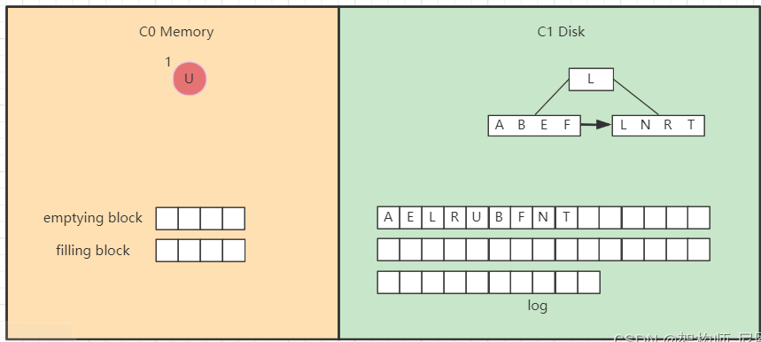

- {:height 552, :width 778}
- 日志结构合并树(Log-Structured Merge-Tree)。其实它并不属于一个具体的数据结构，它更多是一种数据结构的设计思想。
	- 保存在后台合并的一系列**SSTabel**
- 内存部分：memtable_table 类红黑树结构
	- 一旦红黑树的大小达到阈值，就会把数据整个刷到磁盘中，作为一个SSTabel
- 磁盘部分：SSTabel
	- 为避免文件过多，会定期进行合并
- 数据合并流程：
	- 加载C1的最左边叶子节点到**emptying block**
	  logseq.order-list-type:: number
	- 对C0树的节点和emptying block进行**合并排序**，放入**filling block**
	  logseq.order-list-type:: number
	- filling block填满后，追加到磁盘的新位置，将C1原来的节点删除掉
	  logseq.order-list-type:: number
	- **继续合并**，直到emptying block为空。filling block填满也刷入磁盘。
	  logseq.order-list-type:: number
	- 
	- 
	- 
	- 
-
-