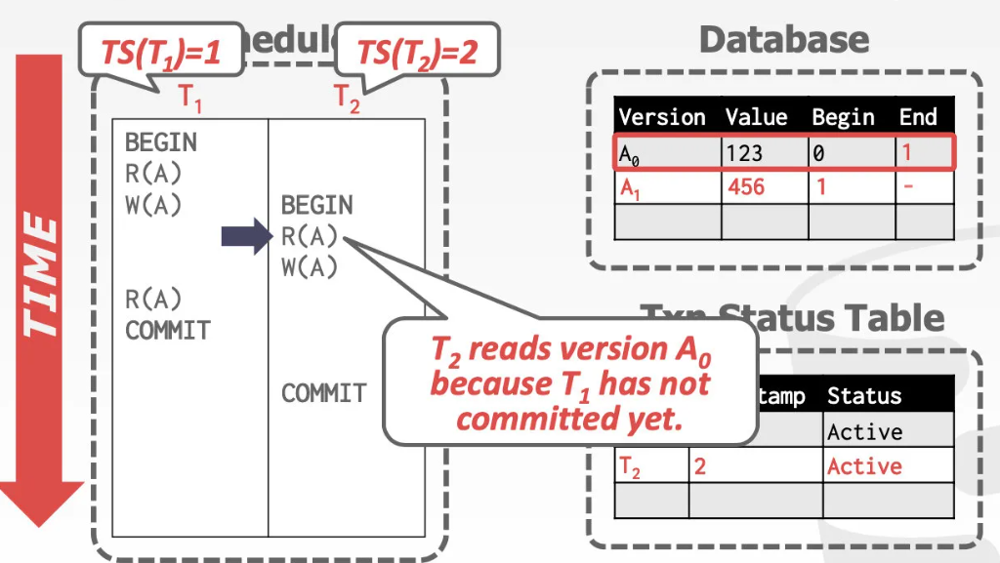
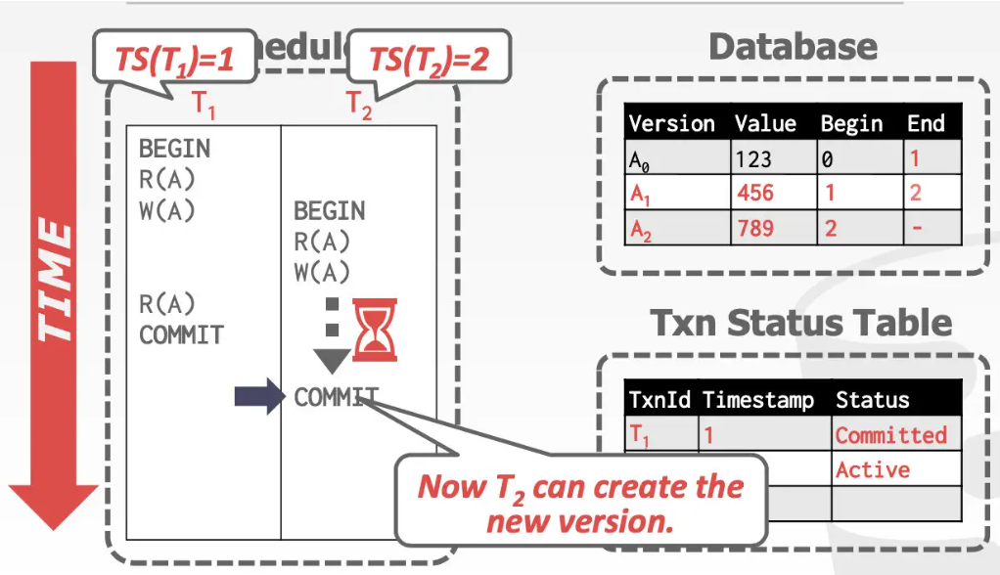
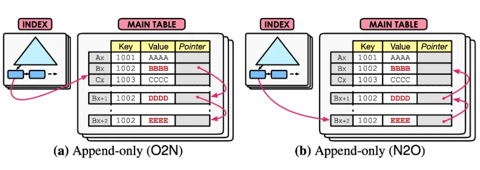
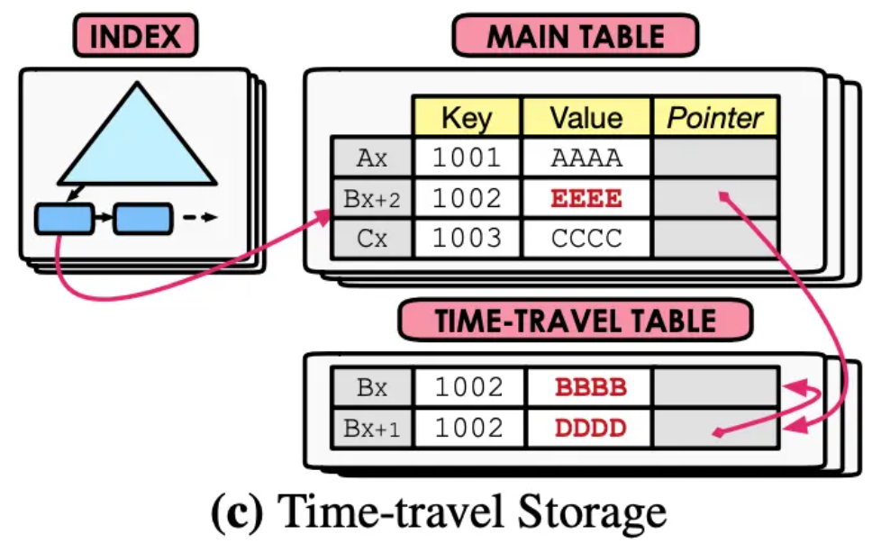
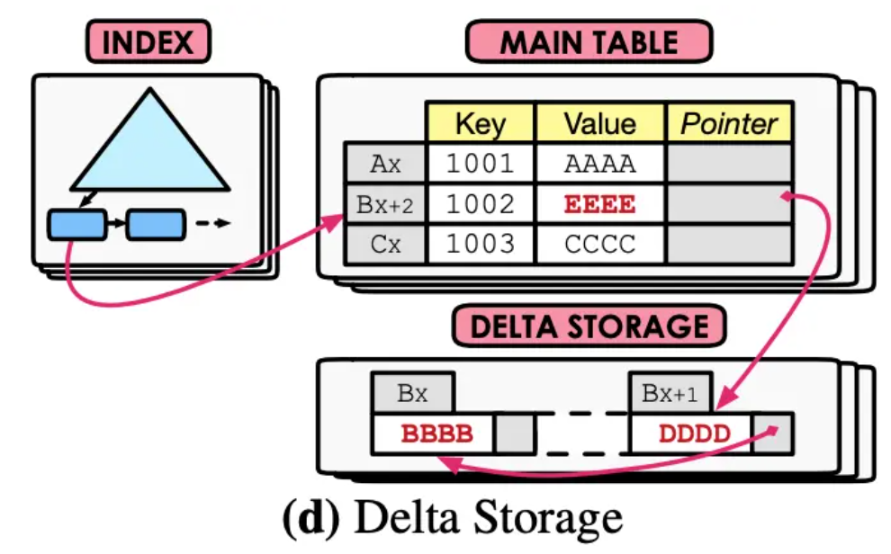
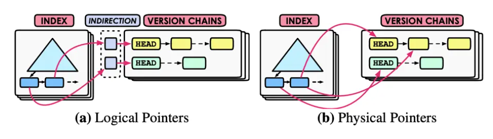

- 对数据库中的每一条数据，DBMS都将记录它的多个版本
	- 当写操作执行时，被修改的对象会创建出一个新版本
	- 当读操作执行时，读取的是当前事务开始之前，就已经存在的 最新版本
- 在 ((6666a683-b051-4d25-a4f6-9e91200fafb4)) 中,事务Ti更新了对象a后，其他的事务就没法读这个对象了，直到事务Ti commit; 而MVCC则保留了历史版本，其他事务可以读历史版本而不被阻塞。
- 简单来说，MVCC加速了在 读未提交、读已提交、可重复读 三种隔离级别下的读写。但对于记账等严格一致性场景，必须使用锁机制升格到serializable级别。
-
- 运行方式
	- 一个全局事务状态表,一个对象A组成的版本链
	- 读取时，只能读取 已提交修改的事务的记录
		- 根据全局事务状态表，判断记录Ai的操作事务Ti是否已经提交
		- 可读取的版本有多条，根据事务的隔离级别来选择读取哪一条
		- {:height 161, :width 277}
	- 写入时，T2需要等到T1的状态变为committed再执行W(A)，因为存在未提交的新版本
		- {:height 156, :width 276}
	- 这个执行调度并不是serializable的，因为T2并没有在T1提交更新的基础上进行操作，因此只依靠MVCC是不能达到调度的串行化的
- 并发控制协议 Concurrency Control Protocol
	- 只使用MVCC无法做到serializable(可串行化)的隔离级别，因此会和其他一些协议结合在一起
	- ((666d7a5f-c3c6-4b09-a979-303f9cd83008))
	- ((666d8276-2d0b-4ae0-8b13-1e28ba11855b))
	- ((6666a683-b051-4d25-a4f6-9e91200fafb4))
- 版本存储 Version Storage
	- 使用tuple对象的指针建立起一个版本链表
		- 对于正在执行中的事务Ti,可以很方便的找到想要的版本
		- tuple如果有索引，那么索引最后指向的是版本链表的头节点
	- 三种实现方式
		-
	- ---
	- 追加方式 Append-Only Storage
		- {:height 165, :width 463}
		- oldest-to-newest(O2N) 写入时开销小,读取时开销大
			- 新版本记录放在链表末尾
			- 必须先遍历完整个链表
		- newest-to-oldest(N2O) 读取时开销小，写入时开销大
			- 更新索引指针，指向新版本
			- 无需遍历整个链表
	- 时间线方式 time-travel storage
		- {:height 251, :width 353}
		- 将老版本的整个tuple直接copy到time-travel表，新版本写入主表，新版本指向老版本
	- 增量存储方式 delta storage
		- {:height 238, :width 359}
		- 在 time-travel Table的基础上，只存储修改部分的数据，而不是整个tuple
		- 节省存储空间，但在读取的时候需要组装数据，所以更慢。
- 垃圾回收 Garbage Collection
	- 数据库不可能无限地存储各个数据的历史版本，存不下那么多的数据，因此DBMS需要把那些已经没有用了，作废了的历史版本删除。
	- 可回收记录的两个宗旨
		- 任何active状态的事务都看不到某个历史版本
		- 某个事务创建了某个历史版本，但这个事务后来回滚了
	- 实现垃圾回收要解决的两个问题
		- 如何发现无用的历史版本？
		- 什么时候去删除无用的历史版本？
	- 两种思路
		- 行记录级别 Tuple-Level
		  collapsed:: true
			- 扫描并清理每一个tuple中的历史版本
			- 两种实现方式
			  collapsed:: true
				- ((666eb100-fc30-4748-b607-1254b992ad78))
				- ((666eb112-7d35-44b1-8a76-cb8e52260535))
			- 后台清理 background vacuuming
			  id:: 666eb100-fc30-4748-b607-1254b992ad78
				- vacuum线程每隔一段时间就扫描历史表（或同类的其他表），然后结合当前active的事务的时间戳去分析表中哪一个版本是无用的
				- 可以维护一个dirty block bitmap，去跟踪自从上次垃圾回收至今表里有哪些页被事务修改过，因此下一次垃圾回收的时候，只需要扫描自从上次GC以来被修改过的页面
			- 合作清理 cooperative cleaning
			  id:: 666eb112-7d35-44b1-8a76-cb8e52260535
				- 工作线程在执行事务操作时顺带扫描并清理过期的版本。
				- 但如果某条记录一直没有被事务扫描到，则永远无法被清理。
		- 事务级别 Transaction-Level
			- 事务维护一个读集合和写集合，分别存储其读到的记录和创建的记录，当事务结束后，再从两个集合中找出对于运行中事务不再可见的记录，将他们删除掉。
- 索引管理 Index Management
	- 主键索引Primary key 的指针会指向版本链表的头部，而且是通过物理地址（在哪个页的哪个slot）来定位的。
	- 辅助索引secondary indexes 的处理则有两个流派
		- 
		-
	- 逻辑指针 logical pointer
		- 索引指向一个"中间指针"即逻辑指针，这个中间指针再指向主表存储的元组的位置(某个页面的某个位置)
		- MySQL InnoDB就是使用逻辑指针的方式，**所有索引都指向主键**，通过主键再去访问真实的数据。
	- 物理指针 physical pointer
		- 所有索引都指向主表存储的元组的真实位置
		- 如果更新了某条记录的位置，则相关的索引都需要更新，造成写放大。
-
- 引用
	- [mysql - 数据库并发控制理论 - 个人文章 - SegmentFault 思否](https://segmentfault.com/a/1190000044918945#item-4-9)