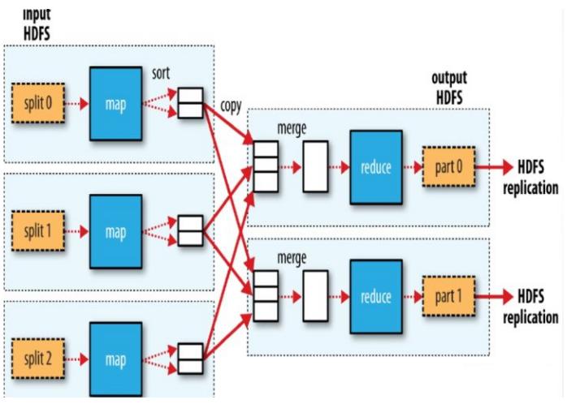
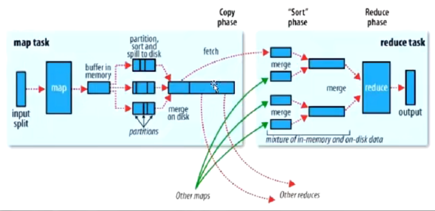
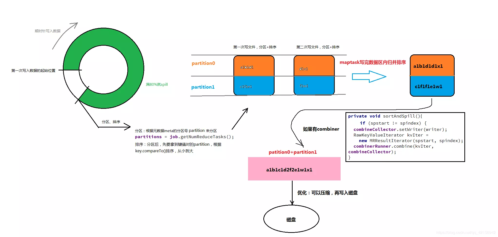

- 核心思想来自于Google发表的论文
- 顾名思义，将计算分为两类 Map 和 Reduce
	- Map
		- 以一条记录为单位做映射，1进N出
		- 映射，变换，过滤2
	- Reduce
		- 以一组(多条记录)为单位做计算
		- 依赖 key:value 这种数据格式，而这种结构是Map阶段的输出结果
		- 分解，缩小，归纳
		- 输出的结果称为 partition 分区
- Split 切片
	- 默认情况下，等价于 [[HDFS]] 中的Block块,是它在程序中的抽象概念
	- 好处
		- 与物理块解耦，可以控制输入数据单元的大小
		- 可以控制并行度
		- 物理层的Block块会把一行数据切割开，它们将在切片中复原
- MapReduce过程
collapsed:: true
	- 
- Map and Reduce Task
	- 
	- Map Task
	  id:: 624e99ec-7cd9-4511-8995-ae6e8ff3a27c
		- 对记录进行格式化，以记录为单位调用map方法
		- 将记录映射成k,v kv会参与分区计算，通过key计算出分区p 最终结构其实是 k,v,p
		- 输出的中间数据，以一个文件的形式，存放在本地的系统中
		- 内存缓冲区 [[溢写]] 磁盘时，做一个 [[二次排序]] 。达到分区有序，且分区内key有序
			- 未来,相同的一组key会相邻在一起
	- Reduce Task
	  id:: 624e99ec-4fdb-4f08-93bf-94aae0682b18
		- 首先进行 [[归并排序]] ，排序结果可以直接接入Reduce方法
			- 通过 [[迭代器模式]] 的支持
		-
- MapTask 源码
	- run方法中
collapsed:: true
		- if 没有reduce方法，map占1 else map占 0.666 sort 占0.333
		- 通过客户端传过来的Job和其中的config 来创建 jobContext,mapper,input[inputFormat,split],output,mapperContext[cconfig,reader,writer,split]
		- try方法块中
			- input.initialize
				- LineRecordReader中处理被切割开的单词的方式
					- 每个切片(除了第一个切片)都让出第一行，从第二行开始读取
					- 相应的，每个切片的结束都需要多读一行
			- mapper.run(mapperContext)
				- nextKeyValue()方法 最终调用的是LineRecordReader.nextKeyValue()
			- output.write
				- NewOutputColector中
					- 有多少个reduce task 就有多少个分区
				- 最终输出到MapOutputBuffer中
					- init方法中
collapsed:: true
						- 溢写(spilper)的大小为0.8
						- sort大小为100m
						- 排序器 sorter [map.sort.class,QuickSort]
						- 比较器 comparator = getOutputKeyComparator(),
							- 获取用户自定义比较器
							- 没有则默认获取 key自身的排序比较器
						- 组合器 combiner
							- 在map端进行的一个小的reduce，默认是不开启的
						- 溢写线程 spilThread
							- run方法中调用 sortAndSpil()
								- 排序，执行combiner,写入磁盘
					- 溢写模型 -- 环形缓冲区
						- 
						- map阶段的输出结果是(k,v,p)三元组
						- 赤道向一端存放k,v 另一端存放索引
						- 索引结构
collapsed:: true
							- 固定宽度16bit = 4 int
							- p
							- key start
							- value start
							- value length
						- 如果数据填充到80%，启动线程
							- 快速排序这80%的数据，比较key，但移动的是索引位置
							- 按照排序顺序写入磁盘，最终达到
								- 分区有序
								- 分区内key有序
						- 如果有combiner
							- 发生在排序之后，最终写入磁盘之前
								- 好处是 溢写的IO变少
							- 发生在最终map输出结束，产生了n个小文件，对文件进行合并时，触发combiner
						-
- ReduceTask 源码
	- reduce执行过程
		- shuffer: 洗牌(相同key拉取到一个分区)，拉取数据
		- sort:  对map输出的已排序好的文件做归并排序
		- reduce
			- 迭代器 rIter = shuffle... //reduce拉取回自己的数据，并包装成迭代器
			- comparator = getOutputValueGroupingComparator()