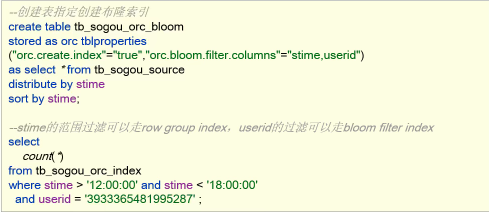

- ORC文件索引
	- Row Group Index 记录每个行组的min\max 值
		- 在执行范围查询时有用
		- 
	- Bloom Filter Index [[布隆过滤器]]
		- 等值查询时有用。
		- 
	- 矢量化查询
		- 按每批1024行读取数据，一次性对整个记录正好应用操作，提升了如  where union join group by 等操作的性能
		- 必须以ORC格式存储数据
		-