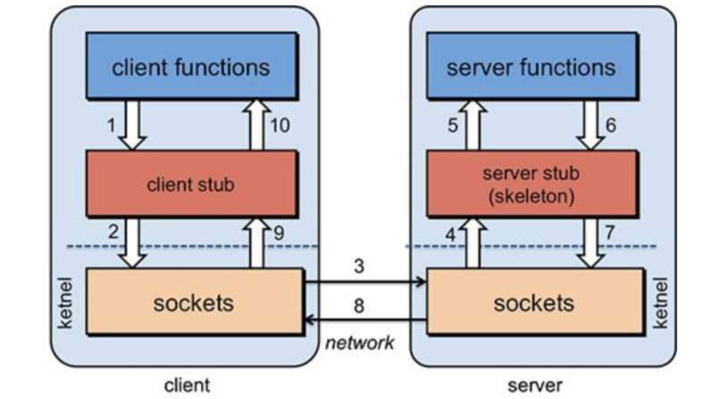

- 中文名称 [[远程过程调用]]
- 定义
	- 计算机 A 上的进程，调用另外一台计算机 B 上的进程，其中 A 上的调用进程被挂起，而 B 上的被调用进程开始执行，当值返回给 A 时，A 进程继续执行。调用方可以通过使用参数将信息传送给被调用方，而后可以通过传回的结果得到信息。而这一过程，对于开发人员来说是透明的。
- 
- [[Java RMI]] 可以看成是PRC 的Java升级版
- RPC的三大基本问题
	- 如何表示数据--序列化与反序列化
	- 如何传递数据--传输协议
	- 如何确定方法--跨语言之间唯一确定方法的协议
- [[Dubbo]]
-