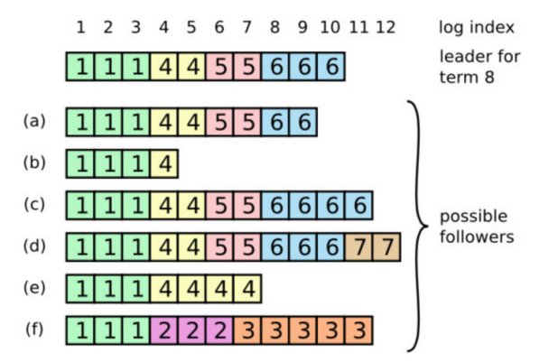
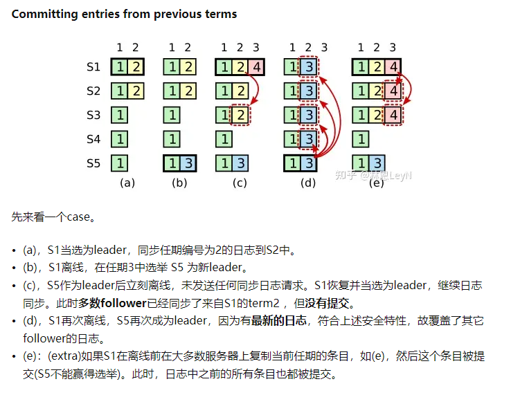

- 论文中文翻译 https://zhuanlan.zhihu.com/p/522435604
- 相较于Paxos算法，Raft的改进在于增加了竞选主节点的过程，所有client对从节点的请求都将**被转发到主节点**进行处理。而且角色也从3种变为了两种：**主节点Leader 和 从节点 Follower**.报文也从二元组(id,value) 变为了三元组**(id,i,value)** i为主节点的**任期编号**.
- 此时，在 "分布式系统中如何对某个值达成一致" 这个问题，就被分解为了三个子问题 http://thesecretlivesofdata.com/raft/#intro
- Leader选举
	- 
	- 故障发现
		- Leader与Follower之间有心跳连接，但每个的**心跳间隔周期**不一样。也可以**称为竞选超时周期**，因为它在每一次接收心跳或投票消息后都会**重置**。
		- 集群出现故障导致Leader宕机,等待一个**心跳间隔周期**后,Follow A未发现Leader,变为Candidate。
	- 参与竞选
		- 本质上是剩下的节点，就“谁来当Leader”达成共识，与Paxos算法无异。
		- 节点A广播投票消息 Vote(任期1,竞选者A),并给自己设置一个**投票重试周期**，用于投票平局的情况，任期+1后重新执行选举流程。
		- Follower在收到消息后，判断任期编号是不是最大且没有投过票，如果是，就将票投给A，并且更新自己保存的任期编号,重置竞选超时周期.
		- 节点A收到超半数的投票后，判断是否一致通过。如果一致通过，则成功竞选。
	- 竞选胜利
		- 节点A 作为新的Leader，再次与其余节点建立心跳链接，开始同步数据。
	- Leader的任期
		- 自动增加：Follow节点成为Candidate后，会主动增加自己的任期编号
		- 更新为较大值：Follow节点发现自己的任期编号比其他节点小时，更新到较大的编号值。
		- 恢复为Follow: 如果一个Candidate或者Leader，发现自己的任期编号比其他节点小，那么它会立即恢复成Follower
		- 拒绝消息：如果一个节点接收到 <= 任期编号值的请求，那么它会直接拒绝这个请求
- 日志复制
	- Raft的日志格式，是严格按照时间顺序写入日志文件中的。
		- 每一个日志项至少包含三个属性：在日志文件中的位置、任期编号、执行的指令。
	- 客户端指令 -> Leader写日志 -> 广播给Follower -> 被安全复制 -> 执行指令 -> 响应客户端
	- 如何判断日志是否一致
		- 不同的日志中的两个条目拥有**相同的索引和任期号**，那么他们存储了相同的**指令**。
		- 不同的日志中的两个条目拥有**相同的索引和任期号**，那么他们**之前**的所有日志条目也全部相同。
	- 如何保证日志的最终一致
		- Leader找到 Follower与自己**相同的最大日志项**，这意味着Follower之前的日志都与Leader的日志相同；
		- Leader强制**覆盖**Follower本地的之后的不一致的日志，实现日志的一致性。
	- 到这里，我们可以推出一条信息： Leader如果任期内没有接收一条客户端指令，是不会触发 强制覆盖Follower日志的。
	- 具体流程
		- 假设现在的集群情况如图中所示 ,Leader此时的任期编号为8，并且打算写入新日志 
		- 在广播最新客户端指令日志时，会包含Leader日志中，紧邻新日志条目之前的那个日志条目的信息PrevLogxxx。
		- Follower 根据这个信息，判断自己的日志是否与Leader一致.如果不一致，则返回faluire 以及自己的最新 LogItem
		- Leader 收到节点的Faluire消息后，找到与Faluire节点最近且最新的LogItem，并开始对Faluire节点强制覆盖LogItem之后的LogItem信息。
	- 如果恢复后，当选的是f或者d，情况会怎么样
		- 根据下文的**安全性保证**，f节点恢复后的任期ID=3，远远小于当前任期id。因此，在数据同步完成之前，参与竞选必定会失败。
	- 为什么在校验时判断的是任期编号和索引，而不是计算副本数目(大多数存在)
		- 因为在一种极端情况下，尽管旧的日志存放在大多服务器上，但仍有可能被最新的日志条目覆盖。
		- 图中，d和e是c的两种可能情况.
		- 
	-
- 安全性保证
	- 保证拥有**最新日志条目**的follower才能被选成 leader。
	- 提交**之前的条目**，应该等到有一个leader**当前任期的条目提交**了，所有的之前条目再一起提交。
	-