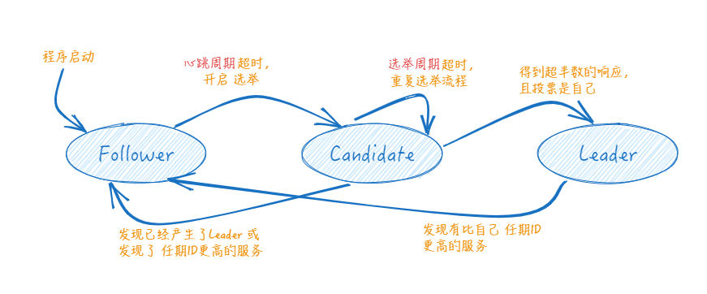

- 相较于Paxos算法，Raft的改进在于增加了竞选主节点的过程，所有client对从节点的请求都将**被转发到主节点**进行处理。而且角色也从3种变为了两种：**主节点Leader 和 从节点 Follower**.报文也从二元组(id,value) 变为了三元组**(id,i,value)** i为主节点的**任期编号**.
- 此时，在 "分布式系统中如何对某个值达成一致" 这个问题，就被分解为了三个子问题 http://thesecretlivesofdata.com/raft/#intro
- Leader选举
	- 
	- 故障发现
		- Leader与Follower之间有心跳连接，但每个的**心跳间隔周期**不一样。也可以**称为竞选超时周期**，因为它在每一次接收心跳或投票消息后都会**重置**。
		- 集群出现故障导致Leader宕机,等待一个**心跳间隔周期**后,Follow A未发现Leader,变为Candidate。
	- 参与竞选
		- 本质上是剩下的节点，就“谁来当Leader”达成共识，与Paxos算法无异。
		- 节点A广播投票消息 Vote(任期1,竞选者A),并给自己设置一个**投票重试周期**，用于投票平局的情况，任期+1后重新执行选举流程。
		- Follower在收到消息后，判断任期编号是不是最大且没有投过票，如果是，就将票投给A，并且更新自己保存的任期编号,重置竞选超时周期.
		- 节点A收到超半数的投票后，判断是否一致通过。如果一致通过，则成功竞选。
	- 竞选胜利
		- 节点A 作为新的Leader，再次与其余节点建立心跳链接，开始同步数据。
	- Leader的任期
		- 自动增加：Follow节点成为Candidate后，会主动增加自己的任期编号
		- 更新为较大值：Follow节点发现自己的任期编号比其他节点小时，更新到较大的编号值。
		- 恢复为Follow: 如果一个Candidate或者Leader，发现自己的任期编号比其他节点小，那么它会立即恢复成Follower
		- 拒绝消息：如果一个节点接收到 <= 任期编号值的请求，那么它会直接拒绝这个请求
- 日志复制
- 安全性保证