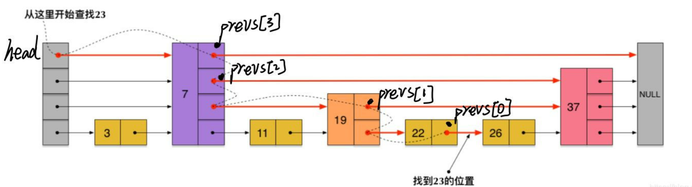

- {{cards [[Redis面试题]]}}
- 项目中缓存是如何使用的，为什么要用 #card
  card-last-interval:: 8.32
  card-repeats:: 3
  card-ease-factor:: 2.08
  card-next-schedule:: 2023-01-29T09:47:08.343Z
  card-last-reviewed:: 2023-01-21T02:47:08.343Z
  card-last-score:: 3
	- 提高接口性能 {{cloze 缓存查询结果}} 用得最多的是 {{cloze 用户信息查询}} 接口
	- 降低数据库压力 {{cloze 热点数据缓存}}
	- 限流&幂等&分布式锁
	- 一级页面熔断降级 {{cloze 缓存数据，降级后直接取用}}
- 缓存使用不当会带来哪些后果，解决办法 #card
  card-last-interval:: 8.32
  card-repeats:: 3
  card-ease-factor:: 2.08
  card-next-schedule:: 2023-02-03T10:13:39.495Z
  card-last-reviewed:: 2023-01-26T03:13:39.496Z
  card-last-score:: 3
	- 缓存与数据库的双写不一致
		- 读的时候 {{cloze 先读缓存，再读数据库，最后把读取的数据放入缓存}}
		- 写的时候 {{cloze 先更新数据库，再删除缓存}}
		- 终极解决方案 4
			- {{cloze 数据库订阅binlog}}
			- {{cloze 消息队列保证key被删除}}
			- {{cloze 延迟再次删除}}
			- {{cloze 设置合理的缓存过期时间兜底}}
	- 缓存雪崩
		- {{cloze 大量key设置了同一时间过期}} {{cloze 服务器宕机}}
		- {{cloze 设置过期时间时加上一个随机值，分散一些}} {{cloze 集群部署}} {{cloze 本地缓存,熔断降级}}
	- 缓存穿透
		- 问题描述 {{cloze 请求查询了缓存和数据库中都不存在的数据，这样每次请求都打到了数据库}}
		- 解决方案 {{cloze 对空值进行缓存}} {{cloze 对请求本身进行拦截和过滤}}
	- 缓存击穿
		- 问题描述 {{cloze 某一热点key突然过期，导致所有请求打到数据库上}}
		- 解决方案 {{cloze 热点key过期时间加长，永不过期}} {{cloze 实时监控热点数据，实时调整过期时间}} 代码层面 {{cloze 使用synch 或 ReentryLock 加锁更新，这样后续的请求就又会走缓存}}
- 在日常项目中用到了哪些Redis数据类型,底层结构是什么样的 #card
  card-last-interval:: 8.32
  card-repeats:: 3
  card-ease-factor:: 2.08
  card-next-schedule:: 2023-02-04T19:25:28.108Z
  card-last-reviewed:: 2023-01-27T12:25:28.108Z
  card-last-score:: 3
	- string
		- {{cloze 普通的kv存储，常用}}
		- 底层结构是 {{cloze 动态字符串SDS}}
	- set
		- {{cloze 集合的交并差操作，比如  你可能认识的人，共同的朋友}}
	- hash
		- {{cloze 层级为1的对象}}
		- {{cloze hash表，采用数组+链表 扩容时采用渐进式rehash}}
	- list
		- {{cloze 用户的粉丝列表，关注列表}} 可基于list实现分页查询
		- 底层结构是 {{cloze 双向无环链表}}
	- zset
		- {{cloze 自定义score排序，比如排行榜机制}}
		- {{cloze 跳跃表，节点按分值大小排序，再按对象大小排序}}
- Redis的过期策略有哪些?数据明明过期了，怎么还占用着内存 #card
  card-last-interval:: 4
  card-repeats:: 2
  card-ease-factor:: 2.22
  card-next-schedule:: 2023-01-28T02:49:28.006Z
  card-last-reviewed:: 2023-01-24T02:49:28.006Z
  card-last-score:: 3
	- 定期删除
		- {{cloze 每隔一段时间，删除过期key}} {{cloze 采用随机抽取策略}}
		- 为什么单个key不能到期删除? {{cloze 需要用监视器来负责监视key，虽然内存及时释放，但占用了宝贵的CPU资源}}
	- 惰性删除
		- {{cloze 当我们查询key的时候才对key进行检测}}
	- 内存淘汰机制
		- {{cloze noevivtion}} 直接拒绝
		- {{cloze allkeys-lru}} 所有key中 lru
		- {{cloze allkeys-random}} 所有key中 随机移除
		- {{cloze volatile-lru}} 有过期时间的key中 lru
		- {{cloze volatile-random}} 有过期时间的key中 随机移除
		- {{cloze volatile-ttl}} 有过期时间的key中 移除最早过期时间的key
- 了解Redis的事务机制吗？ #card
  card-last-interval:: -1
  card-repeats:: 0
  card-ease-factor:: 2.5
  card-next-schedule:: nil
  card-last-reviewed:: nil
  card-last-score:: nil
	- 事务以 {{cloze MUTLI}}命令开始
	- 客户端接收一系列操作，放入队列中
	- 收到 {{cloze EXEC}}命令后，开始顺序执行操作。
	- 监视watch整个事务相关的key是否早已被修改，如果是则拒绝执行这个事务
	- 执行时不会被其他客户端发送来的命令请求打断
	- 不支持回滚，要么都执行，要么都不执行
- 如何处理多个客户端并发写一个key? #card
  card-last-interval:: 2.9
  card-repeats:: 1
  card-ease-factor:: 2.36
  card-next-schedule:: 2023-01-30T09:28:51.301Z
  card-last-reviewed:: 2023-01-27T12:28:51.301Z
  card-last-score:: 3
	- 使用事务 实现CAS
		- {{cloze 事务具有watch机制,一旦被监测的key发生更改，本次提交就失效了}}
- Redis为什么快？ #card
  card-last-interval:: 3.59
  card-repeats:: 1
  card-ease-factor:: 2.36
  card-next-schedule:: 2023-01-20T16:11:05.620Z
  card-last-reviewed:: 2023-01-17T02:11:05.622Z
  card-last-score:: 3
	- 基于内存操作
	- 使用单线程， {{cloze 避免线程切换和竞争产生的消耗}}
	- 基于 {{cloze IO多路复用模型}} IO模型 {{cloze 让单个线程高效处理多个连接请求}}
	- {{cloze C语言实现，更加优化的基础数据结构}} 语言、底层数据结构
- Redis是单线程的吗？ #card
  card-last-interval:: 4
  card-repeats:: 2
  card-ease-factor:: 2.22
  card-next-schedule:: 2023-01-31T12:20:01.549Z
  card-last-reviewed:: 2023-01-27T12:20:01.550Z
  card-last-score:: 3
	- 只有 {{cloze 网络请求模块}} 和 {{cloze 数据操作模块}} 是单线程的 其他的如 持久化模块、集群模块是多线程的
	- 多线程的好处 {{cloze 使用多线程可以提升 IO利用率和CPU利用率}}
		- Redis无需提升CPU利用率，基础操作都是基于内存的
		- 多线程切换会带来开销，且代码复杂性上升。最终选择了IO多路复用
	- 在6.0+，针对 {{cloze 网络请求}}改成了多线程
- Redis的分布式锁如何实现 #card
  card-last-interval:: 4
  card-repeats:: 2
  card-ease-factor:: 2.22
  card-next-schedule:: 2023-01-28T02:48:42.497Z
  card-last-reviewed:: 2023-01-24T02:48:42.497Z
  card-last-score:: 3
	- {{cloze setnx来争抢锁，再用expire加上过期时间}}
	- 高可用分布式锁 {{cloze RedLock}} 但可能导致性能下降，建议使用 {{cloze zk实现分布式锁}}
- 如何把固定前缀开通的key全部找出来 #card
  card-last-interval:: 4
  card-repeats:: 2
  card-ease-factor:: 2.22
  card-next-schedule:: 2023-01-20T09:25:15.232Z
  card-last-reviewed:: 2023-01-16T09:25:15.232Z
  card-last-score:: 3
	- {{cloze scan命令可以提取指定模式的key列表}}
- Redis的持久化机制 #card
  card-last-interval:: 4
  card-repeats:: 2
  card-ease-factor:: 2.22
  card-next-schedule:: 2023-01-30T03:12:09.382Z
  card-last-reviewed:: 2023-01-26T03:12:09.383Z
  card-last-score:: 3
	- bgsave 全量持久化
		- 过程 {{cloze 生成子进程和当前内存快照，子进程进行持久化}}
		- 缺点 {{cloze 非子进程的方式耗时较长，会导致停止服务}} {{cloze 如果不停机，可能丢失最后一部分数据}}
	- aof 增量持久化
		- 过程 {{cloze 以日志的形式记录每个写操作}}
		- 缺点 {{cloze AOF文件大，恢复速度慢}}
	- aof的重写机制
		- 目的 {{cloze 解决AOF 文件过大的问题}}
		- {{cloze 将过期的、不再使用的、重复的以及可优化的命令进行优化，重新生成AOF文件}}
		- 流程 {{cloze fork一个子进程}} {{cloze 重写期间，主线程的写命令被保存在缓冲区中}}
- RDB和AOF各自的优缺点 #card
  card-last-interval:: 4
  card-repeats:: 2
  card-ease-factor:: 2.22
  card-next-schedule:: 2023-01-31T12:33:39.181Z
  card-last-reviewed:: 2023-01-27T12:33:39.182Z
  card-last-score:: 3
	- RDB优点
		- 生成的文件 {{cloze 只有一个紧凑的二进制文件，非常适合备份、全量复制场景}}
		- {{cloze 文件随意拷贝，容灾性好}}
		- 恢复速度快
	- RDB的缺点
		- 实时性 {{cloze 低，每个一段时间进行持久化}}
		- 兼容问题 {{cloze Redis在演化过程中存在多个格式的RDB文件}}
	- AOF的优点
		- 实时性 {{cloze 高，没进行一次写操作就记录到aof文件中}}
	- AOF的缺点
		- 生成的文件 {{cloze 比RDB大}} {{cloze 恢复速度慢}}
- Redis的主从复制过程 #card
  card-last-interval:: 4
  card-repeats:: 2
  card-ease-factor:: 2.22
  card-next-schedule:: 2023-01-31T12:42:17.954Z
  card-last-reviewed:: 2023-01-27T12:42:17.954Z
  card-last-score:: 3
	- 从服务器首次连接 {{cloze 全量复制}} {{cloze rdb or aof文件}}
	- 复制后数据先 {{cloze 保存到本地磁盘}} 后 {{cloze 从磁盘读取到内存}}
	- 重新连接 {{cloze 部分数据复制}} {{cloze offset偏移量 repl-backlog-buffer 复制积压缓冲区}}
- Redis的集群模式的好处 #card
  card-last-interval:: 2.9
  card-repeats:: 1
  card-ease-factor:: 2.36
  card-next-schedule:: 2023-01-30T09:30:13.209Z
  card-last-reviewed:: 2023-01-27T12:30:13.210Z
  card-last-score:: 3
	- 数据分片 {{cloze 自动将数据分片，每个master上放一部分}}
	- 主从复制和自动故障转移 {{cloze 部分master不可用时，还是可以继续工作}}
	- 2个端口 {{cloze 6379 16379}}
- 数据如何分散在机器上 #card
  card-last-interval:: 4
  card-repeats:: 2
  card-ease-factor:: 2.22
  card-next-schedule:: 2023-01-28T02:50:10.341Z
  card-last-reviewed:: 2023-01-24T02:50:10.342Z
  card-last-score:: 3
	- {{cloze 一致性Hash算法}}
		- 哈希环，顺时针，虚拟节点
	- {{cloze hash slot 哈希槽}}
		- 槽位分配 {{cloze 整个集群有固定的16384 个槽位，每个master分配了固定槽位范围}}
		- 机器的增减 {{cloze master的增减只是移动部分槽位}}
		- 好处 {{cloze 无论在数据量大 or 小时，数据分配都很均匀}}
- 节点宕机时的主备切换 #card
  card-last-interval:: 8.32
  card-repeats:: 3
  card-ease-factor:: 2.08
  card-next-schedule:: 2023-02-04T19:30:45.715Z
  card-last-reviewed:: 2023-01-27T12:30:45.716Z
  card-last-score:: 3
	- 判断节点宕机
		- 主观宕机 {{cloze 某一节点发现另一节点一段时间内无心跳返回了}}
		- 故障广播 {{cloze 该节点下线的消息开始在集群中传播}}
		- 客观宕机 {{cloze 半数节点都认为该节点是主观下线}}
	- 从节点过滤
		- {{cloze 如果从节点与主节点断开时间过长，则没有资格参与选举}}
	- 从节点选举
		- {{cloze 投票选举，超过半数者升级}}
- Redis优化策略 #card
	- 在见名知意的情况下，使用短key
	- 不要存过大的数据,存之前先把数据压缩
	- 设置key的合理有效期,选择合适的回收策略
	- 使用连接池，减少不必要的连接
- 如何解决本地缓存与分布式缓存的数据不一致 #card
  card-last-interval:: 2.8
  card-repeats:: 1
  card-ease-factor:: 2.36
  card-next-schedule:: 2023-01-30T07:32:35.551Z
  card-last-reviewed:: 2023-01-27T12:32:35.552Z
  card-last-score:: 3
	- Redis自身有 {{cloze 订阅/分发}} 机制
	- 引入 {{cloze 消息队列}}
	- 本地缓存的过期时间 {{cloze 设置相对短一些}}
- Redis数据如何预热 #card
  card-last-interval:: 4
  card-repeats:: 2
  card-ease-factor:: 2.46
  card-next-schedule:: 2023-01-31T12:21:39.348Z
  card-last-reviewed:: 2023-01-27T12:21:39.348Z
  card-last-score:: 3
	- 暴露内网接口，手动操作
	- 数据量不大时，项目启动时自动加载
	- 定时任务刷新加载
- 热key处理 #card
  card-last-interval:: 3.86
  card-repeats:: 1
  card-ease-factor:: 2.36
  card-next-schedule:: 2023-01-31T08:17:07.034Z
  card-last-reviewed:: 2023-01-27T12:17:07.034Z
  card-last-score:: 3
	- 监测
		- 客户端 {{cloze 设置全局字典 key和调用次数}}
		- 数据仓库 {{cloze 客户端发送mq,数据仓库实时统计}}
		- redis服务端 {{cloze 使用monitor命令统计热点key}}
	- 处理
		- 打散 {{cloze 把热key打散到不同的服务器上，降低压力}}
		- 二级缓存 {{cloze 加入本地的内存缓存}}
- 大key处理 #card
  card-last-interval:: 2.34
  card-repeats:: 1
  card-ease-factor:: 2.36
  card-next-schedule:: 2023-01-29T20:41:23.303Z
  card-last-reviewed:: 2023-01-27T12:41:23.304Z
  card-last-score:: 3
	- 大key造成的问题
		- 进行IO操作时 {{cloze 占用带宽和CPU}}
		- 数据倾斜
		- 过期删除时 {{cloze 可能导致阻塞}}
	- 如何找到大key
		- 命令 {{cloze bigkeys}}
		- 文件分析工具 {{cloze rdb-tools}}
	- 如何处理大key
		- 删除 {{cloze 扫描并惰性删除}}
		- 压缩 {{cloze 压缩算法进行压缩}}
		- 拆分 {{cloze 按长度截取拆分，使用multiget读取}}
- Redis的SDS与C语言的字符串比较 #card
  card-last-interval:: 3.34
  card-repeats:: 1
  card-ease-factor:: 2.36
  card-next-schedule:: 2023-01-30T20:22:48.361Z
  card-last-reviewed:: 2023-01-27T12:22:48.361Z
  card-last-score:: 3
	- c语言字符串的缺点
		- {{cloze 获取字符串长度 需要O(n)}}
		- {{cloze 有 缓冲区溢出 问题}}
		- {{cloze 只能保存文本数据，出现`\0` 会提前结束}}
	- SDS是如何解决的
		- {{cloze 增加len字段表示当前字符串长度}}
		- {{cloze 自动扩展空间，扩容时成倍分配，缩容时先留着并不正式归还}}
		- {{cloze 二进制安全，写入什么就读取什么，不做任何限制}}
- Redis的字典，渐进式Rehash过程 #card
  card-last-interval:: 2.43
  card-repeats:: 1
  card-ease-factor:: 2.36
  card-next-schedule:: 2023-01-29T22:35:11.630Z
  card-last-reviewed:: 2023-01-27T12:35:11.631Z
  card-last-score:: 3
	- 两个table, 采用 {{cloze 数组+链表的链地址法}} 解决哈希冲突 哈希算法为 {{cloze hashcode & sizemask}} sizemask = realsize - 1
	- 扩容时
		- {{cloze 把t0的值rehash到t1,过程是渐进式的(分多次地完成)}}
		- {{cloze 此时有数据插入，则直接加入t1表}}
		- {{cloze 扩容因子为 used / size = 1 时}}
- Redis的跳跃表skipList是如何实现的 #card
  card-last-interval:: 2.26
  card-repeats:: 1
  card-ease-factor:: 2.36
  card-next-schedule:: 2023-01-29T18:41:41.779Z
  card-last-reviewed:: 2023-01-27T12:41:41.779Z
  card-last-score:: 3
	- 层级
		- 插入时按几率分配层级
	- 查找过程
		- 
		- 头节点持有所有层级的第一个元素信息，从上到下遍历
		- 遍历每一层的节点，直到遇见NULL 或 >目标值
		- 向下一层，继续遍历该层
- Redis的压缩列表zipList和quickList #card
  card-last-interval:: 3.11
  card-repeats:: 1
  card-ease-factor:: 2.36
  card-next-schedule:: 2023-01-30T14:24:26.279Z
  card-last-reviewed:: 2023-01-27T12:24:26.280Z
  card-last-score:: 3
	- 压缩体现在哪里?
		- 普通的数组结构， {{cloze 每一个单元的长度由最大字符串长度决定的}}
		- 压缩单元 {{cloze 每一单元之前，都带有该单元的长度和编码信息(固定长度)}} 这样存储相对小的字符串时，就节省了空间，同时也保留的内存的连续性(CPU缓存读取)
	- 多个这样的节点联合起来，构成了压缩列表
		- 并具有额外参数 {{cloze 整个列表大小}} {{cloze 偏移量}} {{cloze 列表节点数}} {{cloze 末端标志}}
	- 多个ziplist进行双向链接，构成了quickList
-