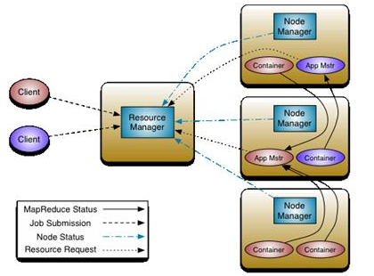

- hadoop1.x时代
	- 计算如何向数据移动？
		- 资源管理 和 任务调度
	- 组成角色
		- 客户端
			- 1. 根据每次的计算数据，咨询 [[NameNode]] 元数据（block) ，用以计算切片(split)，得到一个切片的**清单**(MapTask的数量)
				- split是逻辑的，block是物理的，block身上有 offset,locations ,split和block是有映射关系
				- 因此，输出的结果split中包含偏移量 以及告诉对应的MapTask应该移动到哪些节点 locations
			- 2. 生成计算程序未来运行时的相关配置文件 `xxx.xml`
			- 3. 将 jar包 split清单 配置[ [[xml]] ]文件 上传到[[HDFS]]中
				- 上传的数据的副本数默认是10
			- 4. 通知JobTracker准备启动任务,并告知文件都放在了HDFS的哪些地方
		- JobTracker
			- 资源管理 和 任务调度
			- 1. 从 [[HDFS]] 中取回split清单
			  2. 根据自己收到的TaskTracker汇报的资源，最终确定每一个MapTask去哪一个节点的确切的清单
			  3. 未来，TaskTracker在心跳的时候，取回自己的任务信息
		- TaskTracker
			- 任务管理 和 资源汇报
			- 1. 心跳取回任务
			  2. 从 [[HDFS]] 中下载 jar xml 到本机
			  3. 启动任务描述中的MapTask\ReduceTask
- JobTracker 3个问题
	- 单点故障
	- 压力过大
	- 集成了资源管理和任务调度，两种耦合。未来新的计算框架不能复用资源管理
		- 重复造轮子
		- 造成资源争抢。因为各自实现资源管理，但是都部署在一起，加之相互隔离，不能感知对方的使用
- hadoop2.x时代 yarn 资源管理
	- 
		- App Master 当计算发生时，出现它。相当于没有资源管理的JobTracker
			- 询问Resouce Manager 哪些Map去哪个Node
		- Resouce Manager 向Node Manger通知，要跑哪个任务
		- Container