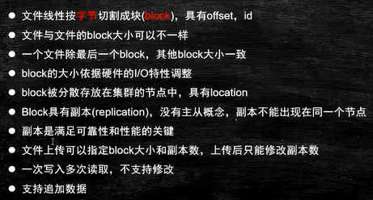
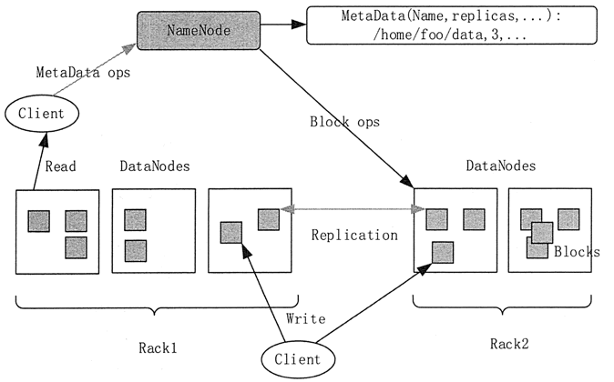
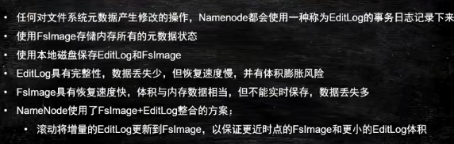
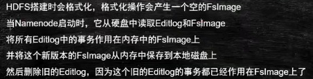
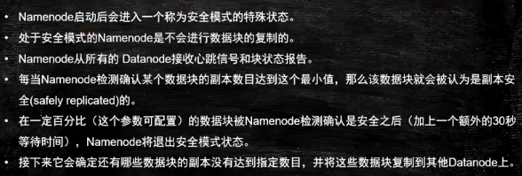
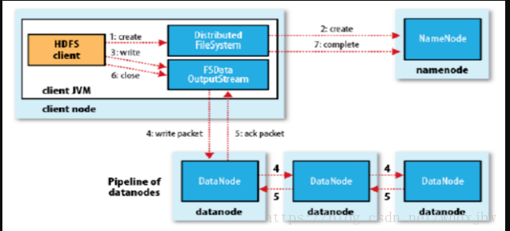
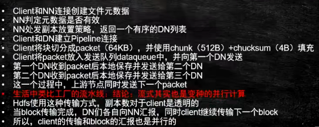
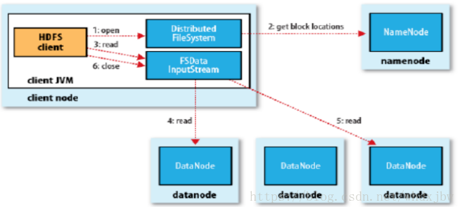
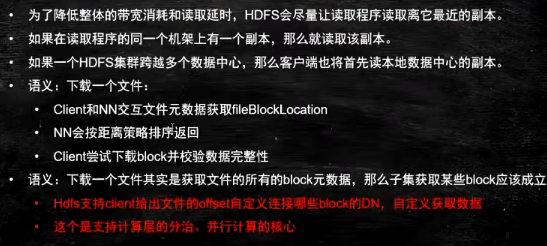

- 更好的支持分布式计算 #分布式系统
- 存储模型
	- 
	- 切割过程，会将有实际意义的字符(单词，中文，符号)切分到两个文件中，如何再拼接起来？
	- 切分为块的目的，是为了分散在多个节点中
	- 创建副本，是为了解决可靠性和性能的问题, #数据冗余 #容灾
	- 支持修改会怎么样？在修改的地方，所对应的块会变大。在它之后的块的偏移量就不对了。只能将溢出数据逐渐下移到最后一块，造成大量网络传输。这是不必要的。 #泛洪操作
- 架构设计 #主从结构
	- 主从(Master/Slaves)架构
	- 由一个[[NameNode]](主) 和一些[[DataNode]](从) 组成,包含 文件[[数据]](data) 和文件 [[元数据]] (metadata)
		- NameNode负责存储和管理文件元数据,并维护一个文件目录树
		- DataNode负责存在文件数据(block-块),并提供block的读写
		- DataNode与NameNode之间维持心跳链接,并汇报自己持有的block信息
	- Client 向NameNode交互文件元数据(metadata); 向DataNode交互文件数据(data)
	- 
- 角色功能
	- 角色 = 进程
	- [[NameNode]]
	- [[DataNode]]
	- [[SeconaryNameNode]]
- [[元数据]]\持久化 #持久化技术 #NameNode
  id:: 622c4b81-70b0-4b12-adfc-fc6de273d0d4
	- 持久化时并不保存block的位置信息
		- 保证数据一致性：宁可等DataNode主动上报，也不拿过时的信息（从日志中读取）。
	- EditsLog 日志文件
		- 体积小，记录少时有优势
	- FsImage 快照
		- 如果有更快的滚动更新时间点(更新间隔短)
	- 
	- 最近时间点的FsImage + 增量EditsLog
		- current = 10 FI=9  EL =9 to 10
	- FsImage的滚动更新方案
		- 由 [[NameNode]] 8点溢写，9点溢写 ...
		- [[NameNode]] 第一次开启时写溢出FsImage = 8点,之后使用EitsLog=8 to 9，将这些记录更新到8点的FI中，就变成了9点 的FI
			- 但此时NameNode可能会拒绝服务，因此需要寻求另一台机器来做这件事情，就是 [[SeconaryNameNode]]
- 安全模式 #NameNode
	- NameNode启动，产生和使用FsImage&EditLog
		- 
	- 开启安全模式，恢复block信息
		- 
		-
- 块的副本放置策略
	- 第一个副本：放置在上次文件所在的DataNode所在本机。如果是集群外提交，则随机挑选一台磁盘不太满，CPU不太忙的节点
	- 第二个副本：放在与第一个副本不同的 机架 的节点上
	- 第三个副本：与第二个副本相同机架的节点
	- 更多副本：随机节点
- 读写流程
	- 写流程
		- 
		- 
	- 读流程
		- 
		- 
- 部署
	- 伪分布式模式
	- HA High Available模式 #高可用
-